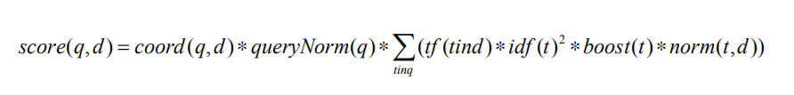

- [第1章 Elasticsearch集群入门](#%E7%AC%AC1%E7%AB%A0-Elasticsearch%E9%9B%86%E7%BE%A4%E5%85%A5%E9%97%A8)
  - [1.1 全文检索](#11-%E5%85%A8%E6%96%87%E6%A3%80%E7%B4%A2)
    - [1.1.1 Lucene 词汇表和架构](#111-Lucene-%E8%AF%8D%E6%B1%87%E8%A1%A8%E5%92%8C%E6%9E%B6%E6%9E%84)
    - [1.1.2 输入数据分析](#112-%E8%BE%93%E5%85%A5%E6%95%B0%E6%8D%AE%E5%88%86%E6%9E%90)
    - [1.1.3 评分和查询相关性](#113-%E8%AF%84%E5%88%86%E5%92%8C%E6%9F%A5%E8%AF%A2%E7%9B%B8%E5%85%B3%E6%80%A7)
- [第2章 索引](#%E7%AC%AC2%E7%AB%A0-%E7%B4%A2%E5%BC%95)
  - [2.1 Elasticsearch索引](#21-Elasticsearch%E7%B4%A2%E5%BC%95)
  - [2.2 映射配置-mapping](#22-%E6%98%A0%E5%B0%84%E9%85%8D%E7%BD%AE-mapping)
    - [2.2.2 索引结构映射](#222-%E7%B4%A2%E5%BC%95%E7%BB%93%E6%9E%84%E6%98%A0%E5%B0%84)
      - [3. 核心类型](#3-%E6%A0%B8%E5%BF%83%E7%B1%BB%E5%9E%8B)
      - [7. 使用分析器](#7-%E4%BD%BF%E7%94%A8%E5%88%86%E6%9E%90%E5%99%A8)
  - [2.4 用附加的内部信息扩展索引结构](#24-%E7%94%A8%E9%99%84%E5%8A%A0%E7%9A%84%E5%86%85%E9%83%A8%E4%BF%A1%E6%81%AF%E6%89%A9%E5%B1%95%E7%B4%A2%E5%BC%95%E7%BB%93%E6%9E%84)
    - [2.4.1 标识符字段](#241-%E6%A0%87%E8%AF%86%E7%AC%A6%E5%AD%97%E6%AE%B5)
    - [2.4.2 _source字段](#242-source%E5%AD%97%E6%AE%B5)
  - [2.5 段合并介绍](#25-%E6%AE%B5%E5%90%88%E5%B9%B6%E4%BB%8B%E7%BB%8D)
    - [2.5.3 合并策略](#253-%E5%90%88%E5%B9%B6%E7%AD%96%E7%95%A5)
    - [2.5.4 合并调度器](#254-%E5%90%88%E5%B9%B6%E8%B0%83%E5%BA%A6%E5%99%A8)
    - [2.5.5 合并因子](#255-%E5%90%88%E5%B9%B6%E5%9B%A0%E5%AD%90)
  - [2.6 路由介绍](#26-%E8%B7%AF%E7%94%B1%E4%BB%8B%E7%BB%8D)
- [第3章 搜索](#%E7%AC%AC3%E7%AB%A0-%E6%90%9C%E7%B4%A2)
  - [3.2 理解查询过程](#32-%E7%90%86%E8%A7%A3%E6%9F%A5%E8%AF%A2%E8%BF%87%E7%A8%8B)
    - [3.2.3 搜索类型](#323-%E6%90%9C%E7%B4%A2%E7%B1%BB%E5%9E%8B)
  - [3.3 基本查询](#33-%E5%9F%BA%E6%9C%AC%E6%9F%A5%E8%AF%A2)
    - [3.3.11 fuzzy_like_this查询](#3311-fuzzylikethis%E6%9F%A5%E8%AF%A2)
    - [3.3.13 fuzzy查询](#3313-fuzzy%E6%9F%A5%E8%AF%A2)
    - [3.3.14 通配符查询](#3314-%E9%80%9A%E9%85%8D%E7%AC%A6%E6%9F%A5%E8%AF%A2)
  - [3.4 复合查询](#34-%E5%A4%8D%E5%90%88%E6%9F%A5%E8%AF%A2)
    - [3.4.1 布尔查询](#341-%E5%B8%83%E5%B0%94%E6%9F%A5%E8%AF%A2)
    - [3.4.3 constant_score查询](#343-constantscore%E6%9F%A5%E8%AF%A2)
  - [3.5 查询结果的过滤](#35-%E6%9F%A5%E8%AF%A2%E7%BB%93%E6%9E%9C%E7%9A%84%E8%BF%87%E6%BB%A4)
    - [3.5.1 使用过滤器](#351-%E4%BD%BF%E7%94%A8%E8%BF%87%E6%BB%A4%E5%99%A8)
    - [3.5.2 过滤器类型](#352-%E8%BF%87%E6%BB%A4%E5%99%A8%E7%B1%BB%E5%9E%8B)
    - [3.5.3 过滤器的缓存](#353-%E8%BF%87%E6%BB%A4%E5%99%A8%E7%9A%84%E7%BC%93%E5%AD%98)
  - [3.8 数据排序](#38-%E6%95%B0%E6%8D%AE%E6%8E%92%E5%BA%8F)
    - [3.8.1 默认排序](#381-%E9%BB%98%E8%AE%A4%E6%8E%92%E5%BA%8F)
    - [3.8.2 选择用于排序的字段](#382-%E9%80%89%E6%8B%A9%E7%94%A8%E4%BA%8E%E6%8E%92%E5%BA%8F%E7%9A%84%E5%AD%97%E6%AE%B5)
    - [3.8.3 指定缺少字段的行为](#383-%E6%8C%87%E5%AE%9A%E7%BC%BA%E5%B0%91%E5%AD%97%E6%AE%B5%E7%9A%84%E8%A1%8C%E4%B8%BA)
    - [3.8.4 动态条件](#384-%E5%8A%A8%E6%80%81%E6%9D%A1%E4%BB%B6)
  - [3.9 查询重写](#39-%E6%9F%A5%E8%AF%A2%E9%87%8D%E5%86%99)
    - [3.9.1 查询重写的属性](#391-%E6%9F%A5%E8%AF%A2%E9%87%8D%E5%86%99%E7%9A%84%E5%B1%9E%E6%80%A7)
- [第4章 扩展索引结构](#%E7%AC%AC4%E7%AB%A0-%E6%89%A9%E5%B1%95%E7%B4%A2%E5%BC%95%E7%BB%93%E6%9E%84)
  - [4.1 索引树形数据](#41-%E7%B4%A2%E5%BC%95%E6%A0%91%E5%BD%A2%E6%95%B0%E6%8D%AE)
    - [4.1.1 数据结构](#411-%E6%95%B0%E6%8D%AE%E7%BB%93%E6%9E%84)
    - [4.1.2 分析](#412-%E5%88%86%E6%9E%90)
  - [4.2 索引非扁平数据](#42-%E7%B4%A2%E5%BC%95%E9%9D%9E%E6%89%81%E5%B9%B3%E6%95%B0%E6%8D%AE)
    - [4.2.3 数组](#423-%E6%95%B0%E7%BB%84)
    - [4.2.4 映射](#424-%E6%98%A0%E5%B0%84)
    - [4.2.6 动态还是非动态](#426-%E5%8A%A8%E6%80%81%E8%BF%98%E6%98%AF%E9%9D%9E%E5%8A%A8%E6%80%81)
  - [4.3 使用嵌套对象](#43-%E4%BD%BF%E7%94%A8%E5%B5%8C%E5%A5%97%E5%AF%B9%E8%B1%A1)
  - [4.4 使用父子关系](#44-%E4%BD%BF%E7%94%A8%E7%88%B6%E5%AD%90%E5%85%B3%E7%B3%BB)
    - [4.4.2 查询](#442-%E6%9F%A5%E8%AF%A2)
      - [1. 查询子文档中的数据](#1-%E6%9F%A5%E8%AF%A2%E5%AD%90%E6%96%87%E6%A1%A3%E4%B8%AD%E7%9A%84%E6%95%B0%E6%8D%AE)
      - [2. 查询父文档中的数据](#2-%E6%9F%A5%E8%AF%A2%E7%88%B6%E6%96%87%E6%A1%A3%E4%B8%AD%E7%9A%84%E6%95%B0%E6%8D%AE)
    - [4.4.3 父子关系和过滤](#443-%E7%88%B6%E5%AD%90%E5%85%B3%E7%B3%BB%E5%92%8C%E8%BF%87%E6%BB%A4)
    - [4.4.4 性能考虑](#444-%E6%80%A7%E8%83%BD%E8%80%83%E8%99%91)
  - [4.5 使用更新API修改索引数据](#45-%E4%BD%BF%E7%94%A8%E6%9B%B4%E6%96%B0API%E4%BF%AE%E6%94%B9%E7%B4%A2%E5%BC%95%E6%95%B0%E6%8D%AE)
    - [4.5.1 映射](#451-%E6%98%A0%E5%B0%84)
    - [4.5.2 添加一个新字段](#452-%E6%B7%BB%E5%8A%A0%E4%B8%80%E4%B8%AA%E6%96%B0%E5%AD%97%E6%AE%B5)
    - [4.5.3 修改字段](#453-%E4%BF%AE%E6%94%B9%E5%AD%97%E6%AE%B5)
- [第5章 更好的搜索--重点](#%E7%AC%AC5%E7%AB%A0-%E6%9B%B4%E5%A5%BD%E7%9A%84%E6%90%9C%E7%B4%A2--%E9%87%8D%E7%82%B9)
  - [5.1 Apache Lucene 评分简介](#51-Apache-Lucene-%E8%AF%84%E5%88%86%E7%AE%80%E4%BB%8B)
    - [5.1.1 当文档被匹配时](#511-%E5%BD%93%E6%96%87%E6%A1%A3%E8%A2%AB%E5%8C%B9%E9%85%8D%E6%97%B6)
    - [5.1.2 默认评分公式](#512-%E9%BB%98%E8%AE%A4%E8%AF%84%E5%88%86%E5%85%AC%E5%BC%8F)
  - [5.2 Elasticsearch 的脚本功能](#52-Elasticsearch-%E7%9A%84%E8%84%9A%E6%9C%AC%E5%8A%9F%E8%83%BD)
    - [5.2.1 脚本执行过程中可用的对象](#521-%E8%84%9A%E6%9C%AC%E6%89%A7%E8%A1%8C%E8%BF%87%E7%A8%8B%E4%B8%AD%E5%8F%AF%E7%94%A8%E7%9A%84%E5%AF%B9%E8%B1%A1)
    - [5.2.2 Painless脚本语言（原文是MVEL，1.3.0已废弃）](#522-Painless%E8%84%9A%E6%9C%AC%E8%AF%AD%E8%A8%80%E5%8E%9F%E6%96%87%E6%98%AFMVEL130%E5%B7%B2%E5%BA%9F%E5%BC%83)
    - [5.2.4 使用自定义脚本库](#524-%E4%BD%BF%E7%94%A8%E8%87%AA%E5%AE%9A%E4%B9%89%E8%84%9A%E6%9C%AC%E5%BA%93)
  - [5.3 搜索不同语言的内容](#53-%E6%90%9C%E7%B4%A2%E4%B8%8D%E5%90%8C%E8%AF%AD%E8%A8%80%E7%9A%84%E5%86%85%E5%AE%B9)
    - [5.3.2 多语言处理](#532-%E5%A4%9A%E8%AF%AD%E8%A8%80%E5%A4%84%E7%90%86)
    - [5.3.3 检测文档的语言](#533-%E6%A3%80%E6%B5%8B%E6%96%87%E6%A1%A3%E7%9A%84%E8%AF%AD%E8%A8%80)
  - [5.4 使用查询加权影响得分](#54-%E4%BD%BF%E7%94%A8%E6%9F%A5%E8%AF%A2%E5%8A%A0%E6%9D%83%E5%BD%B1%E5%93%8D%E5%BE%97%E5%88%86)
    - [5.4.2 为查询添加加权](#542-%E4%B8%BA%E6%9F%A5%E8%AF%A2%E6%B7%BB%E5%8A%A0%E5%8A%A0%E6%9D%83)
    - [5.4.3 修改得分](#543-%E4%BF%AE%E6%94%B9%E5%BE%97%E5%88%86)
  - [5.5 索引时加权何时有意义](#55-%E7%B4%A2%E5%BC%95%E6%97%B6%E5%8A%A0%E6%9D%83%E4%BD%95%E6%97%B6%E6%9C%89%E6%84%8F%E4%B9%89)
    - [5.5.1 在输入数据中定义字段加权](#551-%E5%9C%A8%E8%BE%93%E5%85%A5%E6%95%B0%E6%8D%AE%E4%B8%AD%E5%AE%9A%E4%B9%89%E5%AD%97%E6%AE%B5%E5%8A%A0%E6%9D%83)
    - [5.5.2 在映射中定义加权](#552-%E5%9C%A8%E6%98%A0%E5%B0%84%E4%B8%AD%E5%AE%9A%E4%B9%89%E5%8A%A0%E6%9D%83)
  - [5.6 同义词](#56-%E5%90%8C%E4%B9%89%E8%AF%8D)
    - [5.6.1 同义词过滤器](#561-%E5%90%8C%E4%B9%89%E8%AF%8D%E8%BF%87%E6%BB%A4%E5%99%A8)
    - [5.6.2 定义同义词规则](#562-%E5%AE%9A%E4%B9%89%E5%90%8C%E4%B9%89%E8%AF%8D%E8%A7%84%E5%88%99)
    - [5.7.2 解释查询](#572-%E8%A7%A3%E9%87%8A%E6%9F%A5%E8%AF%A2)
- [第6章 超越全文检索](#%E7%AC%AC6%E7%AB%A0-%E8%B6%85%E8%B6%8A%E5%85%A8%E6%96%87%E6%A3%80%E7%B4%A2)
  - [6.1 聚合](#61-%E8%81%9A%E5%90%88)
  - [6.2 切面-推荐由聚合来完成](#62-%E5%88%87%E9%9D%A2-%E6%8E%A8%E8%8D%90%E7%94%B1%E8%81%9A%E5%90%88%E6%9D%A5%E5%AE%8C%E6%88%90)
  - [6.3 使用建议器](#63-%E4%BD%BF%E7%94%A8%E5%BB%BA%E8%AE%AE%E5%99%A8)
    - [6.3.1 可用的建议器类型](#631-%E5%8F%AF%E7%94%A8%E7%9A%84%E5%BB%BA%E8%AE%AE%E5%99%A8%E7%B1%BB%E5%9E%8B)
    - [6.3.2 包含建议器](#632-%E5%8C%85%E5%90%AB%E5%BB%BA%E8%AE%AE%E5%99%A8)
    - [6.3.3 term建议器](#633-term%E5%BB%BA%E8%AE%AE%E5%99%A8)
    - [6.3.4 phrase建议器](#634-phrase%E5%BB%BA%E8%AE%AE%E5%99%A8)
    - [6.3.5 completion建议器](#635-completion%E5%BB%BA%E8%AE%AE%E5%99%A8)
  - [6.4 预匹配器](#64-%E9%A2%84%E5%8C%B9%E9%85%8D%E5%99%A8)
  - [6.5 文件的处理](#65-%E6%96%87%E4%BB%B6%E7%9A%84%E5%A4%84%E7%90%86)

# 第1章 Elasticsearch集群入门
## 1.1 全文检索
### 1.1.1 Lucene 词汇表和架构
Apache Lucene的词汇表和整体架构：
- 文档（document）：索引和搜索时使用的主要数据载体，包含一个或多个存有数据的字段。
- 字段（field）：文档的一部分，包含名称和值两部分。
- 词（term）：一个搜索单元，表示文本中的一个词。
- 标记（token）：表示在字段文本中出现的词，由这个词的文本、开始和结束偏移量以及类型组成。

Apache Lucene将所有信息写到一个称为**倒排索引（inverted index）**的结构中。

### 1.1.2 输入数据分析
传入文档中的数据通过数据分析转化成倒排索引。分析的工作由分析器完成，它由一个**分词器（tokenizer）**和零个或多个**标记过滤器（token filter）**组成，也可以有零个或多个字符映射器（character mapper）。

- Lucene中的分词器（tokenizer）作用
把文本分割成多个标记，基本就是词加上一些额外信息，比如该词在原始本中的位置和长度。分词器的处理结果称为**标记流（token stream）**，它是一个接一个的标记，准备被过滤器处理。

- 标记过滤器（token filter）作用
 除了分词器，Lucene分析器包含零个或多个**标记过滤器**，用来处理标记流中的标记。下面是
些过滤器的例子。
  - 小写过滤器（lowercase filter）：把所有的标记变成小写。
  - 同义词过滤器（synonyms filter）：基于基本的同义词规则，把一个标记换成另一个同义的
标记。
  - 多语言词干提取过滤器（multiple language stemming filter）：减少标记（实际上是标记中
的文本部分），得到词根或者基本形式，即词干。

### 1.1.3 评分和查询相关性
默认情况下，Apache Lucene使用TF/IDF（term frequency/inverse document frequency，词频/逆向文档频率）评分机制，这是一种计算文档在我们查询上下文中相关度的算法。当然，它不是唯一可用的算法。

# 第2章 索引

## 2.1 Elasticsearch索引

## 2.2 映射配置-mapping

### 2.2.2 索引结构映射
模式映射（schema mapping，或简称映射）用于定义索引结构。

#### 3. 核心类型
现在来讨论Elasticsearch中可用的每个核心类型，以及它们用来定义行为的属性。
(1) 公共属性
在继续描述所有核心类型之前，先讨论一些可用来描述所有类型（二进制除外）的公共属性。
- index_name：该属性定义将存储在索引中的字段名称。若未定义，字段将以对象的名字
来命名。
- index：可设置值为analyzed和no。另外，对基于字符串的字段，也可以设置为
not_analyzed。如果设置为analyzed，该字段将被编入索引以供搜索。如果设置为no，
将无法搜索该字段。默认值为analyzed。在基于字符串的字段中，还有一个额外的选项
not_analyzed。此设置意味着字段将不经分析而编入索引，使用原始值被编入索引，在
搜索的过程中必须全部匹配。索引属性设置为no将使include_in_all属性失效。
- store：这个属性的值可以是yes或no，指定了该字段的原始值是否被写入索引中。默认
值设置为no，这意味着在结果中不能返回该字段（然而，如果你使用_source字段，即
使没有存储也可返回这个值），但是如果该值编入索引，仍可以基于它来搜索数据。
- boost：该属性的默认值是1。基本上，它定义了在文档中该字段的重要性。boost的值
越高，字段中值的重要性也越高。
- null_value：如果该字段并非索引文档的一部分，此属性指定应写入索引的值。默认的
行为是忽略该字段。
- copy_to：此属性指定一个字段，字段的所有值都将复制到该指定字段。
- include_in_all：此属性指定该字段是否应包括在_all字段中。默认情况下，如果使
用_all字段，所有字段都会包括在其中。2.4节将更详细地介绍_all字段。

(2) 字符串
字符串是最基本的文本类型，我们能够用它存储一个或多个字符。字符串字段的示例定义如
下所示：
"contents" : { "type" : "string", "store" : "no", "index" : 
 "analyzed" } 
除了公共属性，基于字符串的字段还可以使用以下属性。
- term_vector ：此属性的值可以设置为 no （默认值）、 yes 、 with_offsets 、
with_positions和with_positions_offsets。它定义是否要计算该字段的Lucene词
向量（term vector）。如果你使用高亮，那就需要计算这个词向量。
图灵社区会员 打顺顺(lvshun@live.cn) 专享 尊重版权
- omit_norms：该属性可以设置为true或false。对于经过分析的字符串字段，默认值为
false，而对于未经分析但已编入索引的字符串字段，默认值设置为true。当属性为true
时，它会禁用Lucene对该字段的加权基准计算（norms calculation），这样就无法使用索引
期间的加权，从而可以为只用于过滤器中的字段节省内存（在计算所述文件的得分时不
会被考虑在内）。
- analyzer：该属性定义用于索引和搜索的分析器名称。它默认为全局定义的分析器名称。
- index_analyzer：该属性定义了用于建立索引的分析器名称。
- search_analyzer：该属性定义了的分析器，用于处理发送到特定字段的那部分查询字
符串。
- norms.enabled：此属性指定是否为字段加载加权基准（norms）。默认情况下，为已分
析字段设置为true（这意味着字段可加载加权基准），而未经分析字段则设置为false。
- norms.loading：该属性可设置eager和lazy。第一个属性值表示此字段总是载入加权
基准。第二个属性值是指只在需要时才载入。
- position_offset_gap：此属性的默认值为0，它指定索引中在不同实例中具有相同名
称的字段的差距。若想让基于位置的查询（如短语查询）只与一个字段实例相匹配，可
将该属性值设为较高值。
- index_options：该属性定义了信息列表（postings list）的索引选项（2.2.4节将详细讨
论）。可能的值是docs（仅对文档编号建立索引），freqs（对文档编号和词频建立索引），
positions（对文档编号、词频和它们的位置建立索引），offsets（对文档编号、词频、
它们的位置和偏移量建立索引）。对于经分析的字段，此属性的默认值是positions，对
于未经分析的字段，默认值为docs。
- ignore_above：该属性定义字段中字符的最大值。当字段的长度高于指定值时，分析器
会将其忽略。


#### 7. 使用分析器
(1) 开箱即用的分析器
Elasticsearch允许我们使用众多默认定义的分析器中的一种。如下分析器可以开箱即用。
- standard：方便大多数欧洲语言的标准分析器（关于参数的完整列表，请参阅http://www. 
lasticsearch.org/guide/en/elasticsearch/reference/current/analysis-standard-analyzer.html）。
- simple：这个分析器基于非字母字符来分离所提供的值，并将其转换为小写形式。
- whitespace：这个分析器基于空格字符来分离所提供的值。
- stop：这个分析器类似于simple分析器，但除了simple分析器的功能，它还能基于所
提供的停用词（stop word）过滤数据（参数的完整列表，请参阅http://www.elasticsearch. 
rg/guide/en/elasticsearch/reference/current/analysis-stop-analyzer.html）。
- keyword：这是一个非常简单的分析器，只传入提供的值。你可以通过指定字段为
not_analyzed来达到相同的目的。
- pattern：这个分析器通过使用正则表达式灵活地分离文本（参数的完整列表，请参阅
http://www.elasticsearch.org/guide/en/elasticsearch/reference/current/analysis-pattern-analyzer.
html）。
- language：这个分析器旨在特定的语言环境下工作。该分析器所支持语言的完整列表可参
考http://www.elasticsearch.org/guide/en/elasticsearch/reference/current/analysis-lang-analyzer. tml。

(2) 自定义分析器

## 2.4 用附加的内部信息扩展索引结构
### 2.4.1 标识符字段
在Elasticsearch中，文档存在两种内部标识符。
- 第一个是_uid字段，它是索引中文档的唯一标识符，由该文档的标识符和文档类型构成。
这基本意味着，不同类型的文档编入到相同的索引时可以具有相同的文档标识符，而Elasticsearch仍能够区分它们。此字段不需要任何额外的设置，它总是被索引，但知道它的存在是有好处的。
- 持有标识符的第二个字段是_id字段。此字段存储着索引时设置的实际标识符。为了使_id字
段能够被索引（或存储，如果需要的话），需要在映射文件中像设置任何其他属性一样添加_id字
段的定义（但是，如前面所说，应添加到类型定义的主体中）。所以，book类型的示例定义如下：
``` json
{ 
 "book" : { 
 "_id" : { 
 "index": "not_analyzed", 
 "store" : "no" 
 }, 
 "properties" : { 
 . 
 . 
 . 
 } 
 } 
}
```
上述例子在代码中指明希望_id字段不经分析但要编入索引，而且不希望存储.
### 2.4.2 _source字段
_source字段存储的是索引的原始内容。

总结：
如果在{"store":yes}的情况下，ES会对该**字段**单独存储倒排索引，每次根据ID检索的时候，会多走一次IO来从倒排索引取数据。
而如果_source enabled 情况下，ES可以直接根据Client类来解析_source JSON，只需一次IO就将所有字段都检索出来了。
所以一个store设置为no 的field，如果_source被disable，则只能检索不能展示。

- {"store":yes}既然这么费力不讨好，但是仍然有两个应用场景：
  文档很长，检索所有文档或者存储所有文档、获取所有field的代价比较大
  仅仅针对某几个字段进行re-index的时候

## 2.5 段合并介绍
### 2.5.3 合并策略
合并策略描述了应执行合并过程的时机。Elasticsearch允许配置以下三种不同的策略。
- tiered：这是**默认合并策略**，合并尺寸大致相似的段，并考虑到每个层（tier）允许的最大段数量；
- log_byte_size：这个合并策略下，随着时间推移，将产生由索引大小的对数构成的索引，其中存在着一些较大的段以及一些合并因子较小的段等；
- log_doc：这个策略类似于log_byte_size合并策略，但根据索引中的文档数而非的实际字节数来操作。
### 2.5.4 合并调度器
合并调度器指示Elasticsearch合并过程的方式，有如下两种可能。
- 并发合并调度器：这是**默认的合并过程**，在独立的线程中执行，定义好的线程数量可以
并行合并。
- 串行合并调度器：这一合并过程在调用线程（即执行索引的线程）中执行。合并进程会
一直阻塞线程直到合并完成。

### 2.5.5 合并因子
每种合并策略都有好几种设置，我们已经说过在这里不一一介绍，但是合并因子是个例外，
它指定了索引过程中段合并的频率。
**合并因子较小时**，搜索的速度更快，占用的内存也更少，但索引的速度会减慢；
**合并因子较大时**，则索引速度加快，这是因为发生的合并较少，但搜索的速度变慢，占用的内存也会变大。
对于log_byte_size和 log_doc合并策略，可以通过index.merge.policy.merge_factor参数来设置合并因子。
index.merge.policy.merge_factor: 10 
上述例子将合并因子的值设置成10，10也是默认值。建议在批量索引时设置更高的merge_ factor属性值，普通的索引维护则设置较低的属性值。

## 2.6 路由介绍

# 第3章 搜索

## 3.2 理解查询过程

### 3.2.3 搜索类型
为了控制查询如何执行，可以使用search_type请求参数，并将其设置为下列值之一。

- query_then_fetch：第一步，执行查询得到对文档进行排序和分级所需信息。这一步
在所有的分片上执行。然后，只在相关分片上查询文档的实际内容。不同于query_and_ 
fetch，此查询类型返回结果的最大数量等于size参数的值。如果没有指定搜索类型，
就默认使用这个类型，前面描述过。
- query_and_fetch：这通常是最快也最简单的搜索类型实现。查询在所有分片上并行执
行（当然，任意一个主分片，只查询一个副本），所有分片返回等于size值的结果数。返
回文档的最大数量等于size的值乘以分片的数量。
- dfs_query_and_fetch：这个跟query_and_fetch类似，但相比query_and_fetch，
它包含一个额外阶段，在初始查询中执行分布式词频的计算，以得到返回文件的更精确
的得分，从而让查询结果更相关。
- dfs_query_then_fetch：与前一个dfs_query_and_ fetch一样，dfs_query_then_fetch
类似于相应的query_then_fetch，但比query_ then_fetch多了一个额外的阶段，就像
dfs_query_and_fetch一样。
- count：这是一个特殊的搜索，只返回匹配查询的文档数。如果你只需要结果数量，而不
关心文档，应该使用这个搜索类型。
- scan：这是另一个特殊的搜索类型，只有在要让查询返回大量结果时才用。它跟一般的
查询有点不同，因为在发送第一个请求之后，Elasticsearch响应一个滚动标识符，类似于
关系型数据库中的游标。所有查询需要在_search/scroll REST端点运行，并需要在请
求主体中发送返回的滚动标识符。

## 3.3 基本查询
3.3.1 词条查询
3.3.2 多词条查询
3.3.3 match_all查询
3.3.4 常用词查询
3.3.5 match查询
3.3.6 multi_match查询
3.3.7 query_string查询
3.3.8 simple_query_string查询
3.3.9 标识符查询
3.3.10 前缀查询
### 3.3.11 fuzzy_like_this查询
``` javascript
{ 
 "query" : { 
 "fuzzy_like_this" : { 
 "fields" : ["title", "otitle"], 
 "like_text" : "crime punishment" 
 } 
 } 
}
```
fuzzy_like_this查询支持以下查询参数。
- fields：此参数定义应该执行查询的字段数组，默认值是_all字段
- like_text：这是一个必需参数，包含用来跟文档比较的文本。
- ignore_tf：此参数指定在相似度计算期间，是否应忽略词频，默着将使用词频。
图灵社区会员 打顺顺(lvshun@live.cn) 专享 尊重版权第 3 章 搜索
max_query_terms：此参数指定生成的查询中能包括的最大查询词条min_similarity：此参数指定差分词条（differencing terms）应该有的认值为0.5。
prefix_length：此参数指定差分词条的公共前缀长度，默认值为0。
boost：此参数指定使用的加权值，默认值为1.0。
analyzer：这个参数定义了分析所提供文本时用到的分析器名称。

3.3.12 fuzzy_like_this_field查询
### 3.3.13 fuzzy查询
它基于**编辑距离算法**来匹配文档。
### 3.3.14 通配符查询
通配符查询允许我们在查询值中使用*和?等通配符。此外，通配符查询跟词条查询在内容方
面非常类似。可以发送一下查询，来匹配所有包含cr?me词条的文档，这里?表示任意字符：
``` javascript
{ 
 "query" : { 
 "wildcard" : { 
 "title" : "cr?me" 
 } 
 } 
}
```
3.3.15 more_like_this查询
3.3.17 范围查询
3.3.18 最大分查询
3.3.19 正则表达式查询
## 3.4 复合查询
### 3.4.1 布尔查询
们。
- should：被它封装的布尔查询可能被匹配，也可能不被匹配。被匹配的should节点数目
由minimum_should_match参数控制。
- must：被它封装的布尔查询必须被匹配，文档才会返回。
- must_not：被它封装的布尔查询必须不被匹配，文档才会返回。
### 3.4.3 constant_score查询
constant_score查询封装了另一个查询（或过滤），并为每一个所封装查询（或过滤）返
回的文档返回一个**常量得分**。
## 3.5 查询结果的过滤
### 3.5.1 使用过滤器
在title字段搜索Catch-22并向其添加过滤器，如下所示：
``` json
{ 
  "query" : { 
  "match" : { "title" : "Catch-22" } 
  }, 
  "post_filter" : { 
  "term" : { "year" : 1961 } 
  } 
}
```
还有一种在查询中包含过滤器的方法：使用filtered查询
```json 
{ 
  "query": { 
  "filtered" : { 
  "query" : { 
  "match" : { "title" : "Catch-22" } 
  }, 
  "filter" : { 
  "term" : { "year" : 1961 } 
  } 
  } 
  } 
}
```
- 在第一种情况下，过滤器应用到**查询所发现的所有文档**上。
- 第二种情况下，过滤发生在在运行**查询之前**，性能更好。如前所述，过滤器很快，所以filtered查询效率更高。

我们可以看到Elasticsearch在内部为每个过滤器都建立了一个叫**bitset**的结构，它保存着索引中的后续文档是否跟过滤器匹配的信息。bitset很容易被缓存并在使用相同过滤器的所有查询中重用。这是Elasticsearch的一种简便、高效的任务。总之，**尽可能使用bool过滤器**。可惜，现实生活不总是这么简单。某些类型的过滤器没有能力直接创建bitset。在这罕见的情形下，bool筛选器将更低效。你已经知道有两个这样的过滤器：数值型的范围过滤器和脚本过滤器。第三个是使用地理坐标的整组过滤器，6.2.10将对此进行讨论。

### 3.5.2 过滤器类型
- 1. 范围过滤器
gt：大于。
lt：小于。
gte：大于或等于。
lte：小于或等于。
- 2. exists过滤器
- 3. missing过滤器
missing过滤器跟exists过滤器相反，它过滤掉给定字段上有值的文档。
然而，它还有一
些额外的功能。除了选择指定字段缺失的文档，可以指定Elasticsearch对空字段的定义。这有助于在输入数据中包含null、EMPTY、not-defined等词条的情况。
- 4. 脚本过滤器
- 5. 类型过滤器
- 6. 限定过滤器
- 7. 标识符过滤器(dis)
``` javascript
{ 
 "post_filter": { 
 "ids" : { 
 "type": ["book"], 
 "values": [1] 
 } 
 } 
}
```
- 8. 专用过滤器
Elasticsearch支持下列专用过滤器：
bool过滤器；
geo_shape过滤器；
has_child过滤器；
has_parent过滤器；
ids过滤器；
indices过滤器；
match_all过滤器；
nested过滤器；
prefix过滤器；
range过滤器；
regexp过滤器；
term过滤器；
terms过滤器。
- 9. 组合过滤器
第一个选择是使用bool过滤器，它能够在3.4.1节所述原理的基础上组合过滤器。
第二种选择是使用and、or和not过滤器。

- 10. 命名滤器
### 3.5.3 过滤器的缓存
缓存加速了使用过滤器的查询，代价是第一次执行过滤器时的内存成本和查询时间。因此，缓存的最佳选择是那些可以重复使用的过滤器，例如，经常会使用并包括参数值的那些。

有些过滤器不支持_cache参数，因为它们的结果总是被缓存。默认情况下是下面这些：
- exists
- missing
- range
- term
- terms

## 3.8 数据排序
### 3.8.1 默认排序
### 3.8.2 选择用于排序的字段
一般来说，对一个未经分析（not_analyzed）的字段排序是一个好主意。
### 3.8.3 指定缺少字段的行为
使用数字字段排序时，可以更改Elasticsearch对缺少字段的文档的默认行为。例如以下查询：
``` javascript
{ 
 "query" : { 
 "match_all" : { } 
 }, 
 "sort" : [ 
 { "section" : { "order" : "asc", "missing" : "_last" } } 
 ] 
}
```
注意，查询中sort节点的扩展部分添加了missing参数。通过把missing参数设为_last，
Elasticsearch将把缺乏给定字段的文档放在结果列表的底部。设置为_first，则会把缺乏给定字
段的文档放在结果列表的顶部。
### 3.8.4 动态条件
脚本动态打分（doc_value）,并排序
``` javascript
{ 
 "query" : { 
 "match_all" : { } 
 }, 
 "sort" : { 
 "_script" : { 
 "script" : "doc['tags'].values.length > 0 ? 
 doc['tags'].values[0] : '\u19999'", 
 "type" : "string", 
 "order" : "asc" 
 } 
 } 
}
```

## 3.9 查询重写
### 3.9.1 查询重写的属性
可以在任何多项词条查询（比如Elasticsearch的前缀查询和通配符查询）中
使用rewrite参数来控制查询如何被改写。把rewrite参数添加到负责实际查询的JSON对象中，
如下所示：
``` javascript
{ 
 "query" : { 
 "prefix" : { 
 "title" : "s", 
 "rewrite" : "constant_score_boolean" 
 } 
 } 
}
```
现在，来看看此参数的值有哪些选项。
- scoring_boolean：这种重写方法把生成的每个词条翻译成布尔查询中的一个should子句。此查询重写方法可能是CPU密集型（因为它计算并存储每个词条的得分），如果查询
许多词条，可能超过布尔查询极限，也就是1024。此外，此查询会存储计算所得的分数。
- constant_score_boolean：这种重写方法类似于上面描述的scoring_boolean重写
方法，但是对CPU要求较低，因为不需要计算得分。相反，每个词条都得到一个与查询
加权相等的得分，默认是1，可以通过加权属性进行设置。与scoring_boolean重写方
法类似，该方法也可能达到布尔查询的最高限制。
- constant_score_filter：就像Apache Lucene的Javadocs声明的那样，这个重写方法按
顺序访问每个词条，标记该词条的所有文档，并创建一个私有过滤器来重写查询。匹配
的文档都被赋予一个与查询加权相等的常量得分。当匹配词条或文档的数量很大时，此
方法比scoring_boolean和constant_score_boolean快。
- top_terms_N：这种重写方法把生成的每个词条翻译成布尔查询中的一个should子句，
并保持查询计算所得的分数。然而，与scoring_boolean重写方法不同，它只会保留N
个最高得分的词条，以免达到布尔查询的最大限制。
- top_terms_boost_N：这是一种类似top_terms_N的重写方法。然而，与top_terms_N
重写方法不同，分数只由加权计算而来，而非查询。

# 第4章 扩展索引结构
## 4.1 索引树形数据
path_analyzer浏览这种数据类型。

### 4.1.1 数据结构
``` json
curl -XPUT 'localhost:9200/path' -d '{ 
 "settings" : { 
 "index" : { 
 "analysis" : { 
 "analyzer" : { 
 "path_analyzer" : { "tokenizer" : "path_hierarchy" } 
 } 
 } 
 } 
 }, 
 "mappings" : { 
 "category" : { 
 "properties" : { 
 "category" : { 
 "type" : "string", 
 "fields" : { 
 "name" : { "type" : "string", "index" : "not_analyzed" }, 
 "path" : { "type" : "string", "analyzer" : "path_analyzer", "store" : true } 
 } 
 } 
 } 
 } 
 } 
}'
```
我们将使用它在树型结构中存储文档位置的信息。想法很简单，可以用与在硬盘里显示文件和目录完全相同的方式，以路径的形式显示文档
位置。例如，在一家汽车店中可以有如下路径：/cars/passenger/sport、/cars/passenger/camper，或者/cars/delivery_truck/。

### 4.1.2 分析
运用5.7节中描述的分析API，执行以下命令：
curl -XGET 'localhost:9200/path/_analyze?field=category.path&pretty' -d 
'/cars/passenger/sport' 
Elasticsearch返回的结果如下所示：
```json
{ 
 "tokens" : [ { 
 "token" : "/cars", 
 "start_offset" : 0, 
 "end_offset" : 5, 
 "type" : "word", 
 "position" : 1 
 }, { 
 "token" : "/cars/passenger", 
 "start_offset" : 0, 
 "end_offset" : 15, 
 "type" : "word", 
 "position" : 1 
 }, { 
 "token" : "/cars/passenger/sport", 
 "start_offset" : 0, 
 "end_offset" : 21, 
 "type" : "word", 
 "position" : 1 
 } ] 
} 
```
可以看到，Elasticsearch把类别路径/cars/passenger/sport处理并分解成三个标记。归功于此，我们很容易通过词条过滤器找到每个属于指定类别或子类别的文档。举例如下：
{ 
 "filter" : { 
 "term" : { "category.path" : "/cars" } 
 } 
} 
注意，我们还在索引中建立了category.name字段的原始值，便于直接找到特定路径的文
档，略过层次结构更深的文档。

## 4.2 索引非扁平数据
### 4.2.3 数组
默认情况下，在Lucene中的所有字段都是 多值的，因此在Elasticsearch中也是一样，这意味着它们可以存储多个值。
为了索引这些字段， 我们使用JSON数组类型，嵌套在中括号[]中。
### 4.2.4 映射
对于对象author，使用数据中同样的名称，除了properties部分，我们还添加了 type属性并设置值为object，告知Elasticsearch应期待一个对象类型。在对象author中嵌套了 对象name，因此author字段的映射如下所示： 
``` json
{
    "author":{
        "type":"object",
        "properties":{
            "name":{
                "type":"object",
                "properties":{
                    "firstName":{
                        "type":"string",
                        "index":"analyzed"
                    },
                    "lastName":{
                        "type":"string",
                        "index":"analyzed"
                    }
                }
            }
        }
    }
}
```
firstName和lastName字段在索引中体现为author.name.firstName和author.name. lastName。 

### 4.2.6 动态还是非动态
Elasticsearch是无模式的，这意味着不必创建前面的映射就可索引数据。 Elasticsearch的动态行为默认是打开的，但可能想在索引的某些部分把它关掉。为此，可为指定 字段增加属性dynamic，将值设置为false，该属性应该设置在与非动态对象的type属性相同的 级别上。举例来说，如果我们希望对象author和name为非动态，应该将映射文件的相关部分修 改成类似下面这样： 
``` json
   "author":{
        "type":"object",
        "dynamic":false,
        "properties":{
            "name":{
                "type":"object",
                "dynamic":false,
                "properties":{
                    "firstName":{
                        "type":"string",
                        "index":"analyzed"
                    },
                    "lastName":{
                        "type":"string",
                        "index":"analyzed"
                    }
                }
            }
        }
    }
```
应记住，为此类对象增加新字段时，应更新映射。 
## 4.3 使用嵌套对象
基本上，通过使用嵌套对象，Elasticsearch允许我们连接 一个主文档和多个附属文档。主文档及嵌套文档一同被索引，放置于索引的同一段上（实际在同 一块上），确保为该数据结构获取最佳性能。更改文档也是一样的，除非使用更新API，你需要同时**索引父文档和其他所有嵌套文档**。 

- 评分与嵌套查询 
在查询过程中处理嵌套文档时，有一个附加属性。除path属性外，还有个score_mode属性， 它允许我们定义如何从嵌套查询中计算得分。在Elasticsearch中可将此属性设置为如下值。 
- avg：这是默认值。使用这个值时，Elasticsearch可在指定的嵌套查询中计算出平均值。 该平均值包含在主查询的得分中。 
- total：score_mode属性设置为此值时，Elasticsearch可对每个嵌套查询的得分求和。该 值包含在主查询的得分中。 
- max：score_mode属性设置为此值时，Elasticsearch可得出嵌套查询的最高得分。该值包 含在主查询的得分中。 
- none：score_mode属性设置为此值时，Elasticsearch不计算嵌套查询的得分。 
## 4.4 使用父子关系
上一节已讨论了索引嵌套文档及其父文档的能力。然而，即使嵌套文档在索引中是作为独立文档检索的，除非使用更新API，否则还是无法更改单个嵌套文档。**而在Elasticsearch中，我们可利用父子关系操作**。请看以下内容。 
4.4.1 
### 4.4.2 查询
当然，也可针对子文档来执行查询并检测其父文档是否存在。然而要注意的是，**针对父文档执行查询时，子文档将无法返回，反之亦然**。 
#### 1. 查询子文档中的数据
如果要寻找XXL号的红色衣服，可以运行如下命令行： 
``` json
curl -XGET 'localhost:9200/shop/_search?pretty' -d '       
{
    "query":{
        "has_child":{
            "type":"variation",
            "query":{
                "bool":{
                    "must":[
                        {
                            "term":{
                                "size":"XXL"
                            }
                        },
                        {
                            "term":{
                                "color":"red"
                            }
                        }
                    ]
                }
            }
        }
    }
}' 
```
查询很简单。类型has_child告知Elasticsearch我们想在子文档中搜索。为了指定感兴趣的子类型，指定type属性为子类型的名称。
- top_children查询 
除has_child查询之外，Elasticsearch还公开了top_children查询，它查询子文档但返回 父文档。此查询可针对特定数量的子文档，示例如下： 
```json
{
    "query":{
        "top_children":{
            "type":"variation",
            "query":{
                "term":{
                    "size":"XXL"
                }
            },
            "score":"max",
            "factor":10,
            "incremental_factor":2
        }
    }
}
```
1. 上述查询首先在100个子文档中运行（factor乘以size的默认参数10）。
2. 如果找到10个父文 档（因为默认size的参数值为10），这些文档将返回并结束查询。
3. 然而，如果返回的父文档数量 较少，且尚有子文档未经查询，那么另外20个子文档将被查询（incremental_factor参数乘 以size），直到找到规定数量的父文档或者所有子文档查询结束为止。 

top_children查询通过使用score参数指定得分的计算方式，可能的参数值包括：max（所 有子查询得分的最大值）、sum（所有子查询得分的总和）或avg（所有子查询得分的平均值）。 
#### 2. 查询父文档中的数据
**如果想要返回与父文档中指定数据匹配的子文档**，可使用类似于has_child的查询： has_parent。然而，我们用父文档类型的值指定parent_type属性，而不是type属性。这么这个查询将返回索引的子文档，而不是父文档： 
curl -XGET 'localhost:9200/shop/_search?pretty' -d '
{
    "query":{
        "has_parent":{
            "parent_type":"cloth",
            "query":{
                "term":{
                    "name":"test"
                }
            }
        }
    }
}'

### 4.4.3 父子关系和过滤
如果想要将父子查询作为过滤器使用，可以用过滤器has_child和has_parent，它们具备了与has_child和has_parent查询相同的功能。实际上，Elasticsearch将那些过滤器封装为**常数得分查询**，使其可作为查询使用。 
### 4.4.4 性能考虑
1. 使用Elasticsearch父子的功能时，必须注意它的性能影响。需要记住的第一件事是父子文档 需要存储在相同的分片中，查询才能够工作。如果单一父文档有大量的子文档，可能导致分片上的文档数量不平均。因此，其中的一个节点的性能会降低，造成整个查询速度变慢。另外，请记住，**比起查询无任何关联的文档，父子查询的速度较慢**。 
2. 第二个非常重要的事情是，执行has_child等查询时，Elasticsearch需要预加载并缓存文档标识符。这些标识符将存储在内存中，必须确保Elasticsearch有足够的内存。否则，你将得到 OutOfMemory异常，节点或整个集群将无法运作。 
3. 最后，我们提到过，首次查询将花一定时间预加载和缓存文档标识符。为了提升首次查询父 子关系文档的性能，可以使用预热API。关于如何在Elasticsearch中添加预热查询，请参考8.5节。
## 4.5 使用更新API修改索引数据
### 4.5.1 映射
### 4.5.2 添加一个新字段
>> tips:在现有类型中添加新字段后，**需要再次对所有文档进行索引**，因为 Elasticsearch不会自动更新。这很关键，可以使用初始数据源或从_source 字段中获得初始数据并再次索引
### 4.5.3 修改字段
下修改是**安全**的： 
- 增加新的类型定义
- 增加新的字段
- 增加新的分析器。 

而以下修改是**不允许**或是**无法实现**的： 
- 更改字段类型（如将文本改为数字）； 
- 更改“存储到”字段为不存储，反之亦然； 
- 更改索引属性的值；
- 更改已索引文档的分析器。 
注意一点，上述允许和不允许的操作没有涵盖更新API的全部可能性，你必须实际操作以验 证更新是否可行。 

# 第5章  更好的搜索--重点
## 5.1 Apache Lucene 评分简介
本节将讨论Apache Lucene的默认评分机制：TF/IDF算法，看看它
如何影响返回的文档。
tips:TF/IDF算法不是Elasticsearch公开的唯一可用的算法。(参考书：Mastering ElasticSearch)
### 5.1.1 当文档被匹配时
Lucene返回文档时，意味着文档与我们发送的查询匹配，并且对该文档已给出一个分数。**得分越高，从搜索引擎的角度来看文档越相关**。然而，两个不同的查询将对同一文档计算出不同的分数。正因为如此，在查询之间比较分数通常没什么意义。

 评分属性时，考虑以下因素。
- 文档加权：对文档建立索引时，对文档的加权值。
- 字段加权：查询和索引时，对字段的加权值。
- 协调：基于文档词条数的协调因子。对包含更多查询词条的文档，它提供更大的值。
- 逆文档频率：基于词条的因子，它告诉评分公式，给定词条出现的频率有多低。逆文档
频率越高，词条越罕见。
- 长度规范：基于字段的规范化因子，它基于给定字段包含的词条数目。字段越长，该因
子给的加权值越小。这基本上意味着更短的文档更受分数的青睐。
- 词频：基于词条的因子，描述给定词条在文档中出现的次数，词频越高，文档的得分越高。
- 查询规范：基于查询的规范化因子，由每个查询词条比重的平方之和计算而成。查询规
范用于查询之间的得分比较，但这并不一定很容易，有时甚至做不到。
### 5.1.2 默认评分公式
TF-IDF（term frequency–inversedocument frequency）是一种用于资讯检索与资讯探勘的常用加权技术。
TF：Term Frequency 词频
IDF：Inverse documentfrequency 倒文档频率

TF/IDF算法的实用计算公式如下：

我们可以看到，文档的评分因子是**查询q**和**文档d**的一个函数。还有两个不直接依赖于查询词条的因子，coord和queryNorm。公式中这两个元素跟查询中的每个词计算而得的总和相乘。另一方面，该总和由给定词的词频、逆文档频率、词条加权和规范相乘而来，其中的规范就是我们前面讨论过的长度规范。

- 影响文档评分的因素：
- 匹配的词条越罕见，文档的得分越高；
- 文档的字段越小，文档的得分越高；
- 字段的加权越高，文档的得分越高；
- 我们可以看到，文档匹配的查询词条数目越高、字段越少（意味着索引的词条越少），Lucene给文档的分数越高。同时，罕见词条比常见词条更受评分的青睐。
5.1.3 相关性的意义
## 5.2 Elasticsearch 的脚本功能
脚本的属性：
- script：此属性包含实际的脚本代码。
- lang：这个属性定义了提供脚本语言信息的字段。如果省略，Elasticsearch假定为Painless。
- params：此对象包含参数及其值。每个定义的参数可以通过指定参数名称在脚本中使用。
通过使用参数，我们可以编写更干净的代码。由于可以缓存，使用参数的脚本比嵌入常数的代码执行得更快。
### 5.2.1 脚本执行过程中可用的对象
- 在搜索过程中，下列对象是可用的。
- _doc（也可以用doc）：这是org.elasticsearch.search.lookup.DocLookup对象的实例。通过它可以访问当前找到的文档，附带计算的得分和字段的值。
- _source：这是个org.elasticsearch. search.lookup.SourceLookup对象的实例，通过它可以访问当前文档的source，以及定义在source中的值。
- _fields：这是个org.elasticsearch.search.lookup.FieldsLookup对象的实例，通过它可以访问文档的所有字段。

- 在文档更新过程中
Elasticsearch只通过_source属性公开了ctx对象，通过它可以访问当前文档。
### 5.2.2 Painless脚本语言（原文是MVEL，1.3.0已废弃）
painless是一种简单，安全的脚本语言，专为与Elasticsearch一起使用而设计，它是Elasticsearch的默认脚本语言，可以安全地用于内联和存储脚本，有关painless语法和语言功能的详细说明，请参阅Painless语言规范。
你可以在Elasticsearch中使用脚本的任何地方使用Painless脚本，Painless提供：
- 性能快：Painless脚本运行速度比备选方案快几倍。
- 安全：具有方法调用/字段粒度的细粒度白名单，有关可用类和方法的完整列表，请参阅Painless API参考。
- 可选输入：变量和参数可以使用显式类型或动态def类型。
- 语法：扩展Java的语法，以提供Groovy样式的脚本语言功能，使脚本更易于编写。
优化：专为Elasticsearch脚本编写而设计。

### 5.2.4 使用自定义脚本库

- 使用本地代码
(1) 工厂实现类
实现org.elasticsearch.script.NativeScriptFactory类。该接口强制我们实现newScript()方法。它接收定义在API请求中的参数，返回脚本的一个实例。
(2) 实现本地脚本
我们的类从org.elasticsearch.script.AbstractSearchScript类继承并实现
run()方法。该方法从当前文档中得到适当的值，并且根据我们的奇怪逻辑来处理后，返回一个结果。你可能注意到了source()，没错，它和我们在非本地脚本中碰到的_source参数完全一样。doc()和fields()方法同样是可用的，与之前描述的逻辑一样。
(3) 安装脚本
在把已编译的类封装成JAR归档后，应该把它放在Elasticsearch的lib目录，这使我们的代码对类加载器可见。我们应该做的是注册脚本，可以通过Setting API调用来实现或在elasticsearch.yml配置文件添加一行。
(4) 执行脚本
```json
{ 
  "query" : { 
  "match_all" : { } 
  }, 
  "sort" : { 
  "_script" : { 
  "script" : "native_sort" "params" : { 
  "field" : "otitle" 
  }, 
  "lang" : "native", 
  "type" : "string", 
  "order" : "asc" 
  } 
  } 
}
```
提供native_sort作为脚本名字、native作为脚本语言
## 5.3 搜索不同语言的内容
### 5.3.2 多语言处理
### 5.3.3 检测文档的语言
- Apache Tika（http://tika.apache.org/）；
- Language detection（http://code.google.com/p/language-detection/）
## 5.4 使用查询加权影响得分
### 5.4.2 为查询添加加权
字段加权查询
```json
{ 
  "query" : { 
  "query_string" : { 
  "fields" : ["from^5", "to^10", "subject"], 
  "query" : "john", 
  "use_dis_max" : false 
  } 
  } 
}
```
通过这种方式，可以告诉Elasticsearch给定字段的重要程度。我们看最重要的字段是to，其次是from。subject字段的boost为默认值，即1.0。

字段加权bool查询，如下所示：
```json
{ 
 "query" : { 
 "bool" : { 
 "should" : [ 
 { "term" : { "from": { "value" : "john", "boost" : 5 }}}, 
 { "term" : { "to": { "value" : "john", "boost" : 10 }}}, 
 { "term" : { "subject": { "value" : "john" }}} 
 ] 
 } 
 } 
}
```
### 5.4.3 修改得分
1. constant_score查询
constant_score查询允许我们对任何过滤器或查询明确设置一个被用作得分的值，它将通
过加权参数赋给每个匹配文档。默认是1.0
2. 加权查询
它允许我们定义一个查询的额外部分，用于降低匹配文档的得分。negative_boost
3. function_score查询-P154

## 5.5 索引时加权何时有意义
我们获得独立于查询的一个加权，成本是重建索引（在加权值变化时，我们需要重建索引）。此外，由于加权过程中已经在索引时计算，性能会稍好一些。Elasticsearch把加权的信息存储为规范化信息的一部分。很重要的是，如果把omit_norms设置为true，就不能使用索引时加权。

### 5.5.1 在输入数据中定义字段加权
如果想为这个特定文档的author字段加权，结构应该会略有变化，文档看起来应该如下所示：
```json
{ 
 "title" : "The Complete Sherlock Holmes", 
 "author" : { 
 "_value" : "Arthur Conan Doyle", 
 "_boost" : 10.0, 
 }, 
 "year": 1936 
}
```
### 5.5.2 在映射中定义加权
可以直接在映射文件中定义字段的加权。下面的示例演示了这一点：
```json 
{ 
 "mappings" : { 
 "book" : { 
 "properties" : { 
 "title" : { "type" : "string" }, 
 "author" : { "type" : "string", "boost" : 10.0 } 
 } 
 } 
 } 
}
```

## 5.6 同义词
### 5.6.1 同义词过滤器
为了使用同义词过滤器，我们需要定义自己的分析器，称为**synonym**，使用空格分词器和一个叫synonym的过滤器。该过滤器的类型属性必须设置为synonym，它告诉Elasticsearch，该过滤器是一个同义词过滤器。此外，我们希望忽略大小写，对大写和小写的同义词一视同仁（设置**ignore_case属性为true**）。

1. 映射中的同义词
"synonyms" : [ 
 "crime => criminality" 
]
2. 存储在文件系统中的同义词
"filter" : { 
 "synonym" : { 
 "type" : "synonym", 
 "synonyms_path" : "synonyms.txt" 
 } 
}
### 5.6.2 定义同义词规则
1. 使用Apache Solr同义词
2. 使用WordNet同义词

##5.7 理解解释信息
###5.7.1 理解字段分析
1. Elasticsearch提供一个专门的REST API端点，**_analyze**。
让我们先看Elasticsearch的默认分析器返回的信息。运行以下命令：
curl -XGET 'localhost:9200/_analyze?pretty' -d 'Crime and Punishment'

2. 有另一种分析API的可用形式：我们能够提供分词器和过滤器。要在创建目
标映射之前实验一下配置时，它非常方便。调用的示例如下所示：
``` js
curl -XGET 
 'localhost:9200/library/_analyze?tokenizer=whitespace& 
 filters=lowercase,kstem&pretty' -d 'John Smith' 
```
上面的例子使用了一个分析器，它由whitespace分词器和两个过滤器（lowercase和kstem）组成。可以看到，分析API可以**非常有效地跟踪映射配置中的错误**，对**解决查询和搜索相关性问题也非常有用**。它可以告诉我们分析器如何工作，它们生成的词条是什么，这些词条的属性是什么。有了这些资料，分析查询问题会更容易追踪。

### 5.7.2 解释查询
Elasticsearch让我们可以解释特定的查询和文档是如何计算
得分的(_explain)。看下面的示例：
```js
curl -XGET 'localhost:9200/library/book/1/_explain?pretty&q=quiet'
```

# 第6章 超越全文检索
## 6.1 聚合
6.1.1 一般查询结构
###6.1.2 可用的聚合
目前，有两组聚合：度量聚合 （metric aggregation）和桶聚合（bucketing aggregation）。 
1. 度量聚合
(1) min,max,sum,avg 聚合
(2) 使用脚本
{ "aggs": {      
  "min_year": {        
    "min": {          
      "script": "doc['year'].value - 1000"  
    }   
  }  
  } 
在本例中，聚合使用的值是原始year字段值减去1000。可以用另外一个写法来得到相同的 响应：提供script属性和字段名，如下所示： 
{
  "aggs": {      
    "min_year": {        
      "min": {          
        "field": "year",          
        "script": "_value - 1000"       
         }      
         }    
         }  
      }
(3) value_count聚合
value_count聚合跟前面描述的聚合类似，只是输入字段不一定要是数值型
(4) stats 和extended_stats聚合
stats和extended_stats聚合可以看成是在单一聚合对象中返回所有前面描述聚合的一种聚合。
2. 桶聚合
(1) terms聚合
{"aggs":{
        "availability":{
            "terms":{
                "field":"copies"
            }
        }
    }
}
>> tips:你应该记得，当字段被分析时，会从如例子所示的分析词条中得到桶和计数值。这可能不是你想要的答案，解决办法就是在索引中为字段添加一个**额外的、 未经分析的版本**，并使用它来做聚合计算。 
(2) range 聚合
from，to
keyed属性：可以为每个范围添加key属性并把它的值设置为所需的名称。
(3) date_range聚合
(4) IPv4_range聚合
(5) missing聚合
看看多少条目**没有定义原始标题**（otitle字段）。为此，我们使用 missing聚合，在这种情况下它是个好东西。示例查询如下所示： 
{ "aggs":{
        "missing_original_title":{
            "missing":{
                "field":"otitle"
            }
        }
    }
}
(6) nested聚合
(7) histogram聚合
{
    "aggs":{
        "years":{
            "histogram":{
                "field":"year",
                "interval":100
            }
        }
    }
}
这里，新的信息片段是interval，它定义了将用于创建桶的每个范围的长度。因此，在我们的示例中，桶将以100年为周期来创建。
(8) date_histogram聚合
(9) 时区
(10) geo_distance聚合
(11) geohash_grid聚合 
6.1.3 聚合的嵌套
6.1.4 桶排序和嵌套聚合
6.1.5 全局和子集

- 包含和排除
include
exclude
## 6.2 切面-推荐由聚合来完成
## 6.3 使用建议器
### 6.3.1 可用的建议器类型 
Elasticsearch提供了以下三种建议器的类型。 
- term：这种建议器更正每个传入的单词，在非短语查询中很有用，比如单词条查询。 
- phrase：这种建议器工作在短语上，返回一个恰当的短语。
- completion：这种建议器旨在提供快速高效的自动完成结果。 
### 6.3.2 包含建议器
```js
curl -XGET 'localhost:9200/library/_search?pretty' -d
'{
    "query":{
        "match_all":{

        }
    },
    "suggest":{
        "text":"serlock holnes",
        "first_suggestion":{
            "term":{
                "field":"_all"
            }
        },
        "second_suggestion":{
            "term":{
                "field":"title"
            }
        }
    }
}'
```
### 6.3.3 term建议器
term建议器基于字符串编辑距离（string edit distance）工作。
### 6.3.4 phrase建议器
### 6.3.5 completion建议器
completion建议器允许我们创建自动完成功能，并且性能很好，这是因为你可以在索引中存储复杂结构，而不是在查询时计算

## 6.4 预匹配器
## 6.5 文件的处理