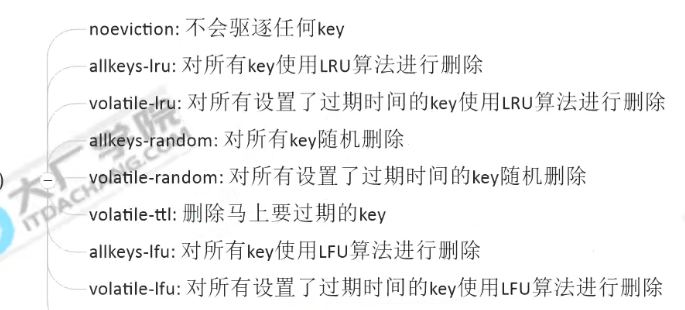

# Redis
[原理和使用](http://www.cnblogs.com/guozefeng/p/6907456.html)
* 简介
简单来说 Redis 就是一个数据库，不过与传统数据库不同的是 redis 的数据是存在内存中的，所以存写速度非常快，因此 redis 被广泛应用于缓存方向。另外，redis 也经常用来做分布式锁。redis 提供了多种数据类型来支持不同的业务场景。除此之外，redis 支持事务 、持久化、LUA脚本、LRU驱动事件、多种集群方案。
* Redis 与其他 key - value 缓存产品有以下三个特点
 1. Redis支持数据的持久化，可以将内存中的数据保存在磁盘中，重启的时候可以再次加载进行使用。 
 2. Redis不仅仅支持简单的key-value类型的数据，同时还提供string,list，set，sorted set(zset)，hash等数据结构的存储。
 3. Redis支持数据的备份，即master-slave模式的数据备份。

## Redis 为什么快？
Redis 的高性能得益于以下几个基础：
- C 语言实现，虽然 C 对 Redis 的性能有助力，但语言并不是最核心因素。
- 纯内存 I/O，相较于其他基于磁盘的 DB，Redis 的纯内存操作有着天然的性能优势。
- I/O 多路复用，基于 epoll/select/kqueue 等 I/O 多路复用技术，实现高吞吐的网络 I/O。
- 单线程模型，单线程无法利用多核，但是从另一个层面来说则避免了多线程频繁上下文切换，以及同步机制如锁带来的开销。
## 网络模型
  Redis是单线程+多路IO复用技术

  - Redis v4.0（引入多线程处理异步任务）
    Redis 在 v4.0 版本的时候就已经引入了的多线程来做一些异步操作，此举主要针对的是那些非常耗时的命令，通过将这些命令的执行进行异步化，避免阻塞单线程的事件循环。比如删除大对象key

  - Redis v6.0（正式在网络模型中实现 I/O 多线程）
    把读取客户端请求命令和回写响应数据的逻辑异步化了，交给 I/O 线程去完成。这里需要特别注意的一点是：I/O 线程仅仅是读取和解析客户端命令而不会真正去执行命令，客户端命令的执行最终还是要在主线程上完成。

    - 单线程事件循环
        [网络模型分析](https://segmentfault.com/a/1190000039223696)

       [Linux I/O 原理和 Zero-copy 技术全面揭秘](https://strikefreedom.top/linux-io-and-zero-copy)  

    - Redis V6.0之后实现多线程网络模型的设计方案总结：
       - 使用 I/O 线程实现网络 I/O 多线程化，I/O 线程只负责网络 I/O 和命令解析，不执行客户端命令。
       - 利用原子操作+交错访问实现无锁的多线程模型。
       - 通过设置 CPU 亲和性，隔离主进程和其他子进程，让多线程网络模型能发挥最大的性能。

## 结构特点
1. 所有的redis节点彼此互联(**PING-PONG机制**),内部使用二进制协议优化传输速度和带宽。
[PING-PONG](https://blog.csdn.net/Your__Highness/article/details/89420084)
2. 节点的fail是通过集群中超过半数的节点检测失效时才生效。
3. 客户端与redis节点直连,不需要中间proxy层.客户端不需要连接集群所有节点,连接集群中任何一个可用节点即可。
4. redis-cluster把所有的物理节点映射到[0-16383]slot上（不一定是平均分配）,cluster 负责维护node<->slot<->value。
5. Redis集群预分好16384个桶，当需要在 Redis 集群中放置一个 key-value 时，根据 CRC16(key) mod 16384的值，决定将一个key放到哪个桶中。

## 数据类型
- 1. 在 Redis 中，常用的 5 种数据结构和应用场景如下：
  - String：key,value数据类型；使用场景有：缓存（喜欢的文章）、计数器（商品编号，订单号）、分布式锁（setnx）等。
    添加元素：set key value
    获取元素：get key
    同时设置多个键值：MSET key value [key value ....]
    同时获取多个键值：MGET key value [key value ....]
    递增数字：INCR key
    增加指定的整数：INCRBY key increment
    递减数字：DECR key
    减少指定的整数：DECRBY key decrement
    获取字符串长度：STRLEN key
    
    分布式锁：setnx key value；set key value [EX seconds] [PX milliseconds] [NX|XX]

  - List：链表、队列、微博关注人时间轴列表、微信订阅公众号等。
    向列表左边添加元素：LPUSH key value [value ...]
    向列表右边添加元素：RPUSH key value [value ...]
    查看列表： LRANGE key start stop
    获取列表中元素的个数： LLEN key

  - Hash：是一个Map<key,map<object,object>>数据结构，保存用户信息，购物车信息、Hash 表等。
    一次设置一个字段值：HSET key field value
    一次获取一个字段值：HGET key field
    一次设置多个字段值：HMSET key field value [field value ...]
    一次获取多个字段值：HMGET key field [field ...]
    获取所有字段值：hgetall key
    获取某个key内的全部数量：hlen key
    删除一个key：hdel key
    集合运算：差集SDIFF、交集SINTER、并集SUNION

  - Set：抽奖小程序，朋友圈点赞和取消赞、共同好友（可能认识的人）等。
    添加元素：SADD key member[member...]
    删除元素：SREM key member[member...]
    获取集合中的所有元素：SMEMBERS key
    判断元素是否在集合中：SISMEMBER key member
    获取集合中的元素个数：SCARD key
    从集合中随机弹出一个元素，元素不删除：SRANDMEMBER key 【数字】
    从集合中随机弹出一个元素，出一个删除一个：SPOP key 【数字】
    集合运算：差集SDIFF、交集SINTER、并集SUNION

  - Zset：访问量排行榜、点击量排行榜、抖音热搜等。(超过128使用跳表)
    向有序集合中加入一个元素和该元素的分数
    添加元素：ZADD key score member[score member...]
    按照元素分数从小到大的顺序返回索引从start到stop之间的所有元素：ZRANGE key start stop [WITHSCORES]
    获取元素的分数： ZSCORE key member
    删除元素：ZREM key member [member ...]
    获取指定分数范围的元素: ZRANGEBYSCORE key min max [WITHSCORES] [LIMIT offset count]
    增加某个元素的分数：ZINCRBY key increment member
    获取集合中元素的数量：ZCARD KEY
    获取指定分数范围内的元素个数： ZCOUNT key min max
    按照排名范围删除元素：ZREMRANGEBYRANK key start stop
    获取元素的排名：ZRANK key member（从小到大）；ZREVRANK key member（从大到小）

    - 底层数据结构
      zset底层使用了两个数据结构
        1. hash：hash的作用关联元素value和权重score，保障元素的唯一性
        2. 跳跃表：给元素value排序，根据score范围获取元素列表
   
      有序集合对象的编码可以是ziplist或者skiplist。同时满足以下条件时使用ziplist编码：
        1. 元素数量小于128个
        2. 所有member的长度都小于64字节

  - 新增
    bitmaps：位图
    hyperloglogs：
    GEO：地理位置

## Redis 事务
* Redis 通过 MULTI、EXEC、WATCH 等命令来实现事务(transaction)功能。事务提供了一种将多个命令请求打包，然后一次性、按顺序地执行多个命令的机制，并且在事务执行期间，服务器不会中断事务而改去执行其他客户端的命令请求，它会将事务中的所有命令都执行完毕，然后才去处理其他客户端的命令请求。
* 在传统的关系式数据库中，常常用 ACID 性质来检验事务功能的可靠性和安全性。在 Redis 中，事务总是具有原子性（Atomicity)、一致性(Consistency)和隔离性（Isolation），并且当 Redis 运行在某种特定的持久化模式下时，事务也具有持久性（Durability）。

## redis key的hash生成方法
redis cluster在设计的时候，就考虑到了去中心化，去中间件，也就是说，集群中的每个节点都是平等的关系，都是对等的，每个节点都保存各自的数据和整个集群的状态。
每个节点都和其他所有节点连接，而且这些连接保持活跃，这样就保证了我们只需要连接集群中的任意一个节点，就可以获取到其他节点的数据。

Redis 集群没有并使用传统的一致性哈希来分配数据，而是采用另外一种叫做**哈希槽 (hash slot)**的方式来分配的。
redis cluster 默认分配了 **16384** 个slot，当我们set一个key 时，会用**CRC16算法**来取模得到所属的slot，然后将这个key 分到哈希槽区间的节点上，
具体算法就是：CRC16(key) % 16384。所以我们在测试的时候看到set 和 get 的时候，直接跳转到了7000端口的节点。

## 持久化方式RDB,AOF
[详解](https://www.cnblogs.com/itdragon/p/7906481.html)
* AOF(append only file): 会消耗一部分性能，但是可以提高缓存一致性。（Redis 默认是关闭 AOF 持久化的）
* RDB（redis database）: 提高频繁写性能，不启用备份来换取性能（可以通过save命令做备份）
* **混合持久化方式**，Redis 4.0 之后新增的方式，混合持久化是结合了 RDB 和 AOF 的优点，在写入的时候，先把当前的数据以 RDB 的形式写入文件的开头，再将后续的操作命令以 AOF 的格式存入文件，这样既能保证 Redis 重启时的速度，又能减低数据丢失的风险。

- 解决redis aof文件过大的问题 
执行BGREWRITEAOF命令对redis的AOF进行重写
:redis-cli BGREWRITEAOF

- AOF重写作用：
(1) 随着AOF文件越来越大，里面会有大部分是重复命令或者可以合并的命令（100次incr = set key 100）
(2) 重写的好处：减少AOF日志尺寸，减少内存占用，加快数据库恢复时间。

如果AOF和RDB同时开启，系统默认取AOF的数据（数据不会存在丢失），也会保存RDB文件

## 分布式锁

Redisson 的库使用

分布式锁：https://blog.csdn.net/hanchao5272/article/details/99695360
redlock：https://redis.io/topics/distlock

## Redis 内存调整

  - 内存默认不设置，64位系统不限制内存大小，32位系统最大3GB内存
  maxmemory参数： bytes
  info memory查看内存状态

  - 内存打满OOM
    OOM command not allowed when used memory 

  - 缓存淘汰策略
    缓存淘汰方法：
    

    - 定期删除策略
      每隔一段时间执行一次删除过期键操作，周期性轮询redis库中的时效性数据，采用**随机抽取**的策略，利用**过期数据占比**的方式控制删除频度。
    - 惰性删除

  - LRU：Least Recently Used：最近最少使用
    数据结构由hashmap + double linkedlist组成
    java使用LinkedHashMap实现LRU算法
  - LFU：Least Ferequently Used：最近最低使用频率

## 缓存问题解决方案
### 缓存雪崩
- 描述：
  缓存中数据大批量同一时间大面积的失效，所以，后面的请求都会落到数据库上，造成数据库短时间内承受大量请求而崩掉。(和**缓存击穿不同**的是，缓存击穿指并发查同一条数据，缓存雪崩是不同数据都过期了，很多数据都查不到从而查数据库。)
- 解决方案：
1. 缓存数据的过期时间设置随机，防止同一时间大量数据过期现象发生。
2. 如果缓存数据库是分布式部署，将热点数据均匀分布在不同得缓存数据库中。
3. 设置热点数据永远不过期。

事前：尽量保证整个 redis 集群的高可用性，发现机器宕机尽快补上。选择合适的内存淘汰策略。
事中：本地ehcache缓存 + hystrix限流&降级，避免MySQL崩掉
事后：利用 redis 持久化机制保存的数据尽快恢复缓存

### 缓存穿透
- 描述：
  缓存穿透是指缓存和数据库中都没有的数据，而用户不断发起请求，如发起为id为“-1”的数据或id为特别大不存在的数据。这时的用户很可能是攻击者，攻击会导致数据库压力过大。
- 解决方案：
  1. 接口层增加校验，如用户鉴权校验，id做基础校验，id<=0的直接拦截；
  2. 从缓存取不到的数据，在数据库中也没有取到，这时也可以将key-value对写为key-null，缓存有效时间可以设置短点，如30秒（设置太长会导致正常情况也没法使用）。这样可以防止攻击用户反复用同一个id暴力攻击
  3. 可以考虑采用**布隆过滤器**，将所有可能存在的数据哈希到一个足够大的bitmap中，一个一定不存在的数据会被 这个bitmap拦截掉，从而避免了对底层存储系统的查询压力。
BloomFilter--算法

### 缓存击穿
- 描述:
  缓存击穿是指缓存中没有**但数据库中有**的数据（一般是缓存时间到期），这时由于并发用户特别多，同时读缓存没读到数据，又同时去数据库去取数据，引起数据库压力瞬间增大，造成过大压力
- 解决方案： 
1. 设置常用热点数据的key长期有效；
2. 业务加互斥锁(mutex key)-会降低业务性能；
3. 对key操作加锁-SETNX(set if not exists);

## Redis 和 Memcached 的区别
对于 redis 和 memcached 我总结了下面四点。现在公司一般都是用 redis 来实现缓存，而且 redis 自身也越来越强大了！
1. redis支持更丰富的数据类型（支持更复杂的应用场景）：Redis不仅仅支持简单的k/v类型的数据，同时还提供list，set，zset，hash等数据结构的存储。memcached支持简单的数据类型，String。
2. Redis支持数据的持久化，可以将内存中的数据保持在磁盘中，重启的时候可以再次加载进行使用,而Memecache把数据全部存在内存之中。
3. 集群模式：memcached没有原生的集群模式，需要依靠客户端来实现往集群中分片写入数据；但是 redis 目前是原生支持 cluster 模式的.
4. **Memcached是多线程，非阻塞IO复用的网络模型；Redis使用单线程的多路 IO 复用模型。**

参考：
Java工程师面试突击第1季（可能是史上最好的Java面试突击课程）-中华石杉老师。视频地址见下面！ 
链接： https://pan.baidu.com/s/18pp6g1xKVGCfUATf_nMrOA
密码：5i58

## Redis性能如此高的原因，我总结了如下几点：
1. 纯内存操作--内存读写速度非常快
2. 单线程---减少线程的上下文切换耗时，也不需要考虑锁的问题（加锁，释放锁，死锁等），优化可以使用多进程（redis实例）
3. 使用网络IO多路复用技术-epoll（多路-指的是多个socket连接，复用指的是复用同一个线程）
4. 高效的数据结构--hash ，压缩表，跳表等
5. 合理的数据编码--SDS
其他方面的优化
Redis: 单线程模型、I/O多路复用、影响性能的因素: https://blog.csdn.net/hanchao5272/article/details/99690691

1. SDS-数据编码
Redis 是用 C 语言开发完成的，但在 Redis 字符串中，并没有使用 C 语言中的字符串，而是用一种称为 SDS（Simple Dynamic String）的结构体来保存字符串。

redis为什么快：https://www.sohu.com/a/295050863_463994?sec=wd
