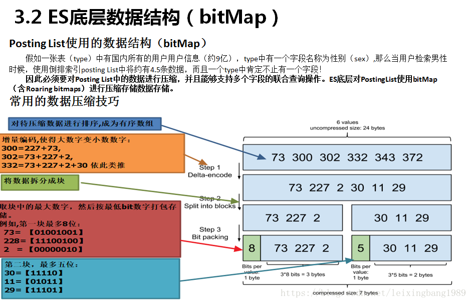

# Elasticsearch
## 介绍
* Elasticsearch 是一个分布式可扩展的实时搜索和分析引擎,一个建立在全文搜索引擎 Apache Lucene(TM) 基础上的搜索引擎.当然 Elasticsearch 并不仅仅是 Lucene 那么简单，它不仅包括了全文搜索功能，还可以进行以下工作:
1. 分布式实时文件存储，并将每一个字段都编入索引，使其可以被搜索。
2. 实时分析的分布式搜索引擎。
3. 可以扩展到上百台服务器，处理PB级别的结构化或非结构化数据。
## 索引
term index-> term dictionary -> posting list

1. Posting List
Elasticsearch分别为每个field都建立了一个倒排索引，Kate, John, 24, Female这些叫term，而[1,2]就是Posting List。Posting list就是一个int的数组，存储了所有符合某个term的文档id。

2. Term Dictionary
Elasticsearch为了能快速找到某个term，将所有的term排个序，二分法查找term，logN的查找效率，就像通过字典查找一样，这就是Term Dictionary。现在再看起来，似乎和传统数据库通过B-Tree的方式类似啊，为什么说比B-Tree的查询快呢？
3. Term Index
B-Tree通过减少磁盘寻道次数来提高查询性能，Elasticsearch也是采用同样的思路，直接通过内存查找term，不读磁盘，但是如果term太多，term dictionary也会很大，放内存不现实，于是有了Term Index，就像字典里的索引页一样，A开头的有哪些term，分别在哪页，可以理解term index是一颗树(**teri tree**)：这棵树不会包含所有的term，它包含的是term的一些前缀。通过term index可以快速地定位到term dictionary的某个offset，然后从这个位置再往后顺序查找。
所以term index不需要存下所有的term，而仅仅是他们的一些*前缀与Term Dictionary的block之间的映射关系*，再结合FST(Finite State Transducers)的压缩技术，可以使term index缓存到内存中。从term index查到对应的term dictionary的block位置之后，再去磁盘上找term，大大减少了磁盘随机读的次数。

* FST:finite state transducers:有穷状态转换器-压缩term index
* Frame Of Reference：增量编码压缩，将大数变小数，按字节存储-压缩posting list

* Bitmap是一种数据结构，假设有某个posting list：
[1,3,4,7,10]
对应的bitmap就是：
[1,0,1,1,0,0,1,0,0,1]
非常直观，用0/1表示某个值是否存在，比如10这个值就对应第10位，对应的bit值是1，这样用一个字节就可以代表8个文档id，旧版本(5.0之前)的Lucene就是用这样的方式来压缩的，但这样的压缩方式仍然不够高效，如果有1亿个文档，那么需要12.5MB的存储空间，这仅仅是对应一个索引字段(我们往往会有很多个索引字段)。于是有人想出了Roaring bitmaps这样更高效的数据结构。

Bitmap的缺点是存储空间随着文档个数线性增长，Roaring bitmaps需要打破这个魔咒就一定要用到某些指数特性：
* Roaring bitmaps
将posting list按照65535为界限分块，比如第一块所包含的文档id范围在0~65535之间，第二块的id范围是65536~131071，以此类推。再用*<商，余数>*的组合表示每一组id，这样每组里的id范围都在0~65535内了，剩下的就好办了，既然每组id不会变得无限大，那么我们就可以通过最有效的方式对这里的id存储。

"为什么是以65535为界限?"
程序员的世界里除了1024外，65535也是一个经典值，因为它=2^16-1，正好是用2个字节能表示的最大数，一个short的存储单位，注意“If a block has more than 4096 values, encode as a bit set, and otherwise as a simple array using 2 bytes per value”，如果是大块，用节省点用bitset存，小块就豪爽点，2个字节我也不计较了，用一个short[]存着方便。
那为什么用4096来区分大块还是小块呢？
个人理解：都说程序员的世界是二进制的，4096*2bytes ＝ 8192bytes 在NTFS文件系统下是两个扇区，即一个簇。

 [参考](https://www.cnblogs.com/dreamroute/p/8484457.html)

>> 扇区：**硬盘**不是一次读写一个字节而是一次读写一个扇区（512个字节）
>> 簇：**系统读读写文件的基本单位**，一般为2的n次方个扇区(由文件系统决定)
>> 块可以包含若干页，页可以包含若干簇，簇可以包含若干扇区

>> 从应用程序包括用户界面的角度来看，存取信息的最小单位是Byte（字节）；
从磁盘的物理结构来看存取信息的最小单位是扇区，一个扇区是512字节；
从操作系统对硬盘的存取管理来看，存取信息的最小单位是簇，簇是一个逻辑概念，一个簇可以是2、4、8、16、32或64个连续的扇区。一个簇只能被一个文件占用，哪怕是只有1个字节的文件，在磁盘上存储时也要占用一个簇，这个簇里剩下的扇区是无用的。例如用*NTFS文件系统格式化的时候默认是8个扇区组成一个簇，即4096字节*。所以你如果保存了一个只有1字节的文件（例如字母N），它在磁盘上实际也要占用4096字节（4K），**所以"簇"也可以理解为磁盘存取信息(寻址)的最小单位**。 

## 评分
### 布尔模型
* 布尔模型（Boolean Model） 只是在查询中使用 AND 、 OR 和 NOT （与、或和非）这样的条件来查找匹配的文档，以下查询：
full AND text AND search AND (elasticsearch OR lucene)
会将所有包括词 full 、 text 和 search ，以及 elasticsearch 或 lucene 的文档作为结果集。
这个过程简单且快速，它将所有可能不匹配的文档排除在外。

### 词频/逆向文档频率(TF/IDF)-默认
词的权重由三个因素决定
1. 检索词频率-term frequency
检索词在该字段出现的频率？出现频率越高，相关性也越高。 字段中出现过 5 次要比只出现过 1 次的相关性高。 
2. 反向文档频率-inverse document frequency
每个检索词在索引中出现的频率？频率越高，相关性越低。检索词出现在多数文档中会比出现在少数文档中的权重更低。 
3. 字段长度准则-field-length norm
字段的长度是多少？长度越长，相关性越低。 检索词出现在一个短的 title 要比同样的词出现在一个长的 content 字段权重更大。 
### 向量空间模型
向量空间模型（vector space model） 提供一种比较**多词查询**的方式，单个评分代表文档与查询的匹配程度。

## 总结和思考
Elasticsearch的索引思路:
将磁盘里的东西尽量搬进内存，减少磁盘随机读取次数(同时也利用磁盘顺序读特性)，结合各种奇技淫巧的压缩算法，用及其苛刻的态度使用内存。
所以，对于使用Elasticsearch进行索引时需要注意:
1. 不需要索引的字段，一定要明确定义出来，因为默认是自动建索引的
2. 同样的道理，对于String类型的字段，不需要analysis的也需要明确定义出来，因为默认也是会analysis的
3. 选择有规律的ID很重要，随机性太大的ID(比如java的UUID)不利于查询
* 检索优化点思考借鉴：
上面看到的压缩算法，都是对Posting list里的大量ID进行压缩的，那如果ID是顺序的，或者是有公共前缀等具有一定规律性的ID，压缩比会比较高；
另外一个因素: 可能是最影响查询性能的，应该是最后通过Posting list里的ID到磁盘中查找Document信息的那步，因为Elasticsearch是分Segment存储的，根据ID这个大范围的Term定位到Segment的效率直接影响了最后查询的性能，如果*ID是有规律*的，可以快速跳过不包含该ID的Segment，从而减少不必要的磁盘读次数，

# Kafka
详解：http://www.cnblogs.com/likehua/p/3999538.html
事务：https://www.zybuluo.com/tinadu/note/949867
1. 为什么使用消息队列？
解耦，异步，削峰（避免大数据量造成系统宕机）

2. Zookeeper在kafka中作用
 1.broker注册；2.topic注册；3.生产者负载均衡；4.消费者信息；5.消费者和分区关系；6.消费者负载均衡；7.消费者offset提交（high level api）
3. 多分区的设计的特点： 
  * 1 为了并发读写，加快读写速度； 
  * 2 是利用多分区的存储，利于数据的均衡； 
  * 3 是为了加快数据的恢复速率，一但某台机器挂了，整个集群只需要恢复一部分数据，可加快故障恢复的时间。

## Kafka快速写：
1. 以顺序追加的方式向各个分区中写入消息-消息顺序写入磁盘。
2. 同时，KAFKA采用了MMAP(Memory Mapped Files，内存映射文件)技术-利用操作系统的页缓存来实现文件到物理内存的直接映射。完成映射之后对物理内存的操作在适当时候会被同步到硬盘上。
## Kafka快速读：
1. 零拷贝-在Linux中，是通过sendfile系统调用来完成的。Java提供了访问这个系统调用的方法：FileChannel.transferTo API。
Kafka使用sendfile，只需要一次拷贝就行：允许操作系统将数据直接从页缓存发送到网络上。所以在这个优化的路径中，只有最后一步将数据拷贝到网卡缓存中是需要的。这种页缓存和sendfile组合，意味着KAFKA集群的消费者大多数都完全从缓存消费消息，而磁盘没有任何读取活动

## ack典型的值： 
* 0： 表示Producer从来不等待来自broker的确认信息。  这个选择提供了最小的时延但同时风险最大（因为当server宕机时，数据将会丢失）。 
* 1：表示获得Leader replica已经接收了数据的确认信息。  这个选择时延较小同时确保了server确认接收成功。 
* -1：Producer会获得所有同步replicas都收到数据的确认。  同时时延最大，然而，这种方式并没有完全消除丢失消息的风险，因为同步replicas的数量可能是1。如果你想确保某些replicas接收到数据，那么你应该在Topic-level设置中选项min.insync.replicas设置一下。

仅设置 acks= -1 也不能保证数据不丢失,当ISR列表中只有Leader时,同样有可能造成数据丢失。要保证数据不丢除了设置acks=-1，还要保证ISR的大小大于等于2。
▪具体参数设置： 
request.required.acks:设置为-1 等待所有ISR列表中的Replica接收到消息后采算写成功。 
min.insync.replicas: 设置为>=2,保证ISR中至少两个Replica。 
.kafka支持Gzip/snappy等多种压缩方式

## Exactly Once方案-自己保持offset
官方文档提供方案
1. 使用关系数据库，通过事务存取，如果consumer挂了，重启，消息也不会重复消费;
2. 搜索引擎：把offset和数据一起，建在索引里
tips:在消费端"Exactly Once"前提下，即使生产端有"重复发送"，也可以通过DB的offset判重来实现producer+consumer的"Exactly Once".
**自己保存offset前提条件是**
Configure enable.auto.commit=false   //禁用自动ack
Use the offset provided with each ConsumerRecord to save your position. //每次取到消息，把对应的offset存下来
On restart restore the position of the consumer using seek(TopicPartition, long).//下次重启，通过consumer.seek函数，定位到自己保存的offset，从那开始消费

# ZOOKEEPER
## 简介

   ZooKeeper 是一个典型的分布式**数据一致性**解决方案，分布式应用程序可以基于 ZooKeeper 实现诸如*数据发布/订阅、负载均衡、命名服务、分布式协调/通知、集群管理、Master 选举、分布式锁和分布式队列*等功能。
## 应用场景
   1. Zookeeper 一个最常用的使用场景就是用于担任服务生产者和服务消费者的**注册中心**
## 重要概念
1. ZooKeeper 本身就是一个分布式程序（只要半数以上节点存活，ZooKeeper 就能正常服务）。
为了保证高可用，最好是以集群形态来部署 ZooKeeper，这样只要集群中大部分机器是可用的（能够容忍一定的机器故障），那么 ZooKeeper 本身仍然是可用的。
2. ZooKeeper 将数据保存在内存中，这也就保证了 高吞吐量和低延迟（但是内存限制了能够存储的容量不太大，此限制也是保持znode中存储的数据量较小的进一步原因）。
ZooKeeper 是高性能的。 在“读”多于“写”的应用程序中尤其地高性能，因为“写”会导致所有的服务器间同步状态。（“读”多于“写”是协调服务的典型场景。）
3. ZooKeeper有临时节点的概念。 *当创建临时节点的客户端会话一直保持活动，瞬时节点就一直存在。而当会话终结时，瞬时节点被删除。持久节点是指一旦这个ZNode被创建了，除非主动进行ZNode的移除操作，否则这个ZNode将一直保存在Zookeeper上。*
4. ZooKeeper 底层其实只提供了两个功能：1 管理（存储、读取）用户程序提交的数据；2 为用户程序提供数据节点监听服务。
## 特点
1. 顺序一致性： 从同一客户端发起的事务请求，最终将会严格地按照顺序被应用到 ZooKeeper 中去。
2. 原子性： 所有事务请求的处理结果在整个集群中所有机器上的应用情况是一致的，也就是说，要么整个集群中所有的机器都成功应用了某一个事务，要么都没有应用。
3. 单一系统映像 ： 无论客户端连到哪一个 ZooKeeper 服务器上，其看到的服务端数据模型都是一致的。
4. 可靠性： 一旦一次更改请求被应用，更改的结果就会被持久化，直到被下一次更改覆盖。

Zookeeper一致性原理：http://blog.51cto.com/welcomeweb/2103292?utm_source=oschina-app
fastleaderelection： http://www.jasongj.com/zookeeper/fastleaderelection/
总结
    由于使用主从复制模式，所有的写操作都要由Leader主导完成，而读操作可通过任意节点完成，因此Zookeeper读性能远好于写性能，更适合读多写少的场景
    虽然使用主从复制模式，同一时间只有一个Leader，但是Failover机制保证了集群不存在单点失败（SPOF）的问题
    ZAB协议保证了Failover过程中的数据一致性
    服务器收到数据后先写本地文件再进行处理，保证了数据的持久性
