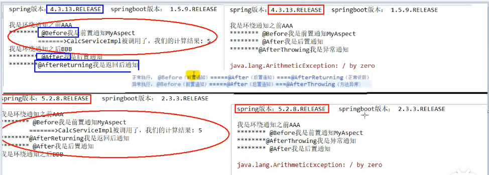
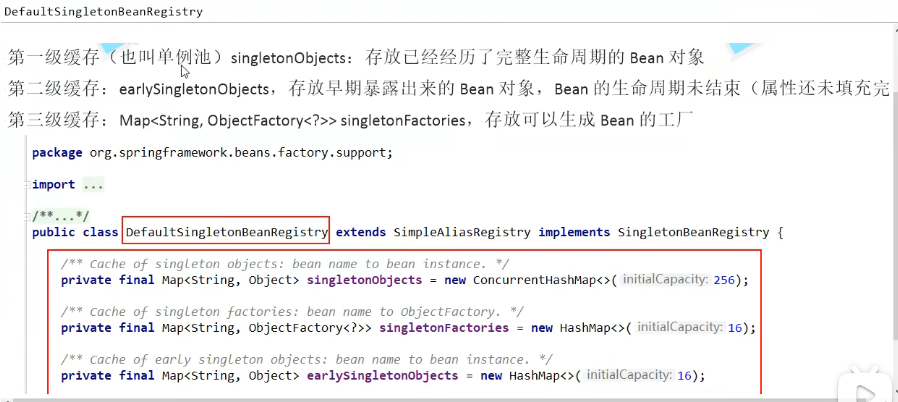

# Spring是什么？
轻量级的开源J2EE框架。他是一个容器框架。

Spring是一个轻量级的控制反转（IOC）和面向切面（AOP）的容器框架。
## Spring 的AOP
由代理实现
代理--todo

业务场景：事务，日志，安全验证

### AOP常见注解
@Before 前置通知：目标方法之前执行
@After 后置通知：目标方法之后执行（始终执行）
@AfterReturing 返回后通知：执行方法结束前执行（异常不执行）
@AfterThrowing 异常通知：出现异常时执行
@Around 环绕通知：环绕目标方法执行

- 注解执行顺序
Spring4----》Spring5 AOP执行顺序发生了变化,也就是SpringBoot1----》SpringBoot2

- Spring4 执行顺序
正常执行顺序：Before==>After==>AfterReturning
异常执行顺序: Before==>After==>AfterThrowing

- Spring5 执行顺序
正常执行顺序：Before==>AfterReturning==>After
异常执行顺序: Before==>AfterThrowing==>After

## Spring的IOC
IOC是个容器（ApplicationContext容器）：控制反转，依赖注入
- IOC容器
实际上就是个Map，里面存的是各种对象，根据全限定类名使用反射创建对象放到map里。在代码里需要使用对象时，通过ID注入（autowired,resource等注解，会根据类型或者name（对象名）注入）。

- 控制反转
对象A获取依赖对象B的过程，由主动行为变成了被动行为，控制权颠倒过来了，这就是“控制反转”这个名称的由来。

- 依赖注入
“获得依赖对象的过程被反转了”。控制被反转之后，获得依赖对象的过程由自身管理变为了由IOC容器主动注入。依赖注入是实现IOC的方法，就是由IOC容器在运行期间，动态地将某种依赖关系注入到对象之中。

## Spring 启动过程ApplicationContext

## Spring的循环依赖
Spring支持构造方法注入和Setter方法注入，默认单例（Singleton）的场景是支持循环依赖的，不报错；但是原型（Prototype）的场景是不支持循环依赖的，会报错。

在使用构造方法注入时，会出现循环依赖：解决方法，通过Setter方法注入可以避免循环依赖产生

- 结论
Spring内部通过3级缓存来解决循环依赖--DefaultSingletonBeanRegistry

## Spring的父子容器（基于ApplicationContext容器扩展）
- **为什么需要父子容器？**
- 父子容器的主要作用应该是划分框架边界。有点单一职责的味道。在J2EE三层架构中，在service层我们一般使用spring框架来管理， 而在web层则有多种选择，如spring mvc、struts等。因此，通常对于web层我们会使用单独的配置文件。
- **是否可以把所有类都通过Spring父容器来管理？（Spring的applicationContext.xml中配置全局扫描)所有的类都通过父容器来管理的配置，然后在SpringMvc的配置里面不配置扫描包路径**
很显然这种方式是行不通的，这样会导致我们请求接口的时候产生404。因为在解析@ReqestMapping注解的过程中initHandlerMethods()函数只是对Spring MVC 容器中的bean进行处理的，并没有去查找父容器的bean， 因此不会对父容器中含有@RequestMapping注解的函数进行处理，更不会生成相应的handler。所以当请求过来时找不到处理的handler，导致404。
- **是否可以把我们所需的类都放入Spring-mvc子容器里面来管理（springmvc的spring-servlet.xml中配置全局扫描）?**
这个是把包的扫描配置spring-servlet.xml中这个是可行的。为什么可行因为无非就是把所有的东西全部交给子容器来管理了，子容器执行了refresh方法，把在它的配置文件里面的东西全部加载管理起来来了。虽然可以这么做不过一般应该是不推荐这么去做的，一般人也不会这么干的。如果你的项目里有用到事务、或者AOP记得也需要把这部分配置需要放到Spring-mvc子容器的配置文件来，不然一部分内容在子容器和一部分内容在父容器,可能就会导致你的事务或者AOP不生效。（这里不就有个经典的八股文吗？你有遇到事物不起作用的时候，其实这也是一种情况）
- **同时通过两个容器同时来管理所有的类？**
这个问题应该是比较好回答了，肯定不会通过这种方式来的，先不说会不会引发其他问题，首先两个容器里面都放一份一样的对象，造成了内存浪费。再者的话子容器会覆盖父容器加载，本来可能父容器配置了事物生成的是代理对象，但是被子容器一覆盖，又成了原生对象。这就导致了你的事务不起作用了。

- **SpringBoot 里面是否还有父子容器？**
Spring Boot默认没有父子级容器

# Spring Boot

## Spring Boot启动过程
- 创建SpringApplication
  - 保存一些信息
  - 判断当前应用的类型：ClassUtils-->Servlet
  - Bootstrappers：初始启动引导器（List<Bootstrapper>）:去spring.factories文件中找org.springframewokr.boot.Bootstrapper
  - 找ApplicationContextInitializer:去spring.factories文件中找ApplicationContextInitializer
     - List<ApplicationContextInitializer<?>> Initializers
  - 找ApplicationListener：应用监听器，去spring.factories文件中找ApplicationListener
     - List<ApplicationListener<?>> Listeners
- 运行SpringApplication
  - StopWatch
  - 记录应用的启动时间
  - 创建引导上下文（Context环境）createBootstrapContext()
    - 获取到所有之前的bootstrappers挨个执行 initialize（）来完成对引导启动器上下文环境设置
  - 让当前应用进入headless模式。java.awt.headless
  - 获取所有RunListener（运行监听器）【为了方便所有Listener进行事件感知】
    - getSpringFatoriesInstances 去spring.factories找SpringApplicationRunListener
    - 遍历SpringApplicationRunListener调用starting方法：相当于通知所有感兴趣系统正在启动过程的人，项目正在starting
  - 保存命令行参数：ApplicationArguments
  - 准备环境 prepareEnviroment
    - 返回或者创建基础环境信息对象：StandardServletEnviroment
    - 配置环境信息对象
      - 读取所有的配置源的配置属性值
    - 绑定环境信息
    - 监听器调用 listener.enviromentPrepared();通知所有的监听器当前环境准备完成
  - 创建IOC容器（createApplicationContext()）
    - 根据项目类型（Servlet）创建容器
    - 当前会创建AnnotationConfigServletWebServerApplicationContext
  - 准备ApplicationContext IOC容器的基本信息 prepareContext（）
    - 保存环境信息
    - IOC容器的后置流程处理
    - 应用初始化容器：applyInitializers
      - 遍历所有的ApplicationContextInitializer，调用initialize，来对IOC容器进行初始化扩展功能
      - 遍历所有的listener调用contextPrepared。EventPublishRunListener，通知所有的监听器contextPrepared
    - 所有的监听器调用contextLoaded。通知所有的监听器contextLoaded
  - 刷新IOC容器， refreshContext
    - 创建容器中的所有组件（参考Spring注解部分）
  - 容器刷新完成后工作--afterRefresh
  - 所有监听器调用listeners.started(context),通知所有的监听器started
  - 调用所有runners；callRunners（）
    - 获取容器中的ApplicationRunner
    - 获取容器中的CommandLineRunner
    - 合并所有runner并且按照@Order进行排序
    - 遍历所有的runner，调用run方法
  - 如果以上有异常
    - 调用listener的failed
  - 调用所有监听器的running方法listeners.running(context)，通知所有的监听器running
  - running如果有问题，继续通知failed，调用所有listener的failed，通知所有的监听器failed
## Spring Boot注解及其实现
- 1. @SpringBootApplication注解：这个注解标识了⼀个SpringBoot⼯程，它实际上是另外三个注解的组
合，这三个注解是：
a. @SpringBootConfiguration：这个注解实际就是⼀个@Configuration，表示启动类也是⼀个配
置类
b. @EnableAutoConfiguration：向Spring容器中导⼊了⼀个Selector，⽤来加载ClassPath下
SpringFactories中所定义的⾃动配置类，将这些⾃动加载为配置Bean
c. @ComponentScan：标识扫描路径，因为默认是没有配置实际扫描路径，所以SpringBoot扫描的
路径是启动类所在的当前⽬录
- 2. @Bean注解：⽤来定义Bean，类似于XML中的<bean>标签，Spring在启动时，会对加了@Bean注解
的⽅法进⾏解析，将⽅法的名字做为beanName，并通过执⾏⽅法得到bean对象
- 3. @Controller、@Service、@ResponseBody、@Autowired等等

# Spring Cloud
Spring Cloud是⼀个微服务框架，提供了微服务领域中的很多功能组件，Dubbo⼀开始是⼀个RPC调⽤框
架，核⼼是解决服务调⽤间的问题，Spring Cloud是⼀个⼤⽽全的框架，Dubbo则更侧重于服务调⽤，所
以Dubbo所提供的功能没有Spring Cloud全⾯，但是Dubbo的服务调⽤性能⽐Spring Cloud⾼，不过
Spring Cloud和Dubbo并不是对⽴的，是可以结合起来⼀起使⽤的。