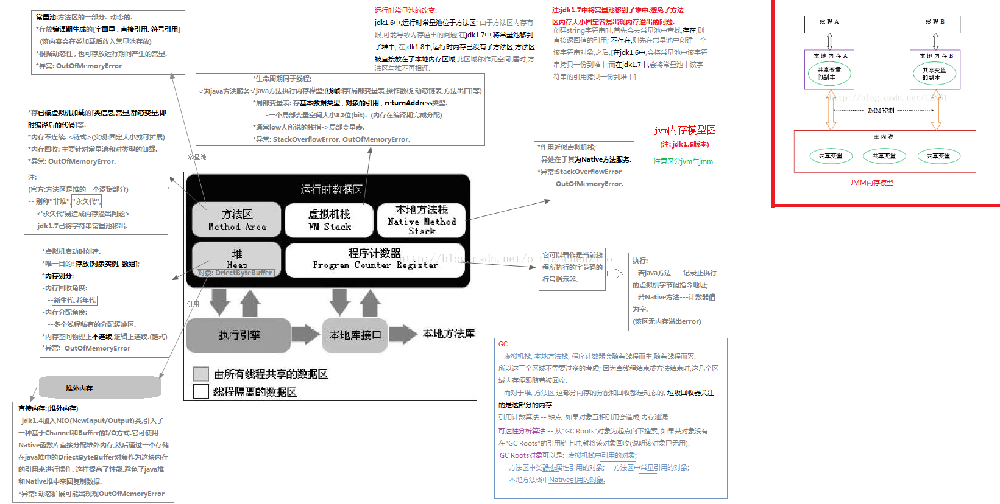
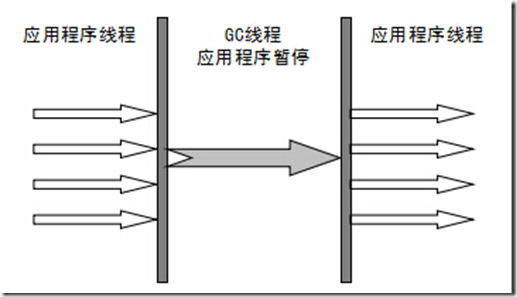
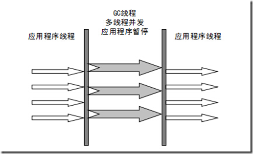
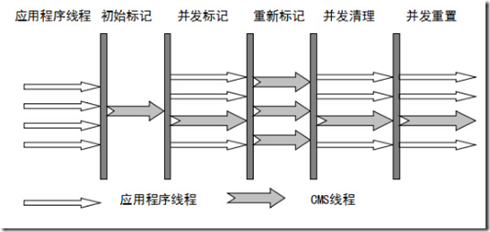
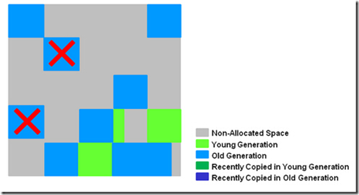

- [JVM内存结构](#jvm%E5%86%85%E5%AD%98%E7%BB%93%E6%9E%84)
  - [JVM运行态数据分区(内存结构)](#jvm%E8%BF%90%E8%A1%8C%E6%80%81%E6%95%B0%E6%8D%AE%E5%88%86%E5%8C%BA%E5%86%85%E5%AD%98%E7%BB%93%E6%9E%84)
  - [Java内存模型(JMM:Java Memory Model)](#java%E5%86%85%E5%AD%98%E6%A8%A1%E5%9E%8Bjmmjava-memory-model)
  - [Java对象模型](#java%E5%AF%B9%E8%B1%A1%E6%A8%A1%E5%9E%8B)
- [GC算法](#gc%E7%AE%97%E6%B3%95)
  - [对象存活判断](#%E5%AF%B9%E8%B1%A1%E5%AD%98%E6%B4%BB%E5%88%A4%E6%96%AD)
  - [垃圾收集算法](#%E5%9E%83%E5%9C%BE%E6%94%B6%E9%9B%86%E7%AE%97%E6%B3%95)
    - [标记-清除算法(Mark-Sweep)](#%E6%A0%87%E8%AE%B0-%E6%B8%85%E9%99%A4%E7%AE%97%E6%B3%95mark-sweep)
    - [复制算法(Copying)](#%E5%A4%8D%E5%88%B6%E7%AE%97%E6%B3%95copying)
    - [标记-压缩算法(Mark-Compact)](#%E6%A0%87%E8%AE%B0-%E5%8E%8B%E7%BC%A9%E7%AE%97%E6%B3%95mark-compact)
    - [分代收集算法(Generational Collection)](#%E5%88%86%E4%BB%A3%E6%94%B6%E9%9B%86%E7%AE%97%E6%B3%95generational-collection)
  - [垃圾收集器](#%E5%9E%83%E5%9C%BE%E6%94%B6%E9%9B%86%E5%99%A8)
    - [Serial收集器:串行收集器](#serial%E6%94%B6%E9%9B%86%E5%99%A8%E4%B8%B2%E8%A1%8C%E6%94%B6%E9%9B%86%E5%99%A8)
    - [ParNew收集器](#parnew%E6%94%B6%E9%9B%86%E5%99%A8)
    - [Parallel收集器-并行收集器](#parallel%E6%94%B6%E9%9B%86%E5%99%A8-%E5%B9%B6%E8%A1%8C%E6%94%B6%E9%9B%86%E5%99%A8)
    - [Parallel Old 收集器](#parallel-old-%E6%94%B6%E9%9B%86%E5%99%A8)
    - [CMS收集器(Concurrent Mark Sweep):并发标记-整理算法--**老年代收集器**（新生代使用ParNew）](#cms%E6%94%B6%E9%9B%86%E5%99%A8concurrent-mark-sweep%E5%B9%B6%E5%8F%91%E6%A0%87%E8%AE%B0-%E6%95%B4%E7%90%86%E7%AE%97%E6%B3%95--%E8%80%81%E5%B9%B4%E4%BB%A3%E6%94%B6%E9%9B%86%E5%99%A8%E6%96%B0%E7%94%9F%E4%BB%A3%E4%BD%BF%E7%94%A8parnew)
    - [G1收集器:(Garbage First Collector)](#g1%E6%94%B6%E9%9B%86%E5%99%A8garbage-first-collector)
    - [Minor GC ，FullGC 触发条件](#minor-gc-fullgc-%E8%A7%A6%E5%8F%91%E6%9D%A1%E4%BB%B6)
- [类加载机制](#%E7%B1%BB%E5%8A%A0%E8%BD%BD%E6%9C%BA%E5%88%B6)
  - ["双亲委派"机制介绍](#%22%E5%8F%8C%E4%BA%B2%E5%A7%94%E6%B4%BE%22%E6%9C%BA%E5%88%B6%E4%BB%8B%E7%BB%8D)
- [服务响应慢的处理方式：](#%E6%9C%8D%E5%8A%A1%E5%93%8D%E5%BA%94%E6%85%A2%E7%9A%84%E5%A4%84%E7%90%86%E6%96%B9%E5%BC%8F)
- [虚拟机性能监控和故障处理](#%E8%99%9A%E6%8B%9F%E6%9C%BA%E6%80%A7%E8%83%BD%E7%9B%91%E6%8E%A7%E5%92%8C%E6%95%85%E9%9A%9C%E5%A4%84%E7%90%86)
# JVM内存结构
## JVM运行态数据分区(内存结构)

d

[详解](https://www.cnblogs.com/dingyingsi/p/3760447.html)
[元空间详解](https://blog.csdn.net/zhushuai1221/article/details/52122880)

## Java内存模型(JMM:Java Memory Model)

>> JMM并不像JVM内存结构一样是真实存在的。他只是一个抽象的概念。JSR-133: Java Memory Model and Thread Specification中描述了，**JMM是和多线程相关的**，他描述了一组规则或规范，这个规范定义了一个线程对共享变量的写入时对另一个线程是可见的。

- Java的多线程之间是通过共享内存进行通信的，而由于采用共享内存进行通信，在通信过程中会存在一系列如可见性、原子性、顺序性等问题，而JMM就是围绕着多线程通信以及与其相关的一系列特性而建立的模型。JMM定义了一些语法集，这些语法集映射到Java语言中就是volatile、synchronized等关键字。

## Java对象模型
>> Java是一种面向对象的语言，而Java对象在JVM中的存储也是有一定的结构的。而这个关于**Java对象自身的存储模型称之为Java对象模型**。
HotSpot虚拟机中，设计了一个OOP-Klass Model。OOP（Ordinary Object Pointer）指的是普通对象指针，而Klass用来描述对象实例的具体类型。
每一个Java类，在被JVM加载的时候，JVM会给这个类创建一个instanceKlass，保存在方法区，用来在JVM层表示该Java类。当我们在Java代码中，使用new创建一个对象的时候，JVM会创建一个instanceOopDesc对象，这个对象中包含了对象头以及实例数据,存储在堆区。

# GC算法
[参考](http://www.cnblogs.com/ityouknow/p/5614961.html)
>> 垃圾收集 Garbage Collection 通常被称为"GC".
   JVM 中，程序计数器、虚拟机栈、本地方法栈都是随线程而生随线程而灭，栈帧随着方法的进入和退出做入栈和出栈操作，实现了自动的内存清理，因此，我们的内存垃圾回收主要集中于**Java堆和方法区**中，在程序运行期间，这部分内存的分配和使用都是动态的

## 对象存活判断
判断对象是否存活一般有两种方式：
- ~~**引用计数**：每个对象有一个引用计数属性，新增一个引用时计数加1，引用释放时计数减1，计数为0时可以回收。此方法简单，*无法解决对象相互循环引用的问题*。~~
- **可达性分析(Reachability Analysis)**：从GC Roots开始向下搜索，搜索所走过的路径称为引用链。当一个对象到GC Roots没有任何引用链相连时，则证明此对象是不可用的。不可达对象。
>> 在Java语言中，**GC Roots**包括：
  虚拟机栈中引用的对象。
  方法区中类静态属性实体引用的对象。
  方法区中常量引用的对象。
  本地方法栈中JNI引用的对象。

## 垃圾收集算法

### 标记-清除算法(Mark-Sweep)
  算法分为“标记”和“清除”两个阶段：首先标记出所有需要回收的对象，在标记完成后统一回收掉所有被标记的对象。
  
  缺点:1. 效率不高，2. 标记清除之后会产生大量的**不连续的内存碎片**，空间碎片太多可能会导致频繁触发垃圾收集动作。

### 复制算法(Copying)
   它将可用内存按容量划分为大小相等的两块，每次只使用其中的一块。当这一块的内存用完了，就将还存活着的对象复制到另外一块上面，然后再把已使用过的内存空间一次清理掉。
   **复制算法适用于新生代**

   缺点：1. 复制收集算法在对象存活率较高时就要执行较多的复制操作，效率将会变低。2. 如果不想浪费50%的空间，就需要有额外的空间进行分配担保，以应对被使用的内存中所有对象都100%存活的极端情况，所以在老年代一般不能直接选用这种算法。 

### 标记-压缩算法(Mark-Compact)
   根据老年代的特点，提出“标记-整理”（Mark-Compact）算法，标记过程仍然与“标记-清除”算法一样，但后续步骤不是直接对可回收对象进行清理，而是让所有存活的对象都向一端移动，然后直接清理掉端边界以外的内存

### 分代收集算法(Generational Collection)
   GC分代的基本假设：绝大部分对象的生命周期都非常短暂，存活时间短。
>> “分代收集”（Generational Collection）算法，把Java堆分为新生代和老年代，这样就可以根据各个年代的特点采用最适当的收集算法。在新生代中，每次垃圾收集时都发现有大批对象死去，只有少量存活，那就选用复制算法，只需要付出少量存活对象的复制成本就可以完成收集。而老年代中因为对象存活率高、没有额外空间对它进行分配担保，就必须使用“标记-清理”或“标记-整理”算法来进行回收。

## 垃圾收集器
如果说收集算法是内存回收的方法论，垃圾收集器就是内存回收的具体实现

### Serial收集器:串行收集器

>> 串行收集器是最古老，最稳定以及效率高的收集器，可能会产生较长的停顿，只使用一个线程去回收。新生代、老年代使用**串行回收**；**新生代复制算法**、**老年代标记-压缩**；*垃圾收集的过程中会Stop The World（服务暂停）*
参数控制：-XX:+UseSerialGC  串行收集器

### ParNew收集器
>> ParNew收集器其实就是Serial收集器的多线程版本。**新生代并行，老年代串行**；**新生代复制算法、老年代标记-压缩**
参数控制：-XX:+UseParNewGC  ParNew收集器
-XX:ParallelGCThreads 限制线程数量

### Parallel收集器-并行收集器
>> Parallel Scavenge(PS)收集器类似ParNew收集器，Parallel收集器更**关注系统的吞吐量**。可以通过参数来打开**自适应调节策略**，虚拟机会根据当前系统的运行情况收集性能监控信息，动态调整这些参数以提供最合适的停顿时间或最大的吞吐量；也可以通过参数控制GC的时间不大于多少毫秒或者比例；**新生代复制算法、老年代标记-压缩**
参数控制：-XX:+UseParallelGC  使用Parallel收集器+ 老年代串行

**JDK8默认收集器查看**
命令：java -XX:+PrintCommandLineFlags -version
默认-XX：UseParallelGC -----  新生代（Parallel Scavenge），老年代（Ps MarkSweep）

### Parallel Old 收集器
>> Parallel Old是Parallel Scavenge收集器的**老年代版本，使用多线程和“标记－整理”算法**。这个收集器是在JDK 1.6中才开始提供
参数控制： -XX:+UseParallelOldGC 使用Parallel收集器+ 老年代并行

### CMS收集器(Concurrent Mark Sweep):并发标记-整理算法--**老年代收集器**（新生代使用ParNew）
>> CMS收集器是基于“标记-清除”算法实现的，它的运作过程相对于前面几种收集器来说要更复杂一些，整个过程分为4个步骤，包括： 

        初始标记（CMS initial mark）--- Stop The World
        并发标记（CMS concurrent mark） 
        重新标记（CMS remark）---Stop The World
        并发清除（CMS concurrent sweep） 
其中初始标记、重新标记这两个步骤仍然需要“Stop The World”。初始标记仅仅只是*标记一下GC Roots能直接关联到的对象*，速度很快，并发标记阶段就是进行GC Roots Tracing的过程，而重新标记阶段则是为了*修正并发标记期间*，因用户程序继续运作而导致标记产生变动的那一部分对象的标记记录，这个阶段的停顿时间一般会比初始标记阶段稍长一些，但远比并发标记的时间短。 

   优点:**并发收集、低停顿**  
   缺点：**产生大量空间碎片、并发阶段会降低吞吐量**
   参数控制：-XX:+UseConcMarkSweepGC  使用CMS收集器
             -XX:+ UseCMSCompactAtFullCollection Full GC后，进行一次碎片整理；整理过程是独占的，会引起停顿时间变长
            -XX:+CMSFullGCsBeforeCompaction  设置进行几次Full GC后，进行一次碎片整理
            -XX:ParallelCMSThreads  设定CMS的线程数量（一般情况约等于可用CPU数量）

### G1收集器:(Garbage First Collector)
>> 与CMS收集器相比G1收集器有以下特点：
1. **空间整合**，G1收集器采用标记-整理算法，不会产生内存空间碎片。分配大对象时不会因为无法找到连续空间而提前触发下一次GC。
2. **可预测停顿**，这是G1的另一大优势，降低停顿时间是G1和CMS的共同关注点，但G1除了追求低停顿外，还能建立可预测的停顿时间模型，能让使用者明确指定在一个长度为N毫秒的时间片段内，消耗在垃圾收集上的时间不得超过N毫秒，这几乎已经是实时Java（RTSJ）的垃圾收集器的特征了。

>> 使用G1收集器时，Java堆的内存布局与其他收集器有很大差别，它将整个Java堆划分为多个大小相等的独立区域（Region），虽然还保留有新生代和老年代的概念，但新生代和老年代不再是物理隔阂了，它们都是一部分（可以不连续）Region的集合。

- 收集步骤
1. **标记阶段**，首先初始标记(Initial-Mark),这个阶段是**停顿的(Stop the World Event)**，并且会触发一次普通Minor GC。对应GC log:GC pause (young) (inital-mark)
2. **Root Region Scanning**，程序运行过程中会回收survivor区(存活到老年代)，这一过程必须在young GC之前完成。
3. **Concurrent Marking**，在整个堆中进行并发标记(和应用程序并发执行)，此过程可能被young GC中断。在并发标记阶段，若发现区域对象中的所有对象都是垃圾，那个这个区域会被立即回收(图中打X)。同时，并发标记过程中，会计算每个区域的对象活性(区域中存活对象的比例)。

4. **Remark**, 再标记，会有**短暂停顿(STW)**。再标记阶段是用来收集 并发标记阶段 产生新的垃圾(并发阶段和应用程序一同运行)；G1中采用了比CMS更快的初始快照算法:snapshot-at-the-beginning (SATB)。
5. **Copy/Clean up**，多线程清除失活对象，**会有STW**。G1将回收区域的存活对象拷贝到新区域，清除Remember Sets，并发清空回收区域并把它返回到空闲区域链表中。
6. 复制/清除过程后。回收区域的活性对象已经被集中回收到深蓝色和深绿色区域。

### Minor GC ，FullGC 触发条件
- Minor GC触发条件：当Eden区满时，触发MinorGC。
- Full GC触发条件：
1. 调用System.gc时，系统建议执行Full GC，但是不必然执行
2. 老年代空间不足
3. 方法区空间不足
4. 通过Minor GC后进入老年代的平均大小**大于老年代的可用内存**
5. 由Eden区、From Space区向To Space区复制时，对象大小大于To Space可用内存，则把该对象转存到老年代，*且老年代的可用内存小于该对象大小*.

# 类加载机制
[详细参考java基础](./Java基础.md)

1. 装载(Load)：查找和加载Class(二进制)文件；
2. 链接(Link)：把类的二进制数据合并到JRE中；
        (a)校验：检查载入Class文件数据的正确性；
        (b)准备：给类的静态变量分配存储空间，并将其初始化为默认值；
        (c)解析：将类中的符号引用转成直接引用；
3. 初始化(Initialize)：对类的静态变量，静态代码块执行初始化操作
4. 使用
5. 卸载

## "双亲委派"机制介绍
JVM在加载类时默认采用的是双亲委派机制。通俗的讲，就是某个特定的类加载器在接到加载类的请求时，首先将加载任务委托给父加载器，依次递归，如果父加载器可以完成类加载任务，就成功返回；只有父加载器无法完成此加载任务时，才自己去加载。

　　

* 启动类加载器：Bootstrap ClassLoader，负责加载存放在JDK\jre\lib(JDK代表JDK的安装目录，下同)下，或被-Xbootclasspath参数指定的路径中的，并且能被虚拟机识别的类库（如rt.jar，所有的java.*开头的类均被Bootstrap ClassLoader加载）。启动类加载器是无法被Java程序直接引用的。
* 扩展类加载器：Extension ClassLoader，该加载器由sun.misc.Launcher$ExtClassLoader实现，它负责加载DK\jre\lib\ext目录中，或者由java.ext.dirs系统变量指定的路径中的所有类库（如javax.*开头的类），开发者可以直接使用扩展类加载器。
* 应用程序类加载器：Application ClassLoader，该类加载器由sun.misc.Launcher$AppClassLoader来实现，它负责加载用户类路径（ClassPath）所指定的类，开发者可以直接使用该类加载器，如果应用程序中没有自定义过自己的类加载器，一般情况下这个就是程序中默认的类加载器。
* 用户自定义类加载器：User ClassLoader，属于应用程序根据自身需要自定义的ClassLoader，如tomcat、jboss都会根据j2ee规范自行实现ClassLoader(继承该类)，加载过程中会先检查类是否被已加载，检查顺序是自底向上，从User ClassLoader到BootStrap ClassLoader逐层检查，只要某个classloader已加载就视为已加载此类，保证此类在所有ClassLoader只加载一次。而加载的顺序是自顶向下，也就是由上层来逐层尝试加载此类。

# 服务响应慢的处理方式：
[参考操作系统](服务慢(无响应)排查方法)
http://www.importnew.com/27436.html
heap dump查看：https://www.cnblogs.com/jingmoxukong/p/5509196.html
java 产生core文件：kill -3 pid
一般来说，需要获取的信息大概分几类：
1. 服务表现：问题的具体表现（出错、超时等）、应用日志、依赖服务的状态等
2. 系统状态：操作系统指标（系统管理的各种资源的状态(端口连接数，服务连接数)、系统日志等）、jvm指标（主要是gc）
3. 硬件指标：cpu、内存、网络、硬盘是否达到瓶颈

# 虚拟机性能监控和故障处理
jstat
jmap
jstack

heap dump： jmap ， kill -3 pid
