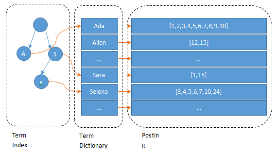
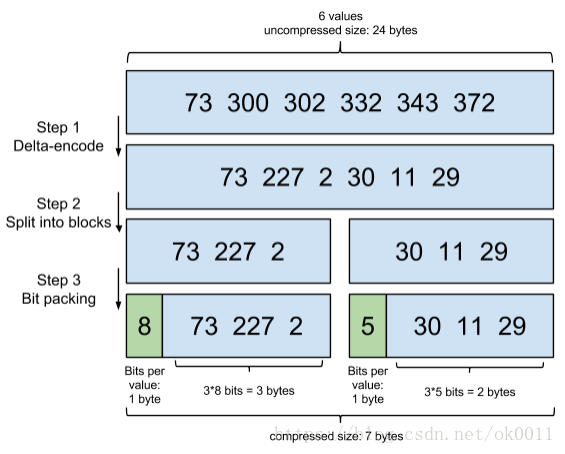

# Elasticsearch
## 介绍
* Elasticsearch 是一个分布式可扩展的实时搜索和分析引擎,一个建立在全文搜索引擎 Apache Lucene(TM) 基础上的搜索引擎.当然 Elasticsearch 并不仅仅是 Lucene 那么简单，它不仅包括了全文搜索功能，还可以进行以下工作:
1. 分布式实时文件存储，并将每一个字段都编入索引，使其可以被搜索。
2. 实时分析的分布式搜索引擎。
3. 可以扩展到上百台服务器，处理PB级别的结构化或非结构化数据。
## 索引
term index-> term dictionary -> posting list

1. Term Index
B-Tree通过减少磁盘寻道次数来提高查询性能，Elasticsearch也是采用同样的思路，直接通过内存查找term，不读磁盘，但是如果term太多，term dictionary也会很大，放内存不现实，于是有了Term Index，就像字典里的索引页一样，A开头的有哪些term，分别在哪页，可以理解term index是一颗树(**teri tree**)：这棵树不会包含所有的term，它包含的是term的一些前缀。通过term index可以快速地定位到term dictionary的某个offset，然后从这个位置再往后顺序查找。
所以term index不需要存下所有的term，而仅仅是他们的一些*前缀与Term Dictionary的block之间的映射关系*，再结合FST(Finite State Transducers)的压缩技术，可以使term index缓存到内存中。从term index查到对应的term dictionary的block位置之后，再去磁盘上找term，大大减少了磁盘随机读的次数。
2. Term Dictionary
Elasticsearch为了能快速找到某个term，将所有的term排个序，二分法查找term，logN的查找效率，就像通过字典查找一样，这就是Term Dictionary。
现在再看起来，似乎和传统数据库通过B-Tree的方式类似啊，为什么说比B-Tree的查询快呢？
3. Posting List
Elasticsearch分别为每个field都建立了一个倒排索引，Kate, John, 24, Female这些叫term，而[1,2]就是Posting List。Posting list就是一个int的数组，存储了所有符合某个term的文档id。

* FST:finite state transducers:有穷状态转换器-压缩term index
* Frame Of Reference：增量编码压缩，将大数变小数，按字节存储-压缩posting list（该压缩算法对于倒排表来说效果很好）

* Bitmap是一种数据结构，假设有某个posting list：
[1,3,4,7,10]
对应的bitmap就是：
[1,0,1,1,0,0,1,0,0,1]
非常直观，用0/1表示某个值是否存在，比如10这个值就对应第10位，对应的bit值是1，这样用一个字节就可以代表8个文档id，旧版本(5.0之前)的Lucene就是用这样的方式来压缩的，但这样的压缩方式仍然不够高效，如果有1亿个文档，那么需要12.5MB的存储空间，这仅仅是对应一个索引字段(我们往往会有很多个索引字段)。于是有人想出了Roaring bitmaps这样更高效的数据结构。

Bitmap的缺点是存储空间随着文档个数线性增长，Roaring bitmaps需要打破这个魔咒就一定要用到某些指数特性：
* Roaring bitmaps（针对Filter数据的缓存）
将posting list按照65535为界限分块，比如第一块所包含的文档id范围在0~65535之间，第二块的id范围是65536~131071，以此类推。再用*<商，余数>*的组合表示每一组id，这样每组里的id范围都在0~65535内了，剩下的就好办了，既然每组id不会变得无限大，那么我们就可以通过最有效的方式对这里的id存储。

"为什么是以65535为界限?"
程序员的世界里除了1024外，65535也是一个经典值，因为它=2^16-1，正好是用2个字节能表示的最大数，一个short的存储单位，注意“If a block has more than 4096 values, encode as a bit set, and otherwise as a simple array using 2 bytes per value”，如果是大块，用节省点用bitset存，小块就豪爽点，2个字节我也不计较了，用一个short[]存着方便。
那为什么用4096来区分大块还是小块呢？
个人理解：都说程序员的世界是二进制的，4096*2bytes ＝ 8192bytes 在NTFS文件系统下是两个扇区，即一个簇。

 [参考](https://www.cnblogs.com/dreamroute/p/8484457.html)

>> 扇区：**硬盘**不是一次读写一个字节而是一次读写一个扇区（512个字节）
>> 簇：**系统读读写文件的基本单位**，一般为2的n次方个扇区(由文件系统决定)
>> 块可以包含若干页，页可以包含若干簇，簇可以包含若干扇区

>> 从**应用程序**包括用户界面的角度来看，存取信息的最小单位是Byte（字节）；
从**磁盘的物理结构**来看存取信息的最小单位是扇区，一个扇区是512字节；
从**操作系统对硬盘的存取管理**来看，存取信息的最小单位是簇，簇是一个逻辑概念，一个簇可以是2、4、8、16、32或64个连续的扇区。一个簇只能被一个文件占用，哪怕是只有1个字节的文件，在磁盘上存储时也要占用一个簇，这个簇里剩下的扇区是无用的。例如用*NTFS文件系统格式化的时候默认是8个扇区组成一个簇，即4096字节*。所以你如果保存了一个只有1字节的文件（例如字母N），它在磁盘上实际也要占用4096字节（4K），**所以"簇"也可以理解为磁盘存取信息(寻址)的最小单位**。 

## 评分
### 布尔模型
* 布尔模型（Boolean Model） 只是在查询中使用 AND 、 OR 和 NOT （与、或和非）这样的条件来查找匹配的文档，以下查询：
full AND text AND search AND (elasticsearch OR lucene)
会将所有包括词 full 、 text 和 search ，以及 elasticsearch 或 lucene 的文档作为结果集。
这个过程简单且快速，它将所有可能不匹配的文档排除在外。

### 词频/逆向文档频率(TF/IDF)-默认
词的权重由三个因素决定
1. 检索词频率-term frequency
检索词在该字段出现的频率？出现频率越高，相关性也越高。 字段中出现过 5 次要比只出现过 1 次的相关性高。 
2. 反向文档频率-inverse document frequency
每个检索词在索引中出现的频率？频率越高，相关性越低。检索词出现在多数文档中会比出现在少数文档中的权重更低。 
3. 字段长度准则-field-length norm
字段的长度是多少？长度越长，相关性越低。 检索词出现在一个短的 title 要比同样的词出现在一个长的 content 字段权重更大。 
### 向量空间模型
向量空间模型（vector space model） 提供一种比较**多词查询**的方式，单个评分代表文档与查询的匹配程度。

## 总结和思考
Elasticsearch的索引思路:
将磁盘里的东西尽量搬进内存，减少磁盘随机读取次数(同时也利用磁盘顺序读特性)，结合各种奇技淫巧的压缩算法，用及其苛刻的态度使用内存。
所以，对于使用Elasticsearch进行索引时需要注意:
1. 不需要索引的字段，一定要明确定义出来，因为默认是自动建索引的
2. 同样的道理，对于String类型的字段，不需要analysis的也需要明确定义出来，因为默认也是会analysis的
3. 选择有规律的ID很重要，随机性太大的ID(比如java的UUID)不利于查询
* 检索优化点思考借鉴：
上面看到的压缩算法，都是对Posting list里的大量ID进行压缩的，那如果ID是顺序的，或者是有公共前缀等具有一定规律性的ID，压缩比会比较高；
另外一个因素: 可能是最影响查询性能的，应该是最后通过Posting list里的ID到磁盘中查找Document信息的那步，因为Elasticsearch是分Segment存储的，根据ID这个大范围的Term定位到Segment的效率直接影响了最后查询的性能，如果*ID是有规律*的，可以快速跳过不包含该ID的Segment，从而减少不必要的磁盘读次数，

#使用记录
//todo
## 模板
## query
## agg
## script
## search after
## scroll
## 优化
### 写入
### 