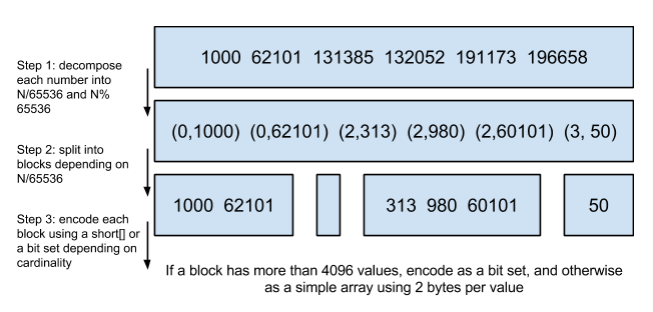

- [介绍](#%E4%BB%8B%E7%BB%8D)
- [内部机制解析](#%E5%86%85%E9%83%A8%E6%9C%BA%E5%88%B6%E8%A7%A3%E6%9E%90)
  - [节点类型](#%E8%8A%82%E7%82%B9%E7%B1%BB%E5%9E%8B)
  - [理解索引（index）](#%E7%90%86%E8%A7%A3%E7%B4%A2%E5%BC%95index)
  - [理解分片(shard)](#%E7%90%86%E8%A7%A3%E5%88%86%E7%89%87shard)
    - [Zen Discovery & Gossip 算法](#zen-discovery--gossip-%E7%AE%97%E6%B3%95)
  - [写操作](#%E5%86%99%E6%93%8D%E4%BD%9C)
    - [TransLog](#translog)
      - [TransLog Settings（持久化策略配置）：](#translog-settings%E6%8C%81%E4%B9%85%E5%8C%96%E7%AD%96%E7%95%A5%E9%85%8D%E7%BD%AE)
      - [Flush Settings（TransLog清洗配置）：](#flush-settingstranslog%E6%B8%85%E6%B4%97%E9%85%8D%E7%BD%AE)
    - [ES 如何写 replicas？](#es-%E5%A6%82%E4%BD%95%E5%86%99-replicas)
  - [更新 & 删除文档操作](#%E6%9B%B4%E6%96%B0--%E5%88%A0%E9%99%A4%E6%96%87%E6%A1%A3%E6%93%8D%E4%BD%9C)
  - [读操作](#%E8%AF%BB%E6%93%8D%E4%BD%9C)
    - [查询阶段](#%E6%9F%A5%E8%AF%A2%E9%98%B6%E6%AE%B5)
      - [读主分片 or 读副本](#%E8%AF%BB%E4%B8%BB%E5%88%86%E7%89%87-or-%E8%AF%BB%E5%89%AF%E6%9C%AC)
    - [聚合提取阶段](#%E8%81%9A%E5%90%88%E6%8F%90%E5%8F%96%E9%98%B6%E6%AE%B5)
- [并发策略](#%E5%B9%B6%E5%8F%91%E7%AD%96%E7%95%A5)
  - [并发策略之悲观锁](#%E5%B9%B6%E5%8F%91%E7%AD%96%E7%95%A5%E4%B9%8B%E6%82%B2%E8%A7%82%E9%94%81)
  - [并发策略之乐观并发控制](#%E5%B9%B6%E5%8F%91%E7%AD%96%E7%95%A5%E4%B9%8B%E4%B9%90%E8%A7%82%E5%B9%B6%E5%8F%91%E6%8E%A7%E5%88%B6)
- [ES和Lucene的结合](#es%E5%92%8Clucene%E7%9A%84%E7%BB%93%E5%90%88)
  - [Shard](#shard)
    - [Segments](#segments)
    - [Type or Index](#type-or-index)
    - [_source & _all & _field_names字段](#source--all--fieldnames%E5%AD%97%E6%AE%B5)
    - [doc_value](#docvalue)
  - [拓展---时间序列数据库（TSDB）](#%E6%8B%93%E5%B1%95---%E6%97%B6%E9%97%B4%E5%BA%8F%E5%88%97%E6%95%B0%E6%8D%AE%E5%BA%93tsdb)
- [索引](#%E7%B4%A2%E5%BC%95)
  - [Term Index](#term-index)
  - [Term Dictionary](#term-dictionary)
  - [Posting List](#posting-list)
- [评分](#%E8%AF%84%E5%88%86)
  - [布尔模型](#%E5%B8%83%E5%B0%94%E6%A8%A1%E5%9E%8B)
  - [词频/逆向文档频率(TF/IDF)-默认](#%E8%AF%8D%E9%A2%91%E9%80%86%E5%90%91%E6%96%87%E6%A1%A3%E9%A2%91%E7%8E%87tfidf-%E9%BB%98%E8%AE%A4)
    - [向量空间模型](#%E5%90%91%E9%87%8F%E7%A9%BA%E9%97%B4%E6%A8%A1%E5%9E%8B)
- [总结和思考](#%E6%80%BB%E7%BB%93%E5%92%8C%E6%80%9D%E8%80%83)
  - [模板](#%E6%A8%A1%E6%9D%BF)
  - [query](#query)
  - [agg](#agg)
  - [script](#script)
  - [search after](#search-after)
  - [scroll](#scroll)
  - [优化](#%E4%BC%98%E5%8C%96)
    - [写入](#%E5%86%99%E5%85%A5)
    - [](#)

# 介绍
* Elasticsearch 是一个分布式可扩展的实时搜索和分析引擎,一个建立在全文搜索引擎 Apache Lucene(TM) 基础上的搜索引擎.当然 Elasticsearch 并不仅仅是 Lucene 那么简单，它不仅包括了全文搜索功能，还可以进行以下工作:
1. 分布式实时文件存储，并将每一个字段都编入索引，使其可以被搜索。
2. 实时分析的分布式搜索引擎。
3. 可以扩展到上百台服务器，处理PB级别的结构化或非结构化数据。

# 内部机制解析
## 节点类型
- Master Eligible Node （候选主节点）：设置成node.master=true (default)都可能会被选举为主节点；
- Master Node （主节点）：由候选主节点选举出来的，负责管理 ES 集群，通过广播的机制与其他节点维持关系，负责集群中的 DDL 操作（创建/删除索引），管理其他节点上的分片（shard)；
推荐配置
``` json
node.master: true
node.data: false
node.ingest: false
```
>> Tips: 关于 Master 脑裂问题。候选主节点之间出现了网络分区则可能会出现集群脑裂的情况，导致数据不一致或者数据丢失。我们可以通过设置**discovery.zen.minimum_master_nodes**设置为(master_eligible_nodes / 2) + 1将避免掉这个问题，
弊端就是当候选主节点数由于宕机等不确定因素导致少于(master_eligible_nodes / 2) + 1的话，集群将无法正常运作下去.

- Data Node（数据节点）：很好理解，存放数据的节点，负责数据的增删改查 CRUD；
推荐配置
``` json
node.master: false
node.data: true
node.ingest: false
```

- Ingest Node（提取节点）：能执行预处理管道，有自己独立的任务要执行，类似于 logstash 的功能，不负责数据也不负责集群相关的事务；
推荐配置
``` json
node.master: false
node.data: false
node.ingest: true
search.remote.connect: false
```

- Tribe Node（部落节点）：协调集群与集群之间的节点，这里不做过多介绍；
https://www.elastic.co/guide/en/elasticsearch/reference/current/modules-tribe.html

- Coordinating Node(协调节点)：每一个节点都是一个潜在的协调节点，且不能被禁用，协调节点最大的作用就是将各个分片里的数据汇集起来一并返回给客户端，因此 ES 的节点需要有足够的 CPU 和内存去处理协调节点的 gather 阶段。

## 理解索引（index）
ElasticSearch 是基于 Apache Lucene 开发的，内部自然沿用的就是 Lucene 的倒排索引，关于倒排索引大致的逻辑模型可以参考如下：
假设有两篇文档：\
Doc1: Life goes on, impossible is nothing;\
Doc2: Life is like a boat;\
那么，索引的文件组织逻辑应该是这样的
|    词项    |  文档ID   |
| :--------: | :-------: |
|    life    | Doc1,Doc2 |
|     is     | Doc1,Doc2 |
|    goes    |   Doc1    |
|     on     |   Doc1    |
|    like    |   Doc2    |
|  nothing   |   Doc1    |
| impossible |   Doc1    |
|    boat    |   Doc2    |

## 理解分片(shard)

- **primary shard**: 每个主分片都有自己的序号，协调节点根据哈希算法将数据路由到对应的主分片上进行读写操作
- **replica shard**: 副本分片，是主分片的副本拷贝，系统默认副本策略为 Quorum，即写入超过半数副本就可以返回成功，这里后续对副本写入再做介绍。

### Zen Discovery & Gossip 算法
ES 的分布式是去中心化的，节点的发现是通过 **Gossip 算法**来做到的，而后选举节点，让各自节点承担不同角色。这里简单介绍一下 Gossip 算法，假设环境中有两个节点NodeA NodeB，Gossip 算法有三种同步数据（Anti-Entropy）的方式：
1. A push B 方式 : A 传 DigestA 给 B，B 接受后回传 DigestA-B 给 A，A 更新 A-B 的数据给 B
2. A Pull B 方式：A 传 DigestA 给 B， B 接受后 更新 B-A 的数据给 A
3. A Pull-Push B 方式：A 传 DigestA 给 B，B 接受后 更新 B-A 的数据给 A 并附带 DigestA-B ，A 更新 A-B 的数据给 B
>> Pull-Push 的收敛度非常好，在第七次遍历的时候就可以完成100个节点的发现了，ES 正是借鉴了上面的算法实现节点发现（**Zen Discovery**）的。
由于算法的复杂度为 Log(N)，那么当节点的数目越来越庞大的时候，其发现节点的性能损耗只是呈 Log(N)递增，换句话说这个算法对节点数目量庞大的集群来说非常受用。

另外关于集群自动发现，不得不提两个参数的区别
discovery.zen.fd.ping_timeout 错误检测的超时，在稳定运行的集群环境之中，检测主机与主机之间是否通畅
discovery.zen.ping_timeout 仅在选举主节点的时候，这个超时机制才起作用

## 写操作

1. 先不考虑副本（replicas），写操作的请求是首先发往协调节点（Coordinating Node），之前说协调节点可能是任何一个你所连上的一个节点，因此每个节点都有可能直接接受客户端的流量，这里相当于做了一次**客户端的LB**。协调节点根据对 document_id 的哈希计算并取余找到对应的主分片（primary shard）:
``` java 
shard = hash(document_id or routing parameter) % (num_of_primary_shards)
```
而主分片本身是分散在集群各个机器之中的，这里就相当于一次**主分片的LB**。
2. 接下来都是在 shard 中进行操作了，先是写入 **Transaction Log**(后续会有详细介绍)，而后将数据写入**内存**中，默认情况下每隔一秒会同步到 **FileSystem cache** 中，FS Cache 拥有文件句柄，因此存在于 FS cache 中的数据是允许被搜索到的（ready for search），这也是 ES 能够实现 NRT（Near-Real-Time）这个特性的原因之一。当然对数据实时性要求高的可以调用 Refresh API。
默认情况下每隔30s 会将FS cache中的 index以及 Transaction Log一并写入磁盘中，当然为了降低数据丢失的概率，可以将这个时间缩短，甚至设置成同步的形式。

### TransLog
TransLog （即所谓的写前日志WAL，Write Ahead Log）的机制与 MySQL 的 binlog，HBase 的 Hlog 并无太大差别。TransLog 本身是写入到FS cache 的，什么时候 fsync 到磁盘取决于数据能接受丢失的程度。
换句话说，如果需要 ES 具备十分强悍的写入能力，数据丢了一部分也没太大关系，这种情况你可以将 fsync 设置为异步执行的，并且把 fsync 的时间间隔设置的很长；如果你需要非常严谨的数据，不能够接受丢失数据，那么你可能在每次写入 TransLog的时候都要 fsync一次（这是默认机制）。
然而业务并非总是这么理想化，现实中同样需要在**可用性与一致性**两者之间做权衡。

- 下面介绍 TransLog 的相关配置。
#### TransLog Settings（持久化策略配置）：
   **index.translog.durability**：如果设为 **async**(异步) ，默认情况下，ES 会每隔五秒对 TransLog 执行一次 fsync 和 commit 的操作；如果设为 **request**(default)，则在每次真正执行index、delete、update 或者 bulk index 操作前立刻将 TransLog fsync 到每一个主分片和副本分片中，并返回成功；
   **index.translog.sync_interval**：只有将index.translog.durability设置为async时才有效，默认5s，表示 TransLog 持久化的时间间隔。

#### Flush Settings（TransLog清洗配置）：
为了避免 Translog 文件太大导致恢复过慢，适当的清洗是必要的。
**index.translog.flush_threshold_size**：当 translog 日志达到这个配置大小的时候将执行一次 Flush 操作，默认512mb；
值得一提，默认情况下每隔三十分钟会 Flush 一次。但一般情况下不会手动调整清洗策略。
>> Tips: An Elasticsearch flush is the process of performing a Lucene commit and starting a new translog.

ES 的Flush操作包含了Lucene索引的fsync以及 Translog的清空，两个操作，因此日志清洗并不会导致数据丢失！

数据恢复的话这里没什么好说的，和其他分布式存储的 WAL 基本一致，从磁盘读取出 TransLog，然后 Replay 即可。

### ES 如何写 replicas？
找到对应的 shard 之后，会预先检查 replicas 数量，开始写replicas，此时支持三种策略，quorum、one和 all，**默认为 quorum（超过半数副本写入即可返回成功）**，对应参数 wait_for_active_shards。
>> Tips: 每一个 replicas shard中的写逻辑是和 primary shard一样的。

## 更新 & 删除文档操作
- 删除： 每个段中维护一个.del 文件，ES 只是逻辑删除文档，在.del 文件中标记为已删除，查询依然可以查到，但是会在结果中过滤掉；
- 更新： 引入版本(_version)的概念，旧版本的记录将在 .del 文件中标记为删除，新版本的文档将被索引到一个新段（Segment）。

## 读操作

读分为两个阶段，查询阶段（Query Phrase）以及聚合提取阶段(Fetch Phrase)
### 查询阶段
协调节点接受到读请求，并将请求分配到相应的分片上（有可能是主分片或是副本分片，这个机制后续会提及），默认情况下，每个分片创建10个结果（仅包含 document_id 和 Scores）的优先级队列，并以相关性排序，返回给协调节点。

- 结果震荡问题（Bouncing Results） 
搜索同一query，结果ES返回的顺序却不尽相同，这就是请求轮询到**不同分片**，而**未设置排序条件**，相同相关性评分情况下，是按照所在segment中​lucene id来排序的，故造成结果震荡问题。(相同数据的不同备份之间的lucene id是能保证一致的)

>> Tips:查询阶段如果不特殊指定，落入的分片有可能是 primary 也有可能是 replicas，这个根据协调节点的负载均衡算法来确定。
#### 读主分片 or 读副本
读数据的时候我们可以根据 **Preference**指定读取的分片类型：
|         参数          |                           描述                           |
| :-------------------: | :------------------------------------------------------: |
|       _primary        |                     只会在主分片操作                     |
|    _primary_first     |   优先主分片操作，如果主分片不可用，就会找其他分片操作   |
|       _replica        |                    只会在副本分片操作                    |
|    _replica_first     | 优先副本分片操作，如果副本分片不可用，就会找其他分片操作 |
|        _local         |                   尽可能在本地分片操作                   |
| _prefer_nodes:abc,xyz |             尽可能指定在 abc,xyz 节点上执行              |
|      _shards:2,3      |            在指定的分片上操作，2，3为分片 ID             |
|      _only_nodes      |                   在指定的 Node 上操作                   |

- custom(自定义)：注意自定义的preference参数不能以下划线"_"开头。
当preference为自定义时，即该参数不为空，且开头不以“下划线”开头时，特别注意：如果以用户query作为自定义preference时，一定要处理以下划线开头的情况，这种情况下如果不属于以上8种情况，则会抛出异常。

>> Preference的配置选择，实际上是CAP中 AP 与 CP 的权衡过程。
1. 如果对可用性要求很高，那么**_primary**这个参数是万万不可用；
2. 如果对一致性要求相对较高但可用性也需要保证的场景来说，可以使用**_primary_first**；
3. 如果对一致性要求极高的场景，但也就放弃了一定程度的可用性，这样用**_primary**会更合适一些。以此类推，需要根据自己的场景选择参数。


### 聚合提取阶段
假设查询落入的分片数为 N，那么聚合阶段就是对 N*10 个结果集进行排序，然后再通过已经拿到的 document_id 查到对应的 document 并组装到队列里，组装完毕后将有序的数据返回给客户端。
>> Tips：深度分页查询是有风险的，所谓深度查询就是涉及到大量 shard 的查询时，直接跳页到几千甚至上万页的数据，协调节点就有宕机的风险，毕竟协调节点需要将大量数据汇总起来进行排序，耗费大量的内存和 CPU 资源。所以慎用！尽可能用**Scroll API** ，即只允许拿到下一页的信息，不允许跳页的情况出现，会避免这种情况的发生。
深度分页的shard如图：


# 并发策略
ES 不支持 ACID 事务，ES 无法确保多个 Documents 处在同一个事务里。如果我们用 RDBS 存储业务数据，ES 只是作为一个搜索引擎对业务数据做了一份副本而已，这可能是基于 binlog 有序同步过来的。这种情况下，数据的 ACID 由 RDBS 来控制，RDBS 本身是有事务的，这种用法并不存在并发问题。
可当不使用 RDBS 的时候，ES 就直接拿来做可靠性存储了，这时候的 ACID 怎么保证呢？

## 并发策略之悲观锁
一个不完美的方案就是悲观锁，ES 是通过创建 lock 文件来对资源进行锁定，与其他线程隔离开来，控制并发。锁大致根据用途分为如下几种：

- 全局锁（Global Locking）
1. 获取全局锁：PUT /fs/lock/global/_create
2. 执行操作语句完后释放全局锁：DELETE /fs/lock/global；如果在已锁状态下加锁，会报错，中断程序无法继续运行。

- 文档锁（Document Locking）：
给单个 document 以一个文档锁，这个时候把锁的影响范围从全局缩小到了文档级别，更细颗粒，提高并发性能。
1. 获取文档锁：
```json 
PUT /fs/lock/_bulk
{ "create": { "_id": 1}}
{ "process_id": 123    }
{ "create": { "_id": 2}}
{ "process_id": 123    }
```
分别给 id 为1和2的 document 上了锁，这里需要指定唯一的进程 ID 123。不过这里要注意的是，一旦document 上锁，其他线程想给它加锁是会报错的，因此可以达到互斥的效果，报错后程序就中断，无法执行对应的操作了。
2. 为了使 lock 可以被查到可以调用：POST /fs/_refresh；
3. 浏览进程 ID 为123的 lock:
```json 
GET /fs/lock/_search?scroll=1m
{
    "sort" : ["_doc"],
    "query": {
        "match" : {
            "process_id" : 123
        }
    }
}
```
4. 可重入锁的获取:
```json
POST /fs/lock/1/_update
{
  "upsert": { "process_id": 123 },
  "script": "if ( ctx._source.process_id != process_id )
  { assert false }; ctx.op = 'noop';"
  "params": {
    "process_id": 123
  }
}
```
原本已经上锁的时候再去加锁会出现报错，哪怕是这个锁的持有者二次加锁也会报错。**现在用这种方式获取锁好处就是使得锁本身是可以被持有者重入多次而不会报错的**。

5. 释放锁
```json
PUT /fs/lock/_bulk
{ "delete": { "_id": 1}}
{ "delete": { "_id": 2}}
```

- 文件树锁（Tree Locking）：
除了以上的锁以外，ES 还支持文件目录锁。**目录锁的特点是既存在独占锁（Exclusive Lock），又存在共享锁（Shared Lock）**。这里就涉及到的原理上和上边几乎一样。
1. 获取独占锁：{ "lock_type": "exclusive" }
2. 获取共享锁：
```json 
{
  "lock_type":  "shared",
  "lock_count": 1
}
```
这里的 lock_count 表示已经被多少个实例共享了。
尝试获取锁可以改成这样:
```json
POST /fs/lock/%2Fclinton/_update
{
  "upsert": {
    "lock_type":  "shared",
    "lock_count": 1
  },
  "script": "if (ctx._source.lock_type == 'exclusive')
  { assert false }; ctx._source.lock_count++"
}
```
判断如果是独占锁则抛错，如果是共享锁则将 lock_count+1。
当然，这里也可以改成可重入的，不多赘述。

>> Tips：以上几种锁并非只针对 ES 的资源来使用，资源可以是各种各样的，甚至可以拿 ES 做分布式锁来使用。

>> 悲观锁的实现就是为了强数据一致性而产生的，但是在使用悲观锁的时候一定要慎重，务必要想清楚你的业务场景用这种很重的锁是否合适？如果十分有必要用，你就得思考如何缩小颗粒度来减小锁影响的范围，甚至我个人觉得在用到悲观锁的时候，ES 并非是一个很不错的选择，我们甚至可以借助 Zookeeper 或者 Redis 等第三方中间件来实现分布式锁，将 ES 的资源隔离开来。
另外，无论哪种锁都无法确保当某个线程获得锁以后挂了，都务必考虑锁的释放问题，避免死锁。这个就不在本文讨论范围。

## 并发策略之乐观并发控制
乐观并发控制（**optimistic concurrency control**）的事务包括以下阶段：
1. 读取：事务将数据读入缓存，这时系统会给事务分派一个时间戳。
2. 校验：事务执行完毕后，进行提交。这时同步校验所有事务，如果事务所读取的数据在读取之后又被其他事务修改，则产生冲突，事务被中断回滚。
3. 写入：通过校验阶段后，将更新的数据写入数据库。用以确保较新版本的数据不会被旧版本的数据覆盖
>> ES 是怎么保证的是老版本数据绝对不会覆盖新版本呢？
大致是先读取需要被修改的记录的最新版本号，然后利用 CAS 算法将对记录做出修改，一旦修改成功，就会将数据平行拷贝到各个节点做副本。因为考虑到某些 replica 同步的过程是平行且异步化的，当更新十分频繁的时候，数据的先来后到谁都说不准，因此对于每个 Document，ES 都会指定一个_version字段存储版本号，而这个版本号会随着 document 的每次变更而自增，每一个新的数据都有着固定的版本号，用以标识数据的先来后到，老版本无法覆盖新版本，这就确保分片之间的数据不会出现不一致的情况，甚至可以避免数据丢失。

# ES和Lucene的结合
## Shard
Shard 实际上是一个 Lucene 的一个实例（Lucene Index），但往往一个 Elastic Index 都是由多个 Shards （primary & replica）构成的。
特别注意，在单个 Lucene 实例里最多包含2,147,483,519 (= Integer.MAX_VALUE - 128) 个 Documents。
>> tips:可以利用 _cat/shards API 来监控 shards 大小。

##Lucene Index 结构
一个 Lucene Index 在文件系统的表现上来看就是存储了一系列文件的一个目录。一个 Lucene Index 由许多独立的 segments 组成，而 segments 包含了文档中的**词汇字典、词汇字典的倒排索引以及 Document 的字段数据**（设置为Stored.YES的字段），所有的 segments 数据存储于 _<segment_name>.cfs的文件中。
### Segments

Segment 直接提供了搜索功能的，ES 的一个 Shard （Lucene Index）中是由大量的 Segment 文件组成的，且每一次 fresh 都会产生一个新的 Segment 文件，这样一来 Segment 文件有大有小，相当碎片化。ES 内部则会开启一个线程将小的 Segment 合并（Merge）成大的 Segment，减少碎片化，降低文件打开数，提升 I/O 性能。

>> Tips:Segment 文件是不可变更的。当一个 Document 更新的时候，实际上是**将旧的文档标记为删除**，然后索引一个新的文档。在 Merge 的过程中会将旧的 Document 删除掉。具体到文件系统来说，文档 A 是写入到_<segment_name>.cfs 文件里的，删除文档 A 实际上是在_<segment_name>.del文件里标记某个 document 已被删除，那么下次查询的时候则会跳过这个文档，视为逻辑删除。当归并（Merge）的时候，老的 segment 文件将会被删除，合并成新的 segment 文件，这个时候也就是物理删除了。

### Type or Index
很多人在前期规范 Schema 的时候犯难，不知道应该直接用 Type 表示数据 Schema 好还是新建一个 Index ？这里接下来会进一步探讨。
- Index 有何局限
当需要对大量的 index 做聚合查询的时候，是将 index中的每一个分片单独查询，再将结果聚合出来，如果量级特别大，那么占用的 CPU 和内存资源将会十分庞大；

- Type 有何局限
在同一个 Index 下，可以通过 _Type 字段指定不同的 Type，其中无论多少个 Type 的聚合查询，shard 数目维持不变，因此聚合所消耗的资源大量减少，然而也会有一定的限制：
1. 同一 Index 下，**同名 Field 类型必须相同**，即使不同的 Type；
2. 同一 Index 下，TypeA 的 Field 会占用 TypeB 的资源（互相消耗资源），会形成一种稀疏存储的情况。尤其是 doc value ，为什么这么说呢？doc value为了性能考虑会保留一部分的磁盘空间，这意味着 TypeB 可能不需要这个字段的 doc_value 而 TypeA 需要，那么 TypeB 就被白白占用了一部分没有半点用处的资源；
3. 同理，Score 评分机制是 index-wide 的，这会导致评分受到影响。

基本来说，数据关联度不大的不建议放到同一个 Index 且以 Type 来区分，如果考虑到 Index 分片过大导致后续检索压力增加的情况，应该对 Index进行拆分，ES 的通常做法是，以时间为维度做数据拆分，比如一天一个 Index 或者一个月一个 Index，依据数据量大小来衡量。

>> Tips： 对于字段信息变更频繁的数据， 也不适合与其他 Index 存在一起且以 Type 来区分。因为在 ES 中，索引元数据本身是放在主节点中维护的，CP 设计。意味着涉及到大量字段变更及元数据变更的操作，都会导致该 Index 被堵塞或假死。我们应该对这样的 **Index 做隔离**，避免影响到其他 Index 正常的增删改查。甚至当涉及到字段变更十分频繁且无法预定义 schema 的场景时，是否要使用 ES 都应该慎思熟虑了！

### _source & _all & _field_names字段
**_source** ：Lucene 对于源文档的存储提供了一个选项（Stored.YES/NO），如果选了YES，其数据就会检索的过程中返回；否则 Lucene 即使成功做了检索，也只能返回数据的 ID，然后借助第三方存储通过 ID 将数据查询出来。该参数默认enabled，表示需要将文档原始数据一并存入索引之中，disabled则表示我的 Lucene 实例中只包含倒排索引以及词典，不对原始文档做持久化；
**_all** ：默认enabled，意思是需要用额外的存储空间存储该 Index 的各字段信息以及数据，目的是检索的过程中可以不需要指定任何字段，也即是全字段匹配；对于字段结构简单的，可以 disabled 取消掉这块功能；
**_field_names** 字段 ：这个字段默认开启，存储的是每个 document 中的字段名，如果没有检查 Document 的字段是否存在这样类似的需求的话，建议关闭，写入性能大约提升20%。

### doc_value
倒排索引的数据组织方式大概是这样的：
|  Term  | Doc_1 | Doc_2 | Doc_3 |
| :----: | :---: | :---: | :---: |
| brown  |   X   |   X   |
|  dog   |   X   |       |   X   |
|  dogs  |       |   X   |   X   |
|  fox   |   X   |       |   X   |
| foxes  |       |   X   |
|   in   |       |   X   |
| jumped |   X   |       |   X   |
|  lazy  |   X   |   X   |
|  leap  |       |   X   |
|  over  |   X   |   X   |   X   |
| quick  |   X   |   X   |   X   |
| summer |       |   X   |
|  the   |   X   |       |   X   |
如果我要查询包含 brown 的文档有哪些？这个就是全文检索了，也相当好办，先从词典里遍历到 brown 这个单词，然后根据倒排索引查得 Doc_1 和 Doc_2 包含这个单词。
那如果我要查 Doc_1 和 Doc_2 包含的单词分别有什么？这个用倒排索引的话开销会非常大，至少是要将整张表关于 Doc_1 和 Doc_2 的列数据遍历一遍才行。这时候我们将数据换一种组织形式，将会起到非常好的效果。
|  Doc  |                          Terms                          |
| :---: | :-----------------------------------------------------: |
| Doc_1 |     brown, dog, fox, jumped, lazy, over, quick, the     |
| Doc_2 | brown, dogs, foxes, in, lazy, leap, over, quick, summer |
| Doc_3 |        dog, dogs, fox, jumped, over, quick, the         |

Doc_1 和 Doc_2 存了什么单词，一目了然。\
当然对于数字类型的字段也是一样的。
|  Doc  | Metric |
| :---: | :----: |
| Doc_1 |  0.2f  |
| Doc_2 |  9.3f  |
| Doc_3 |  5.6f  |
我们把这种数据的组织方式叫做**doc_value**。

>> 倒排索引的特点很明显，就是为了全文检索而生的，但是对于一些聚合查询（排序、求平均值等等）的场景来说，显然不适用。那么这样一来我们为了应对一些聚合场景就需要结构化数据来应付，这里说的结构化数据就是『列存储』，也就是上面说的doc_value。
- doc_value在 ES 中有几个应用场景：
1. 对某个字段排序；
2. 某个字段聚合查询（ max/min/count ）；
3. 部分过滤器 （ 地理位置过滤器 ）；
4. 某个字段的脚本执行。等等。

doc_value是顺序存储到磁盘的，因此访问是很快的。当我们所处理的集合小于所给的 JVM 堆内存，那么整个数据集合是会被加载到内存里的；如果数据集合大于所给的堆内存，那么就会分页加载到内存之中，而不会报出『OutOfMemory Error』。

值得一提的是，doc_value的字段使用极其频繁，因此在5.x 版本后强化成为两个字段，分别是 text 和 keyword。
**text**：string 类型，支持倒排索引，不支持 doc_value；
**keyword**：string 类型，不支持倒排索引，支持doc_value。


## 拓展---时间序列数据库（TSDB）
//todo
https://leonlibraries.github.io/2017/04/27/ElasticSearch%E5%86%85%E9%83%A8%E6%9C%BA%E5%88%B6%E6%B5%85%E6%9E%90%E4%B8%89/


# 索引
term index-> term dictionary -> posting list
//todo
in-memory-buffer   -->> translog --> segment -->commit point
[索引过程](https://www.cnblogs.com/wenBlog/p/8489197.html)


## Term Index
B-Tree通过减少磁盘寻道次数来提高查询性能，Elasticsearch也是采用同样的思路，直接通过内存查找term，不读磁盘，但是如果term太多，term dictionary也会很大，放内存不现实，于是有了Term Index，就像字典里的索引页一样，A开头的有哪些term，分别在哪页，可以理解term index是一颗树(**teri tree**)：这棵树不会包含所有的term，它包含的是term的一些前缀。通过term index可以快速地定位到term dictionary的某个offset，然后从这个位置再往后顺序查找。
所以term index不需要存下所有的term，而仅仅是他们的一些*前缀与Term Dictionary的block之间的映射关系*，再结合FST(Finite State Transducers)的压缩技术，可以使term index缓存到内存中。从term index查到对应的term dictionary的block位置之后，再去磁盘上找term，大大减少了磁盘随机读的次数。
## Term Dictionary
Elasticsearch为了能快速找到某个term，将所有的term排个序，二分法查找term，logN的查找效率，就像通过字典查找一样，这就是Term Dictionary。
现在再看起来，似乎和传统数据库通过B-Tree的方式类似啊，为什么说比B-Tree的查询快呢？
## Posting List
Elasticsearch分别为每个field都建立了一个倒排索引，Kate, John, 24, Female这些叫term，而[1,2]就是Posting List。Posting list就是一个int的数组，存储了所有符合某个term的文档id。

* FST:finite state transducers:有穷状态转换器-压缩term index
* Frame Of Reference：增量编码压缩，将大数变小数，按字节存储-压缩posting list（该压缩算法对于倒排表来说效果很好）


* Bitmap是一种数据结构，假设有某个posting list：
[1,3,4,7,10]
对应的bitmap就是：
[1,0,1,1,0,0,1,0,0,1]
非常直观，用0/1表示某个值是否存在，比如10这个值就对应第10位，对应的bit值是1，这样用一个字节就可以代表8个文档id，旧版本(5.0之前)的Lucene就是用这样的方式来压缩的，但这样的压缩方式仍然不够高效，如果有1亿个文档，那么需要12.5MB的存储空间，这仅仅是对应一个索引字段(我们往往会有很多个索引字段)。于是有人想出了Roaring bitmaps这样更高效的数据结构。

Bitmap的缺点是存储空间随着文档个数线性增长，Roaring bitmaps需要打破这个魔咒就一定要用到某些指数特性：
* Roaring bitmaps（针对Filter数据的缓存）
将posting list按照65535为界限分块，比如第一块所包含的文档id范围在0~65535之间，第二块的id范围是65536~131071，以此类推。再用*<商，余数>*的组合表示每一组id，这样每组里的id范围都在0~65535内了，剩下的就好办了，既然每组id不会变得无限大，那么我们就可以通过最有效的方式对这里的id存储。

"为什么是以65535为界限?"
程序员的世界里除了1024外，65535也是一个经典值，因为它=2^16-1，正好是用2个字节能表示的最大数，一个short的存储单位，注意“If a block has more than 4096 values, encode as a bit set, and otherwise as a simple array using 2 bytes per value”，如果是大块，用节省点用bitset存，小块就豪爽点，2个字节我也不计较了，用一个short[]存着方便。
那为什么用4096来区分大块还是小块呢？
个人理解：都说程序员的世界是二进制的，4096*2bytes ＝ 8192bytes 在NTFS文件系统下是两个扇区，即一个簇。

 [参考](https://www.cnblogs.com/dreamroute/p/8484457.html)

>> 扇区：**硬盘**不是一次读写一个字节而是一次读写一个扇区（512个字节）
>> 簇：**系统读读写文件的基本单位**，一般为2的n次方个扇区(由文件系统决定)
>> 块可以包含若干页，页可以包含若干簇，簇可以包含若干扇区

>> 从**应用程序**包括用户界面的角度来看，存取信息的最小单位是Byte（字节）；
从**磁盘的物理结构**来看存取信息的最小单位是扇区，一个扇区是512字节；
从**操作系统对硬盘的存取管理**来看，存取信息的最小单位是簇，簇是一个逻辑概念，一个簇可以是2、4、8、16、32或64个连续的扇区。一个簇只能被一个文件占用，哪怕是只有1个字节的文件，在磁盘上存储时也要占用一个簇，这个簇里剩下的扇区是无用的。例如用*NTFS文件系统格式化的时候默认是8个扇区组成一个簇，即4096字节*。所以你如果保存了一个只有1字节的文件（例如字母N），它在磁盘上实际也要占用4096字节（4K），**所以"簇"也可以理解为磁盘存取信息(寻址)的最小单位**。 


# 评分
## 布尔模型
* 布尔模型（Boolean Model） 只是在查询中使用 AND 、 OR 和 NOT （与、或和非）这样的条件来查找匹配的文档，以下查询：
full AND text AND search AND (elasticsearch OR lucene)
会将所有包括词 full 、 text 和 search ，以及 elasticsearch 或 lucene 的文档作为结果集。
这个过程简单且快速，它将所有可能不匹配的文档排除在外。

## 词频/逆向文档频率(TF/IDF)-默认
词的权重由三个因素决定
1. 检索词频率-term frequency
检索词在该字段出现的频率？出现频率越高，相关性也越高。 字段中出现过 5 次要比只出现过 1 次的相关性高。 
2. 反向文档频率-inverse document frequency
每个检索词在索引中出现的频率？频率越高，相关性越低。检索词出现在多数文档中会比出现在少数文档中的权重更低。 
3. 字段长度准则-field-length norm
字段的长度是多少？长度越长，相关性越低。 检索词出现在一个短的 title 要比同样的词出现在一个长的 content 字段权重更大。 
### 向量空间模型
向量空间模型（vector space model） 提供一种比较**多词查询**的方式，单个评分代表文档与查询的匹配程度。

# 总结和思考
Elasticsearch的索引思路:
将磁盘里的东西尽量搬进内存，减少磁盘随机读取次数(同时也利用磁盘顺序读特性)，结合各种奇技淫巧的压缩算法，用及其苛刻的态度使用内存。
所以，对于使用Elasticsearch进行索引时需要注意:
1. 不需要索引的字段，一定要明确定义出来，因为默认是自动建索引的
2. 同样的道理，对于String类型的字段，不需要analysis的也需要明确定义出来，因为默认也是会analysis的
3. 选择有规律的ID很重要，随机性太大的ID(比如java的UUID)不利于查询
* 检索优化点思考借鉴：
上面看到的压缩算法，都是对Posting list里的大量ID进行压缩的，那如果ID是顺序的，或者是有公共前缀等具有一定规律性的ID，压缩比会比较高；
另外一个因素: 可能是最影响查询性能的，应该是最后通过Posting list里的ID到磁盘中查找Document信息的那步，因为Elasticsearch是分Segment存储的，根据ID这个大范围的Term定位到Segment的效率直接影响了最后查询的性能，如果*ID是有规律*的，可以快速跳过不包含该ID的Segment，从而减少不必要的磁盘读次数，

优化
https://blog.csdn.net/qq_18145031/article/details/53289797
常见问题解决
http://www.wklken.me/posts/2015/05/23/elasticsearch-issues.html

#使用记录
//todo
## 模板
## query
## agg
## script
## search after
## scroll
## 优化
https://www.bbsmax.com/A/mo5kY2QzwR/
### 写入
### 