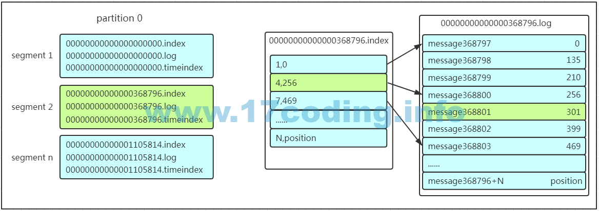
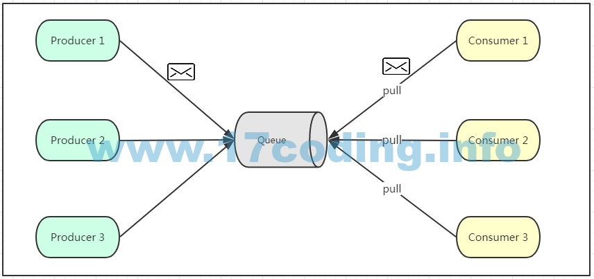
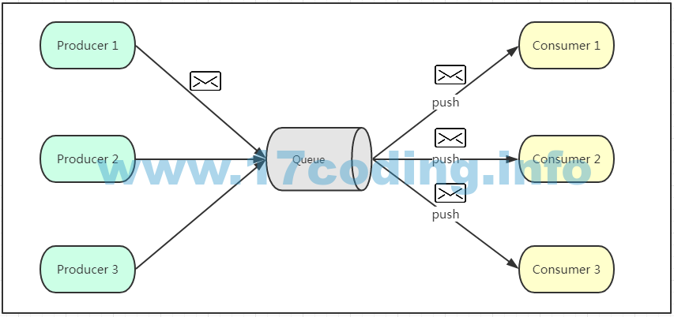

- [KAFKA](#kafka)
  - [为什么使用消息队列？](#%E4%B8%BA%E4%BB%80%E4%B9%88%E4%BD%BF%E7%94%A8%E6%B6%88%E6%81%AF%E9%98%9F%E5%88%97)
  - [基础架构及术语](#%E5%9F%BA%E7%A1%80%E6%9E%B6%E6%9E%84%E5%8F%8A%E6%9C%AF%E8%AF%AD)
  - [工作流分析](#%E5%B7%A5%E4%BD%9C%E6%B5%81%E5%88%86%E6%9E%90)
    - [发送数据](#%E5%8F%91%E9%80%81%E6%95%B0%E6%8D%AE)
      - [分区的主要目的是：](#%E5%88%86%E5%8C%BA%E7%9A%84%E4%B8%BB%E8%A6%81%E7%9B%AE%E7%9A%84%E6%98%AF)
      - [produer数据分发partition原则：](#produer%E6%95%B0%E6%8D%AE%E5%88%86%E5%8F%91partition%E5%8E%9F%E5%88%99)
      - [kafka如何保证数据不丢失](#kafka%E5%A6%82%E4%BD%95%E4%BF%9D%E8%AF%81%E6%95%B0%E6%8D%AE%E4%B8%8D%E4%B8%A2%E5%A4%B1)
    - [保存数据](#%E4%BF%9D%E5%AD%98%E6%95%B0%E6%8D%AE)
      - [partition 结构](#partition-%E7%BB%93%E6%9E%84)
      - [Message 结构](#message-%E7%BB%93%E6%9E%84)
      - [存储策略](#%E5%AD%98%E5%82%A8%E7%AD%96%E7%95%A5)
    - [消费数据](#%E6%B6%88%E8%B4%B9%E6%95%B0%E6%8D%AE)
      - [消费者组（consumer group）](#%E6%B6%88%E8%B4%B9%E8%80%85%E7%BB%84consumer-group)
      - [offset查找message](#offset%E6%9F%A5%E6%89%BEmessage)
  - [Zookeeper在kafka中作用](#zookeeper%E5%9C%A8kafka%E4%B8%AD%E4%BD%9C%E7%94%A8)
  - [多分区的设计的特点：](#%E5%A4%9A%E5%88%86%E5%8C%BA%E7%9A%84%E8%AE%BE%E8%AE%A1%E7%9A%84%E7%89%B9%E7%82%B9)
  - [Kafka快速写：](#kafka%E5%BF%AB%E9%80%9F%E5%86%99)
  - [Kafka快速读：](#kafka%E5%BF%AB%E9%80%9F%E8%AF%BB)
  - [Exactly Once方案-自己保持offset](#exactly-once%E6%96%B9%E6%A1%88-%E8%87%AA%E5%B7%B1%E4%BF%9D%E6%8C%81offset)
  - [消息队列通信的模式](#%E6%B6%88%E6%81%AF%E9%98%9F%E5%88%97%E9%80%9A%E4%BF%A1%E7%9A%84%E6%A8%A1%E5%BC%8F)
    - [点对点模式](#%E7%82%B9%E5%AF%B9%E7%82%B9%E6%A8%A1%E5%BC%8F)
    - [发布订阅模式](#%E5%8F%91%E5%B8%83%E8%AE%A2%E9%98%85%E6%A8%A1%E5%BC%8F)
- [KAFKA STREAM](#kafka-stream)

# KAFKA
https://infoq.cn/article/kafka-analysis-part-2

详解：http://www.cnblogs.com/likehua/p/3999538.html
https://blog.csdn.net/ychenfeng/article/details/74980531
事务：https://www.zybuluo.com/tinadu/note/949867

## 为什么使用消息队列？
**解耦，异步，削峰**（避免大数据量造成系统宕机）

- 高性能，持久化，多副本备份，横向扩展

## 基础架构及术语

- **Producer**：Producer即生产者，消息的产生者，是消息的入口。
  - kafka cluster：
      - Broker：Broker是kafka实例，每个服务器上有一个或多个kafka的实例，我们姑且认为每个broker对应一台服务器。每个kafka集群内的broker都有一个不重复的编号，如图中的broker-0、broker-1等……
      - Topic：消息的主题，可以理解为消息的分类，kafka的数据就保存在topic。在每个broker上都可以创建多个topic。
      - Partition：Topic的分区，每个topic可以有多个分区，分区的作用是做负载，提高kafka的吞吐量。同一个topic在不同的分区的数据是不重复的，partition的表现形式就是一个一个的文件夹！
      - Replication:每一个分区都有多个副本，副本的作用是做备胎。当主分区（Leader）故障的时候会选择一个备胎（Follower）上位，成
      - Leader。在kafka中默认副本的最大数量是10个，且副本的数量不能大于Broker的数量，follower和leader绝对是在不同的机器，同一机器对同一个分区也只可能存放一个副本（包括自己）。
      - Message：每一条发送的消息主体。
- Consumer：消费者，即消息的消费方，是消息的出口。
- Consumer Group：我们可以将多个消费者组成一个消费者组，在kafka的设计中同一个分区的数据只能被消费者组中的某一个消费者消费。同一个消费者组的消费者可以消费同一个topic的不同分区的数据，这也是为了提高kafka的吞吐量！
- Zookeeper：kafka集群依赖zookeeper来保存集群的的元信息，来保证系统的可用性。
## 工作流分析
### 发送数据

tips:消息写入leader后，follower是主动的去leader进行同步的(pull)！

producer采用push模式将数据发布到broker，每条消息追加到分区中，顺序写入磁盘，所以保证**同一分区**内的数据是有序的！写入示意图如下：

#### 分区的主要目的是：
    1. **方便扩展**。因为一个topic可以有多个partition，所以我们可以通过扩展机器去轻松的应对日益增长的数据量。
    2. **提高并发**。以partition为读写单位，可以多个消费者同时消费数据，提高了消息的处理效率。

#### produer数据分发partition原则：
1. partition在写入的时候可以指定需要写入的partition，如果有指定，则写入对应的partition。
2.  如果没有指定partition，但是设置了数据的key，则会根据key的值hash出一个partition。
3.  如果既没指定partition，又没有设置key，则会轮询选出一个partition。

#### kafka如何保证数据不丢失
producer在向kafka写入消息的时候，怎么保证消息不丢失呢？其实上面的写入流程图中有描述出来，那就是通过**ACK应答机制**！这个参数可设置的值为0、1、-1。
- 0  代表producer往集群发送数据不需要等到集群(broker)的返回，不确保消息发送成功。----安全性最低但是效率最高。（因为当server宕机时，数据将会丢失）
- 1  代表producer往集群发送数据只要leader应答就可以发送下一条，只确保leader发送成功。 ----这个选择时延较小同时确保了server确认接收成功。 
- -1 代表producer往集群发送数据需要所有的follower都完成从leader的同步才会发送下一条，确保leader发送成功和所有的副本都完成备份。安全性最高，但是效率最低。

>> tips1:仅设置 acks= -1 也不能保证数据不丢失,当ISR(in-sync Replica)列表中只有Leader时,同样有可能造成数据丢失。**要保证数据不丢除了设置acks=-1，还要保证ISR的大小大于等于2**。
- 具体参数设置： 
request.required.acks:设置为-1 等待所有ISR列表中的Replica接收到消息后采算写成功。 
min.insync.replicas: 设置为>=2,保证ISR中至少两个Replica。

>> tips2: 最后要注意的是，如果往不存在的topic写数据，能不能写入成功呢？kafka会自动创建topic，分区和副本的数量根据默认配置都是1。

### 保存数据
  >> Producer将数据写入kafka后，集群就需要对数据进行保存了！kafka将数据保存在磁盘，可能在我们的一般的认知里，写入磁盘是比较耗时的操作，不适合这种高并发的组件。Kafka初始会单独开辟一块磁盘空间，顺序写入数据（效率比随机写入高）。
#### partition 结构
>> Partition在服务器上的表现形式就是一个一个的文件夹，每个partition的文件夹下面会有多组segment文件，**每组segment文件**又包含.index文件、.log文件、.timeindex文件（早期版本中没有）三个文件， log文件就实际是存储message的地方，而index和timeindex文件为索引文件，用于检索消息。

>> 如上图，这个partition有三组segment文件，每个log文件的大小是一样的，但是存储的message数量是不一定相等的（每条的message大小不一致）。**文件的命名是以该segment最小offset来命名的**，如000.index存储offset为0~368795的消息，kafka就是利用分段+索引的方式来解决查找效率的问题。
#### Message 结构
>> 上面说到log文件就实际是存储message的地方，我们在producer往kafka写入的也是一条一条的message，那存储在log中的message是什么样子的呢？消息主要包含消息体、消息大小、offset、压缩类型……等等！我们重点需要知道的是下面三个：
1. offset：offset是一个占8byte的有序id号，它可以唯一确定每条消息在parition内的位置！
2. 消息大小：消息大小占用4byte，用于描述消息的大小。
3.  消息体：消息体存放的是实际的消息数据（被压缩过），占用的空间根据具体的消息而不一样。
  
- kafka支持**Gzip/snappy**等多种压缩方式
#### 存储策略
无论消息是否被消费，kafka都会保存所有的消息。那对于旧数据有什么删除策略呢？
1. 基于时间，默认配置是168小时（7天）。
2. 基于大小，默认配置是1073741824。--新版kafka是-1，不再根据文件大小删除数据
　　需要注意的是，kafka读取特定消息的时间复杂度是O(1)，所以这里删除过期的文件并不会提高kafka的性能！

### 消费数据
   在讲消息队列通信的两种模式的时候讲到过点对点模式和发布订阅模式。Kafka采用的是**点对点的模式**，消费者主动的去kafka集群拉取消息，与producer相同的是，消费者在拉取消息的时候也是找**leader**去拉取。
#### 消费者组（consumer group）
   多个消费者可以组成一个消费者组（consumer group），每个消费者组都有一个组id！同一个消费组者的消费者可以消费同一topic下不同分区的数据，但是不会组内多个消费者消费同一分区的数据！！！是不是有点绕。我们看下图：
   
   图示是消费者组内的消费者小于partition数量的情况，所以会出现某个消费者消费多个partition数据的情况，消费的速度也就不及只处理一个partition的消费者的处理速度！如果是消费者组的消费者多于partition的数量，那会不会出现多个消费者消费同一个partition的数据呢？上面已经提到过不会出现这种情况！多出来的消费者不消费任何partition的数据。所以在实际的应用中，**建议消费者组的consumer的数量与partition的数量一致！**
#### offset查找message
查找一个offset为368801的message是过程,如下图：

1. 先找到offset的368801message所在的segment文件（利用二分法查找），这里找到的就是在第二个segment文件。
2. 打开找到的segment中的.index文件（也就是368796.index文件，该文件起始偏移量为368796+1，我们要查找的offset为368801的message在该index内的偏移量为368796+5=368801，所以这里要查找的相对offset为5）。由于该文件采用的是**稀疏索引的方式存储着相对offset**及对应message物理偏移量的关系，所以直接找**相对offset**为5的索引找不到，这里同样利用二分法查找相对offset小于或者等于指定的相对offset的索引条目中**最大的那个相对offset**，所以找到的是相对offset为4的这个索引。
3. 根据找到的相对offset为4的索引确定message存储的物理偏移位置为256。打开数据文件，从位置为256的那个地方开始顺序扫描直到找到offset为368801的那条Message。
>> tips: 这套机制是建立在offset为有序的基础上，利用**segment+有序offset+稀疏索引+二分查找+顺序查找**等多种手段来高效的查找数据！至此，消费者就能拿到需要处理的数据进行处理了。那每个消费者又是怎么记录自己消费的位置呢？在早期的版本中，消费者将消费到的offset维护zookeeper中，consumer每间隔一段时间上报一次，这里容易导致重复消费，且性能不好！在新的版本中消费者消费到的offset已经直接维护在kafka集群的__consumer_offsets这个topic中！

## Zookeeper在kafka中作用
 1.broker注册；2.topic注册；3.生产者负载均衡；4.消费者信息；5.消费者和分区关系；6.消费者负载均衡；7.消费者offset提交（high level api，0.11版本转移到kafka的consumer_offset topic）
## 多分区的设计的特点： 
  * 1 为了并发读写，加快读写速度； 
  * 2 是利用多分区的存储，利于数据的均衡； 
  * 3 是为了加快数据的恢复速率，一但某台机器挂了，整个集群只需要恢复一部分数据，可加快故障恢复的时间。

## Kafka快速写：
1. 以顺序追加的方式向各个分区中写入消息-消息顺序写入磁盘。
2. 同时，KAFKA采用了MMAP(Memory Mapped Files，内存映射文件)技术-利用操作系统的**页缓存**来实现文件到物理内存的直接映射。完成映射之后对物理内存的操作在适当时候会被同步到硬盘上。

- 生产者的关键配置
batch.size： 基于大小的batching策略
linger.ms： 基于时间的batching策略
compression.type：压缩的速度上lz4=snappy < gzip
max.in.flight.requests.per.connection (affects ordering，设置为1可以保证有序性，但是发送性能会受影响。不为1的时候，如果发生消息重发则会乱序)
acks (affects durability)
PS： 更大的批次，意味着更好的压缩率、更高的吞吐量。但是负面影响，就是延迟会高些。

## Kafka快速读：
1. 零拷贝-在Linux中，是通过**sendfile系统**调用来完成的。Java提供了访问这个系统调用的方法：FileChannel.transferTo API。
Kafka使用sendfile，只需要一次拷贝就行：允许操作系统将数据直接从页缓存发送到网络上。所以在这个优化的路径中，只有最后一步将数据拷贝到网卡缓存中是需要的。这种页缓存和sendfile组合，意味着KAFKA集群的消费者大多数都完全从缓存消费消息，而磁盘没有任何读取活动

## Exactly Once方案-自己保持offset
官方文档提供方案
1. 使用关系数据库，通过事务存取，如果consumer挂了，重启，消息也不会重复消费;
2. 搜索引擎：把offset和数据一起，建在索引里
tips:在消费端"Exactly Once"前提下，即使生产端有"重复发送"，也可以通过DB的offset判重来实现producer+consumer的"Exactly Once".
**自己保存offset前提条件是**
Configure enable.auto.commit=false   //禁用自动ack
Use the offset provided with each ConsumerRecord to save your position. //每次取到消息，把对应的offset存下来
On restart restore the position of the consumer using seek(TopicPartition, long).//下次重启，通过consumer.seek函数，定位到自己保存的offset，从那开始消费

## 消息队列通信的模式
### 点对点模式

>>  如上图所示，点对点模式通常是基于**拉取或者轮询**的消息传送模型，这个模型的特点是发送到队列的消息被一个且只有一个消费者进行处理。生产者将消息放入消息队列后，由消费者主动的去拉取消息进行消费。点对点模型的的优点是消费者拉取消息的频率可以由自己控制。但是消息队列是否有消息需要消费，在消费者端无法感知，所以在消费者端需要额外的线程去监控。
Kafka采用的是**点对点的模式**
### 发布订阅模式

>> 如上图所示，发布订阅模式是一个基于消息的消息传送模型，该模型可以有多种不同的订阅者。生产者将消息放入消息队列后，队列会将消息推送给订阅过该类消息的消费者（类似微信公众号）。
由于是消费者被动接收推送，所以无需感知消息队列是否有待消费的消息！但是consumer1、consumer2、consumer3由于机器性能不一样，所以处理消息的能力也会不一样，但消息队列却无法感知消费者消费的速度！所以推送的速度成了发布订阅模模式的一个问题！假设三个消费者处理速度分别是8M/s、5M/s、2M/s，如果队列推送的速度为5M/s，则consumer3无法承受！如果队列推送的速度为2M/s，则consumer1、consumer2会出现资源的极大浪费！

# KAFKA STREAM
//todo
https://blog.csdn.net/CRISPY_RICE/article/details/79354144

#kafka使用记录
//todo
producer

consumer

多partition消费

手动提交事务

[参数配置](https://www.cnblogs.com/jun1019/p/6256371.html)

## Kafka幂等性
**幂等，就是指多接口的多次调用所产生的结果和只调用一次是一致的**。没有幂等性的情况下就会重复发送数据，如下图所示:

    Kafka的幂等性机制能保证单个分区不会重复写入数据，而实现幂等性的核心就是引入了producer id 和 sequence number这两个概念。

    Kafka内部会自动为每个Producer分配一个producer id(PID)，broker端会为producer每个Partition维护一个<PID,Partition> -> sequence number映射。sequence number时从0开始单调递增的。

对于新接受到的消息，broker端会进行如下判断：
1.如果新消息的sequence number正好是broker端维护的<PID,Partition> -> sequence number大1，broker会接受处理这条消息。
2.如果新消息的sequence number比broker端维护的sequence number要小，说明时重复消息，broker可以将其直接丢弃
3.如果新消息的sequence number比broker端维护的sequence number要大过1，说明中间存在了丢数据的情况，那么会响应该情况，对应的Producer会抛出OutOfOrderSequenceException。

kafka 幂等性和事务：https://www.cnblogs.com/smartloli/p/11922639.html

FLink集合Kafka的幂等性和事务：https://blog.csdn.net/zc19921215/article/details/108466393#:~:text=Kafka%E5%B9%82%E7%AD%89%E6%80%A7%EF%BC%9A,%E8%B0%83%E7%94%A8%E4%B8%80%E6%AC%A1%E6%98%AF%E4%B8%80%E8%87%B4%E7%9A%84%E3%80%82&text=Kafka%E7%9A%84%E5%B9%82%E7%AD%89%E6%80%A7%E6%9C%BA%E5%88%B6%E8%83%BD%E4%BF%9D%E8%AF%81%E5%8D%95%E4%B8%AA%E5%88%86%E5%8C%BA,number%E8%BF%99%E4%B8%A4%E4%B8%AA%E6%A6%82%E5%BF%B5%E3%80%82

## Kafka事务
  Kafka事务性主要是为了解决幂等性无法跨Partition运作的问题，事务性提供了多个Partition写入的原子性，即写入多个Partition要么全部成功，要么全部失败，不会出现部分成功部分失败这种情况。
