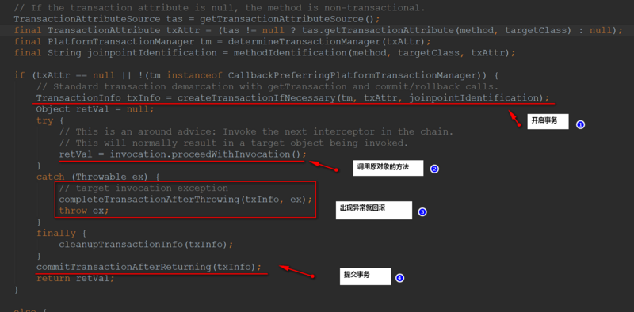

- [Spring](#spring)
  - [Spring的IOC理解-Inversion of Control](#spring%E7%9A%84ioc%E7%90%86%E8%A7%A3-inversion-of-control)
    - [自动装配](#%E8%87%AA%E5%8A%A8%E8%A3%85%E9%85%8D)
  - [Spring的AOP理解-Aspect Oriented Programming](#spring%E7%9A%84aop%E7%90%86%E8%A7%A3-aspect-oriented-programming)
    - [Spring AOP名词说明](#spring-aop%E5%90%8D%E8%AF%8D%E8%AF%B4%E6%98%8E)
  - [Spring 事务](#spring-%E4%BA%8B%E5%8A%A1)
    - [Spring管理事务](#spring%E7%AE%A1%E7%90%86%E4%BA%8B%E5%8A%A1)
    - [Spring事务传播机制](#spring%E4%BA%8B%E5%8A%A1%E4%BC%A0%E6%92%AD%E6%9C%BA%E5%88%B6)
  - [Spring的优点](#spring%E7%9A%84%E4%BC%98%E7%82%B9)
- [SpringBean](#springbean)
  - [一 Bean作用域（scope）](#%E4%B8%80-bean%E4%BD%9C%E7%94%A8%E5%9F%9Fscope)
  - [二 Bean生命周期](#%E4%BA%8C-bean%E7%94%9F%E5%91%BD%E5%91%A8%E6%9C%9F)
  - [BeanFactory和ApplicationContext有什么区别](#beanfactory%E5%92%8Capplicationcontext%E6%9C%89%E4%BB%80%E4%B9%88%E5%8C%BA%E5%88%AB)
  - [Spring 框架中都用到了哪些设计模式？](#spring-%E6%A1%86%E6%9E%B6%E4%B8%AD%E9%83%BD%E7%94%A8%E5%88%B0%E4%BA%86%E5%93%AA%E4%BA%9B%E8%AE%BE%E8%AE%A1%E6%A8%A1%E5%BC%8F)
- [SpringMVC](#springmvc)
  - [SpringMVC 简单介绍](#springmvc-%E7%AE%80%E5%8D%95%E4%BB%8B%E7%BB%8D)
  - [SpringMVC 使用](#springmvc-%E4%BD%BF%E7%94%A8)
  - [SpringMVC 工作原理](#springmvc-%E5%B7%A5%E4%BD%9C%E5%8E%9F%E7%90%86)

# Spring
  Spring是一个轻量级的IOC和AOP容器框架，目的是解决企业应用开发的复杂性。

## Spring的IOC理解-Inversion of Control
1. IOC就是控制反转。当某个角色需要另外一个角色协助的时候，在传统的程序设计过程中，通常由调用者来创建被调用者的实例对象。但在spring中创建被调用者的工作不再由调用者来完成，因此称为控制反转。作用是实现了程序的解耦合，而非传统实现中，由程序代码直接操控。*BeanFactory* 是Spring IoC容器的具体实现与核心接口，提供了一个先进的配置机制，使得任何类型的对象的配置成为可能，用来包装和管理各种bean。
2. IOC让对象的创建不用去new了，可以由spring自动生产，这里用的就是java的反射机制，通过反射在运行时动态的去创建、调用对象。spring就是根据配置文件在运行时动态的去创建对象，并调用对象的方法的。
3. Spring的IOC有三种注入方式 ： 
    第一是根据属性注入，也叫set方法注入； 
    第二种是根据构造方法进行注入； 
    第三种是根据注解进行注入。

### 自动装配
在Spring框架中共有5种自动装配：
1. no：这是Spring框架的默认设置，在该设置下自动装配是关闭的，开发者需要自行在bean定义中用标签明确的设置依赖关系。
2. byName：该选项可以根据bean名称设置依赖关系。当向一个bean中自动装配一个属性时，容器将根据bean的名称自动在配置文件中查询一个匹配的bean。如果找到的话，就装配这个属性，如果没找到的话就报错。
3. byType：该选项可以根据bean类型设置依赖关系。当向一个bean中自动装配一个属性时，容器将根据bean的类型自动在在配置文件中查询一个匹配的bean。如果找到的话，就装配这个属性，如果没找到的话就报错。
4. constructor：构造器的自动装配和byType模式类似，但是仅仅适用于与有构造器相同参数的bean，如果在容器中没有找到与构造器参数类型一致的bean，那么将会抛出异常。
5. autodetect：该模式自动探测使用构造器自动装配或者byType自动装配。首先，首先会尝试找合适的带参数的构造器，如果找到的话就是用构造器自动装配，如果在bean内部没有找到相应的构造器或者是无参构造器，容器就会自动选择byTpe的自动装配方式。
* 自动化的装配bean
   Spring的自动装配需要从两个角度来实现(两个操作)： 
　　1.组件扫描(component scanning)：spring会自动发现应用上下文中所创建的bean； 
　　2.自动装配(autowiring)：spring自动满足bean之间的依赖，也就是我们上篇博文说的IoC/DI； 
　　组件扫描和自动装配组合发挥巨大威力，使的显示的配置降低到最少。

## Spring的AOP理解-Aspect Oriented Programming
 - 原理：AOP是面向切面编程，是通过**动态代理**的方式为程序添加统一功能，集中解决一些公共问题(权限验证，日志，事务处理)。
 - 优点：1.各个步骤之间的良好隔离性耦合性大大降低 
      2.源代码无关性，再扩展功能的同时不对源码进行修改操作 
* AOP实现的关键在于AOP框架自动创建的AOP代理，AOP代理主要分为静态代理和动态代理。静态代理的代表为AspectJ；动态代理则以Spring AOP为代表。
[参考基础代理部分](./Java 基础.md-代理)
1. AspectJ是静态代理的增强，所谓静态代理，就是AOP框架会在编译阶段生成AOP代理类，因此也称为编译时增强，他会在编译阶段将AspectJ织入到Java字节码中，运行的时候就是增强之后的AOP对象。
2. Spring AOP使用的动态代理，所谓的动态代理就是说AOP框架不会去修改字节码，而是每次运行时在内存中临时为方法生成一个AOP对象，这个AOP对象包含了目标对象的全部方法，并且在特定的切点做了增强处理，并回调原对象的方法。 

* Spring AOP中的**动态代理**主要有两种方式，JDK动态代理和CGLIB动态代理：        
1. JDK动态代理通过反射来接收被代理的类，并且要求被代理的类*必须实现一个接口*。JDK动态代理的核心是InvocationHandler接口和Proxy类。生成的代理对象的方法调用都会委托到InvocationHandler.invoke()方法，当我们调用代理类对象的方法时，这个“调用”会转送到invoke方法中，代理类对象作为proxy参数传入，参数method标识了我们具体调用的是代理类的哪个方法，args为这个方法的参数。         
2. *如果目标类没有实现接口*，那么Spring AOP会选择使用CGLIB来动态代理目标类。CGLIB（Code Generation Library），是一个代码生成的类库，可以在运行时动态的生成指定类的一个子类对象，并覆盖其中特定方法，覆盖方法时可以添加增强代码，从而实现AOP。CGLIB是通过继承的方式做的动态代理，因此如果某个类被标记为final，那么它是无法使用CGLIB做动态代理的。
3. 静态代理与动态代理区别在于生成AOP代理对象的时机不同，相对来说AspectJ的静态代理方式具有更好的性能，但是AspectJ需要特定的编译器进行处理，而Spring AOP则无需特定的编译器处理。 

### Spring AOP名词说明
1. 切面（Aspect）：被抽取的公共模块，可能会横切多个对象。 在Spring AOP中，切面可以使用通用类（基于模式的风格） 或者在普通类中以 @AspectJ 注解来实现。
2. 连接点（Join point）：指方法，在Spring AOP中，一个连接点 总是 代表一个方法的执行。 
3. 通知（Advice）：在切面的某个特定的连接点（Join point）上执行的动作。通知有各种类型，其中包括“around”、“before”和“after”等通知。许多AOP框架，包括Spring，都是以拦截器做通知模型， 并维护一个以连接点为中心的拦截器链。
4. 切入点（Pointcut）：切入点是指 我们要对哪些Join point进行拦截的定义。通过切入点表达式，指定拦截的方法，比如指定拦截add*、search*。
5. 引入（Introduction）：（也被称为内部类型声明（inter-type declaration））。声明额外的方法或者某个类型的字段。Spring允许引入新的接口（以及一个对应的实现）到任何被代理的对象。例如，你可以使用一个引入来使bean实现 IsModified 接口，以便简化缓存机制。
6. 目标对象（Target Object）： 被一个或者多个切面（aspect）所通知（advise）的对象。也有人把它叫做 被通知（adviced） 对象。 既然Spring AOP是通过运行时代理实现的，这个对象永远是一个 被代理（proxied） 对象。
7. 织入（Weaving）：指把增强应用到目标对象来创建新的代理对象的过程。Spring是在运行时完成织入。

切入点（pointcut）和连接点（join point）匹配的概念是AOP的关键，这使得AOP不同于其它仅仅提供拦截功能的旧技术。 切入点使得定位通知（advice）可独立于OO层次。 例如，一个提供声明式事务管理的around通知可以被应用到一组横跨多个对象中的方法上（例如服务层的所有业务操作

CGLIB详解
https://www.jianshu.com/p/9a61af393e41?from=timeline&isappinstalled=0

## Spring  事务
Spring事务的底层是Spring AOP，而Spring AOP的底层是动态代理技术;

### Spring管理事务
1. 编程式事务(TransactionTemplate)，在代码中硬编码（不推荐）
2. 声明式事务，在配置文件中配置（推荐）:声明式事务管理建立在AOP之上的。其本质是对方法前后进行拦截，然后在目标方法开始之前创建或者加入一个事务，在执行完目标方法之后根据执行情况提交或者回滚事务。
声明式事务又分为两种：
a、基于XML的声明式事务
<!-- 事务管理器，对mybatis操作数据库进行事务控制，spring使用jdbc的事务控制类  -->
    <bean id="transactionManager" class="org.springframework.jdbc.datasource.DataSourceTransactionManager">
        <property name="dataSource" ref="dataSourceSuport"></property>
    </bean>
  <!-- spring 事务注解     mode="aspectj"表示采用切面    mode="proxy"表示代理模式(默认) -->
     <tx:annotation-driven transaction-manager="transactionManager"  />  
  <!--  通知   映射到上面的事务管理器-->
    <tx:advice  id="txAdive"transaction-manager="transactionManager">
        <tx:attributes>
  <!--name什么方法名称开头  传播行为 REQUIRED必须事务   rollback-for什么异常类进行回滚，逗号隔开 -->
            <tx:method name="save*" propagation="REQUIRED" rollback-for="java.lang.DaoException"/>
            <tx:method name="delete*" propagation="REQUIRED" rollback-for="java.lang.DaoException"/>
            <tx:method name="insert*" propagation="REQUIRED" rollback-for="java.lang.DaoException"/>
            <tx:method name="update*" propagation="REQUIRED" rollback-for="java.lang.DaoException"/>
  <!-- 不是必须的，而且查询类型为事务只读的可以提高数据库性能优化  -->
            <tx:method name="find*" propagation="SUPPORTS"read-only="true"/>
            <tx:method name="get*" propagation="SUPPORTS"read-only="true"/>
            <tx:method name="select*" propagation="SUPPORTS"read-only="true"/>
        </tx:attributes>
    </tx:advice>
  <!-- aop切面并配置切入点入进行事物管理 指向上面的映射 -->
    <aop:config>
        <aop:pointcut expression="execution(* com.service.serviceImpl.*.*(..))"id="txPointcut"/>
        <aop:advisor advice-ref="txAdive" pointcut-ref="txPointcut"/>
    </aop:config>
    <aop:aspectj-autoproxy proxy-target-class="true"/>
b、基于注解的声明式事务:@Transactional
<!-- 事务管理器，对mybatis操作数据库进行事务控制，spring使用jdbc的事务控制类  -->
 <bean id="transactionManager" class="org.springframework.jdbc.datasource.DataSourceTransactionManager">
 <property name="dataSource" ref="dataSourceSuport"></property>
 </bean>
<!-- 开启spring 事务注解支持  mode="aspectj"表示采用切面    mode="proxy"表示代理模式(默认) -->
  <tx:annotation-driven transaction-manager="transactionManager"  />  

### Spring事务传播机制
[参考](https://blog.csdn.net/zht741322694/article/details/78676964)

             传播行为                                              含义
- propagation_required（xml文件中为**required**):表示当前方法必须在一个具有事务的上下文中运行，如有客户端有事务在进行，那么被调用端将在该事务中运行，否则的话重新开启一个事务。**（如果被调用端发生异常，那么调用端和被调用端事务都将回滚）**
- propagation_supports(xml文件中为**supports**）:表示当前方法不必需要具有一个事务上下文，但是如果有一个事务的话，它也可以在这个事务中运行
- propagation_mandatory(xml文件中为**mandatory**）:表示当前方法必须在一个事务中运行，如果没有事务，将抛出异常
- propagation_nested(xml文件中为**nested**):表示如果当前方法正有一个事务在运行中，则该方法应该运行在一个嵌套事务中，被嵌套的事务可以独立于被封装的事务中进行提交或者回滚。*如果封装事务存在，并且外层事务抛出异常回滚，那么内层事务必须回滚，反之，内层事务并不影响外层事务。如果封装事务不存在，则同propagation_required的一样*
- propagation_never（xml文件中为**never**):表示当方法务不应该在一个事务中运行，如果存在一个事务，则抛出异常
- propagation_requires_new(xml文件中为**requires_new**）:表示当前方法必须运行在它自己的事务中。**一个新的事务将启动，而且如果有一个现有的事务在运行的话，则这个方法将在运行期被挂起，直到新的事务提交或者回滚才恢复执行。**
- propagation_not_supported（xml文件中为**not_supported**）:表示该方法不应该在一个事务中运行。**如果有一个事务正在运行，他将在运行期被挂起，直到这个事务提交或者回滚才恢复执行**

## Spring的优点
（1）spring属于低侵入式设计，代码的污染极低；
（2）spring的DI机制降低了业务对象替换的复杂性（IOC）；
（3）容器提供了AOP技术，利用它很容易实现如权限拦截，运行期监控等功能；
（4）降低了组件之间的耦合性 ，实现了软件各层之间的解耦； 
（5）容器提供单例模式支持；
（6）可以使用容器提供的众多服务，如事务管理，消息服务等；
（7）容器提供了众多的辅助类，能加快应用的开发；
（8）spring对于主流的应用框架提供了集成支持，如hibernate，JPA，Struts等
（9）独立于各种应用服务器 
（10）Spring的高度开放性，并不强制应用完全依赖于Spring，开发者可以自由选择spring的部分或全部。

# SpringBean
* 在 Spring 中，那些组成应用程序的主体及由 Spring IOC 容器所管理的对象，被称之为 bean。简单地讲，bean 就是由 IOC 容器初始化、装配及管理的对象，除此之外，bean 就与应用程序中的其他对象没有什么区别了。而 bean 的定义以及 bean 相互间的依赖关系将通过配置元数据来描述。

## 一 Bean作用域（scope）
1. singleton——唯一 bean 实例（默认）
2. prototype——每次请求都会创建一个新的 bean 实例
3. request——每一次HTTP请求都会产生一个新的bean，该bean仅在当前HTTP request内有效
4. session——每一次HTTP请求都会产生一个新的 bean，该bean仅在当前 HTTP session 内有效
5. globalSession

## 二 Bean生命周期
* 周期介绍：
bean生命周期可以参考一下Servlet的生命周期：实例化，初始init，接收请求service，销毁destroy；
    Spring上下文中的Bean也类似，如下
    1、实例化一个Bean－－也就是我们常说的new；
    2、按照Spring上下文对实例化的Bean进行配置－－也就是IOC注入；
    3、如果这个Bean已经实现了BeanNameAware接口，会调用它实现的setBeanName(String)方法，此处传递的就是Spring配置文件中Bean的id值
    4、如果这个Bean已经实现了BeanFactoryAware接口，会调用它实现的setBeanFactory(BeanFactory)传递的是Spring工厂自身(可以用这个方式来获取其它Bean，只需在Spring配置文件中配置一个普通的Bean就可以)；
    5、如果这个Bean已经实现了**ApplicationContextAware**接口，会调用setApplicationContext(ApplicationContext)方法，传入Spring上下文（同样这个方式也可以实现步骤4的内容，但比4更好，因为ApplicationContext是BeanFactory的子接口，有更多的实现方法）；
    6、如果这个Bean关联了BeanPostProcessor接口，将会调用postProcessBeforeInitialization(Object obj, String s)方法，**BeanPostProcessor经常被用作是Bean内容的更改(IOC注入代理对象)**，并且由于这个是在Bean初始化结束时调用那个的方法，也可以被应用于内存或缓存技术；
    7、如果Bean在Spring配置文件中配置了init-method属性会自动调用其配置的初始化方法。
    8、如果这个Bean关联了BeanPostProcessor接口，将会调用postProcessAfterInitialization(Object obj, String s)方法、；
    注：以上工作完成以后就可以应用这个Bean了，那这个Bean是一个Singleton的，所以一般情况下我们调用同一个id的Bean会是在内容地址相同的实例，当然在Spring配置文件中也可以配置非Singleton，这里我们不做赘述。
    9、当Bean不再需要时，会经过清理阶段，如果Bean实现了DisposableBean这个接口，会调用那个其实现的destroy()方法；
    10、最后，如果这个Bean的Spring配置中配置了destroy-method属性，会自动调用其配置的销毁方法。
 
我们这里描述的是应用Spring上下文Bean的生命周期，如果应用Spring的工厂也就是**BeanFactory**的话去掉第5步就Ok了。
Spring 容器可以管理 *singleton 作用域*下 bean 的生命周期，在此作用域下，Spring 能够精确地知道bean何时被创建，何时初始化完成，以及何时被销毁。而对于 *prototype 作用域*的bean，Spring只负责创建，当容器创建了 bean 的实例后，bean 的实例就交给了客户端的代码管理，Spring容器将不再跟踪其生命周期，并且不会管理那些被配置成prototype作用域的bean的生命周期。

## BeanFactory和ApplicationContext有什么区别
 BeanFactory和ApplicationContext是Spring的两大核心接口，而其中ApplicationContext是BeanFactory的子接口。它们都可以当做Spring的容器，生成Bean实例的，并管理容器中的Bean。
 1. BeanFactory：是Spring里面最底层的接口，提供了最简单的容器的功能，负责读取bean配置文档，管理bean的加载与实例化，维护bean之间的依赖关系，负责bean的生命周期，但是*无法支持spring的aop功能和web应用*。
 2. ApplicationContext接口作为BeanFactory的派生，因而具有BeanFactory所有的功能。而且ApplicationContext还在功能上做了扩展，以一种更面向框架的方式工作以及对上下文进行分层和实现继承。
3. BeanFactroy采用的是延迟加载形式来注入Bean的，即只有在使用到某个Bean时(调用getBean())，才对该Bean进行加载实例化，这样，我们就不能发现一些存在的Spring的配置问题。如果Bean的某一个属性没有注入，BeanFacotry加载后，直至第一次使用调用getBean方法才会抛出异常。
[引用](https://blog.csdn.net/a745233700/article/details/80959716)

## Spring 框架中都用到了哪些设计模式？
1. 代理模式—在AOP被用的比较多。
2. 单例模式—在spring配置文件中定义的bean默认为单例模式。
3. 工厂模式—BeanFactory用来创建对象的实例。
4. 模板方法—用来解决代码重复的问题。比如. RestTemplate, JmsTemplate, JpaTemplate。
5. 前端控制器—Spring提供了DispatcherServlet来对请求进行分发。
6. 视图帮助(View Helper )—Spring提供了一系列的JSP标签，高效宏来辅助将分散的代码整合在视图里。
7. 依赖注入—贯穿于BeanFactory / ApplicationContext接口的核心理念。

# SpringMVC

## SpringMVC 简单介绍
SpringMVC 框架是以请求为驱动，围绕 Servlet 设计，将请求发给控制器，然后通过模型对象，分派器来展示请求结果视图。其中核心类是 DispatcherServlet，它是一个 Servlet，顶层是实现的Servlet接口。

## SpringMVC 使用
需要在 web.xml 中配置 DispatcherServlet 。并且需要配置 Spring 监听器ContextLoaderListener

## SpringMVC 工作原理
流程说明（重要）：
（1）客户端（浏览器）发送请求，直接请求到 DispatcherServlet。
（2）DispatcherServlet 根据请求信息调用 HandlerMapping，解析请求对应的 Handler。
（3）解析到对应的 Handler（也就是我们平常说的 Controller 控制器）后，开始由 HandlerAdapter 适配器处理。
（4）HandlerAdapter 会根据 Handler 来调用真正的处理器来处理请求，并处理相应的业务逻辑。
（5）处理器处理完业务后，会返回一个 ModelAndView 对象，Model 是返回的数据对象，View 是个逻辑上的 View。
（6）ViewResolver 会根据逻辑 View 查找实际的 View。
（7）DispaterServlet 把返回的 Model 传给 View（视图渲染）。
（8）把 View 返回给请求者（浏览器）

面试总结：https://blog.csdn.net/qq_39470733/article/details/77709607

